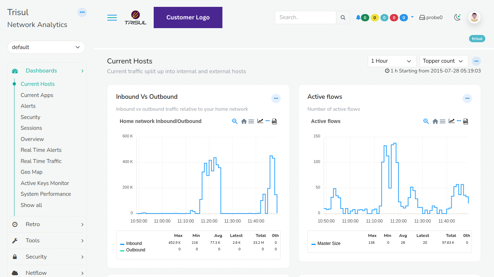
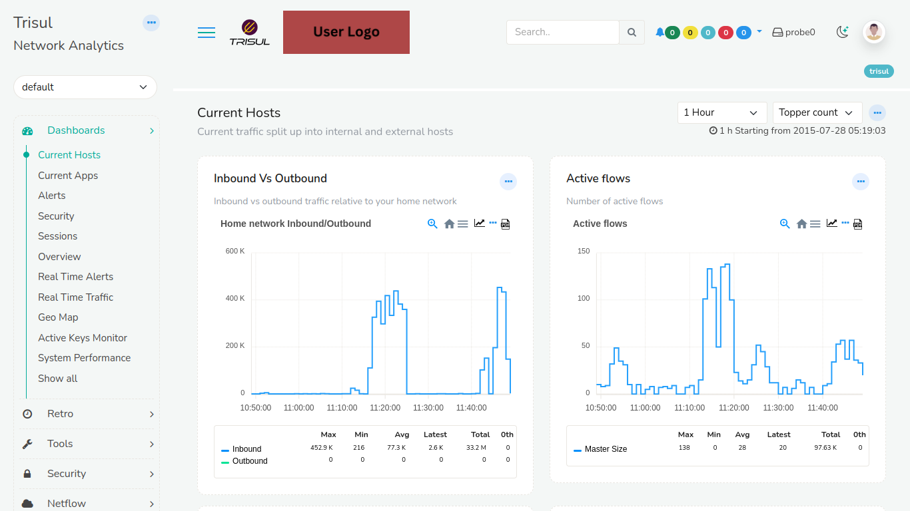
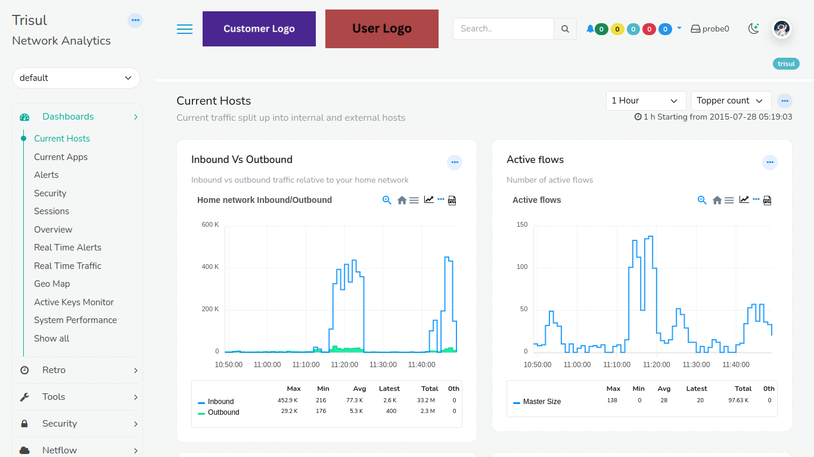

# Manage Contexts - List

Here you can view and edit some attributes of a Trisul Context.

:::tip
A Trisul Context is also known as a Tenant when used in a Managed Service Provider scenario. 
:::

The total number of available contexts will be displayed on the header of the dashboard.

:::info navigation
:point_right: Context Admin &rarr; Manage &rarr; List Contexts
:::

  
*Figure: Showing list of all available contexts*

The contexts list contains the following information as in the table.

| Column | Description |
|--------|-------------|
| Status | Indicates the current status of the context such as running, not running |
| Name | Name of the context |
| Description | Brief description of the context providing additional information |
| Display name | Human-readable name of the context. Used for display purposes only |
| Exists on disk | Indicates whether the context exists in the local disk or not |
| Actions | Click on the edit button to edit the description and display name of the contexts |

## Actions  

Use the buttons on the top to perform these actions 

### Download

Click on the download button to download the list of all texts in three formats PDF, XLSX, CSV.

### Sync

Clicking on the Sync button syncs the contexts created and deleted in CLI tools and refelects in the webtrisul UI.

### Prune Unused and deleted contexts

Clicking on prune unused and deleted contexts removes unnecessary context data to free up resources.

### Filter

Use the filter bar to enter a string and search for a particular context name.

## Edit Context 

By selecting the "Edit" option you can change some values of the context 

| Field | Description |
|--------|-------------|
| Context Name | Read only, this cannot be changed as it is assigned at creation time using the CLI Tools|
| Description| For your internal usage, this will not be displayed |
| Display Name | When set, this is displayed in the login screen and in other places instead of the context name  |
| Context Logo | A Logo that is shown in addition to the product logo when a user logs into that context. See below |

## The Context or Tenant Logo 

For MSP Users an optional logo can be associated with a Tenant (context), this logo will be shown as follows.

Click choose file and upload the logo image to set it as Tenant logo. 

**Logo Setting Options**

- **Setting 1** (Dual Logo)   
 Display a customer logo alongside the Trisul Logo on the top panel as in the figure.

  
*Figure: Trisul Logo with Customer Logo*  

- **Setting 2** (User Identification)  
Place a Tenant logo (admin/user) next to the Trisul Logo on the top panel as in the figure.

  
*Figure: Trisul Logo with Tenant Logo*  

- **Setting 3** (Custom Branding)  
Showcase a user logo alongside a customer logo, without displaying the Trisul Logoas in the figure.

  
*Figure: Tenant Logo with Customer Logo*    

