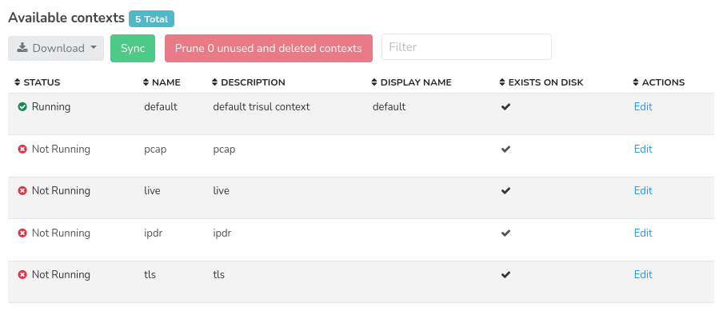

# Manage Contexts - List

In List Contexts you can view the list of all the available contexts you have created and deleted using the CLI tools. The total number of available contexts will be diplayed on the header of the dashboard.

:::info navigation
:point_right: Context Admin &rarr; Manage &rarr; List Contexts
:::

  
*Figure: Showing list of all available contexts*

The contexts list contains the following information as in the table.

| Column | Description |
|--------|-------------|
| Status | Indicates the current status of the context such as running, not running |
| Name | Name of the context |
| Description | Brief description of the context providing additional information |
| Display name | Human-readable name of the context. Used for display purposes only |
| Exists on disk | Indicates whether the context exists in the local disk or not |
| Actions | Click on the edit button to edit the description and display name of the contexts |

>All the colums are [sortable](docs/ug/ui/elements#column-sorter)

## Download

Click on the download button to download the list of all texts in three formats PDF, XLSX, CSV.

## Sync

Clicking on the Sync button syncs the contexts created and deleted in CLI tools and refelects in the webtrisul UI.

## Prune Unused and deleted contexts

Clicking on prune unused and deleted contexts removes unnecessary context data to free up resources.

## Filter

Use the filter bar to enter a string and search for a particular context name.
