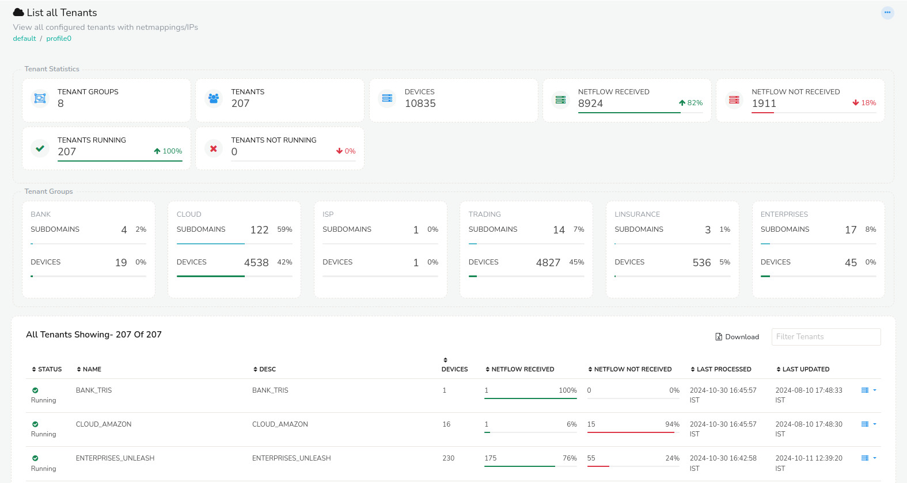

# Manage Contexts - Tenants

The Tenant Management page provides a comprehensive overview of all tenants, their network mappings, and key statistics.

  
*Figure: Showing list of tenants*

## Tenant Statistics
The page also provides real-time statistics, including:

- Total Tenants: Number of tenants configured
- Total Devices: Number of devices associated with all tenants
- NetFlow Received: Total NetFlow data received from all tenants
- NetFlow Not Received: Total NetFlow data not received from all tenants
- Running Tenants: Number of tenants currently running
- Non-Running Tenants: Number of tenants not running

## Tenant Groups
The page also lists all tenant groups within each contexts with number of subdomains and devices.

## All Tenants
You can find the list of all tenants with the following information which can be downloaded by clicking on the download button.

| Column | Description |
|--------|-------------|
| Status | Current operational state of the tenant like running, not running |
| Name | Name of the tenant |
| Desc | Brief description about the tenant providing additional context |
| Devices | Number of devices associated with this tenant |
| Netflow received | Total amount of NetFlow data received from devices in this tenant |
| Netflow not received | Total amount of NetFlow data expected but not received from devices in this tenant |
| Last processed | Timestamp of the last time NetFlow data was successfully processed for this tenant |
| Last updated | Timestamp of the last update of the tenant |

## Filter

Use the filter bar by entering a string to search for a particular tenant.