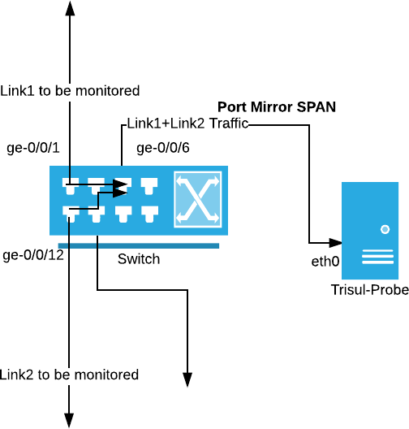
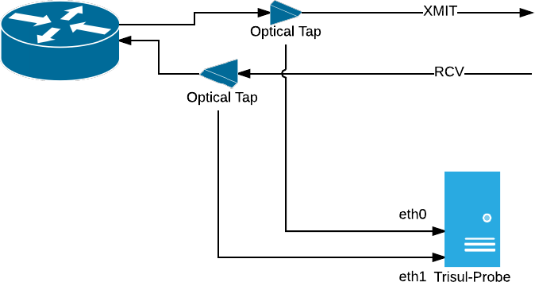
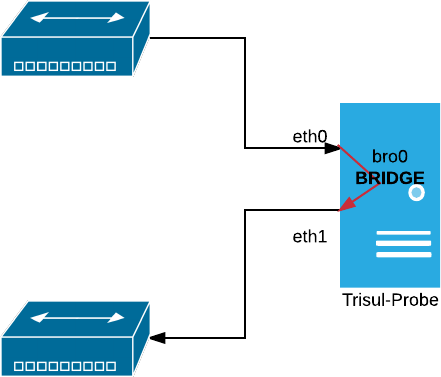

# Configure Packet Capture

Before Trisul can analyze traffic, it needs access to raw network packets. This page helps you choose the right packet acquisition method based on your network size, speed, and deployment model.

### Choose the Right Method:
Use the option that best matches your environment:

- **Port Mirror (SPAN)**– rBest for most enterprise networks with links below 500 Mbps.
- **Network Taps**– Recommended for high-speed links above 500 Mbps, where SPAN ports become unreliable or lossy.
- **Bridges**– Suitable only for small offices or appliance-style deployments, where Trisul can be placed inline.

### Virtual Machine Configuration

If Trisul is running inside a virtual machine, ensure the virtual switch is in promiscuous mode. Without this, mirrored traffic from the physical interface may not reach the probe.  

Refer to the official documentation for  [[VMWare](https://kb.vmware.com/s/article/1004099)] environments for setup instructions.


## Configuring Port Mirror / SPAN Port

Port mirroring copies traffic from one or more switch ports and sends it to a designated monitoring port connected to the Trisul Probe.

Typical use case:

- Enterprise access or aggregation switches
- Moderate traffic volumes
- Quick deployment without additional hardware

Example:  
Traffic from ports `ge/0/0/1` and `ge/0/0/12` is mirrored to `ge/0/0/6`, which connects to the Trisul Probe.

> Refer to your switch vendor’s documentation for configuring SPAN sessions. [[CiscoSPANdocumentation](https://www.cisco.com/c/en/us/support/docs/switches/catalyst-6500-series-switches/10570-41.html)]

The following diagram shows how you can configure a SPAN port and feed packets into Trisul. 

  
*Figure: Port Mirroring*


## Using Network Taps

As traffic rates increase, SPAN ports can drop packets or distort timing. Network taps solve this by passively copying traffic directly from the link.

When to use taps:

- Links above 500 Mbps
- 10G or higher optical or copper links
- Environments where packet accuracy is critical

  
*Figure: Network Taps*


> Note: For full-duplex links, each direction is tapped separately and connected to two probe interfaces.


## Using Trisul as a Bridge

In small environments, Trisul can be deployed inline as a bridge, transparently passing traffic while capturing packets.

  
*Figure: Bridge*

Use this only when:

- Traffic volumes are low
- Inline deployment is acceptable
- You are running a small office or appliance setup

>Bridge mode places Trisul directly in the traffic path. Not recommended for high-availability or high-speed networks.

### Bridging Ethernet Connections

A bridge allows you to connect two or more network segments together allowing devices to join the network when it’s not possible to connect them directly to a router or switch

#### How to Bridge

**UBUNTU**

Install the bridge-utils package.

Copy:  `sudo apt-get install bridge-utils`  
Automatically Create the Bridge at Start-up.  
Sample: `/etc/network/interfaces file`

```bash
 BASH#eth0
auto eth0
iface eth0 inet manual
up ifconfig eth0 up
#eth1
auto eth1
iface eth1 inet manual
up ifconfig eth1 up
#bridge br0
auto br0
iface br0 inet static
address 192.168.2.79
gateway 192.168.2.1
netmask 255.255.255.0
bridge_ports eth0 eth1
```

Restart networking:

```xml
sudo /etc/init.d/networking restart
```

**CENTOS**

Install the bridge-utils package.
```bash
yum install  bridge-utils
```

To create a network bridge, create a file in the `/etc/sysconfig/network-scripts/` directory called `ifcfg-br0`  
Sample `/etc/sysconfig/network-scripts/ifcfg-br0`

```bash
DEVICE=br0
TYPE=Bridge
IPADDR=192.168.2.78
GATEWAY=192.168.2.1
NETMASK=255.255.255.0
ONBOOT=yes
BOOTPROTO=none
NM_CONTROLLED=no
DELAY=0
```

To complete the bridge another interface is created, or an existing interface is modified, and pointed to the bridge interface  
Sample: `/etc/sysconfig/network-scripts/ifcfg-eth0`

```bash
DEVICE=eth0
TYPE=Ethernet
HWADDR=AA:BB:CC:DD:EE:FF
BOOTPROTO=none
ONBOOT=yes
NM_CONTROLLED=no
BRIDGE=br0
```

Sample: `/etc/sysconfig/network-scripts/ifcfg-eth1`

```bash
DEVICE=eth1
TYPE=Ethernet
HWADDR=AA:BB:CC:DD:EE:FG
BOOTPROTO=none
ONBOOT=yes
NM_CONTROLLED=no
BRIDGE=br0
```

Restart networking

`/etc/init.d/netwok restart`

With packet capture configured, the Trisul Probe can now observe live network traffic and start analysis.