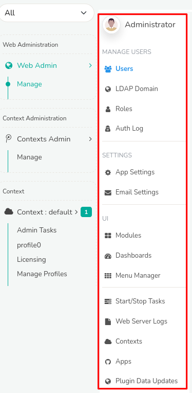

# Web Admin: Manage

This section provides access to the Trisul administration functions, a centralized management interface for configuring and monitoring the Trisul platform.  

From here, administrators can manage user access, configure system settings, monitor logs, customize dashboards and menus, and restart web server. 

## Manage

:::info navigation
Go to Web Admin: Manage &rarr; (*List of all Admin Menus*)
:::

The following sections provide detailed information and controls for each of these administrative functions as functional menus.

  
*Figure: Admin Menus*

You can find the 

| Menu | Description |
|-------|------------|
| Users | Manage system access, create/modify/delete user accounts, assign roles, and set login permissions for all users. |
| LDAP Domain | Configure LDAP domain and create login option that authenticates users against an LDAP server.|
| Roles | Lists roles and associated permissions, specifying authorized actions for each user category. |
| Auth Log | System authentication Log to keep track of each and every Login that provides a list of users with name,context,location,timestamp for every login attempt. |
| App Settings | Make modifications in the web interface directly change few functionalities in UI with the help of this menu. |
| Modules | View and manage list of available modules that are being actively used in the web interface. |
| Dashboards | View and manage list of all dashboards in the UI. |
| Menu Manager | Menu manager allows you to change the order of menu items, edit menu links, or clone and add new items. |
| Start/Stop Tasks | Administrative Tasks can be started and stopped by a single click from this menu including web server and email alert notification service. |
| Web Server Logs | Monitor web server logs, email logs, background tasks logs, auth log, web socket logs for troubleshooting. |
| Apps | Explore all Trisul apps in the platform that can extend support for your analyses. |
| Plugin Data Updates | Shows status of automatic feed updates for Badfellas, Geo, URL filter plugins. |