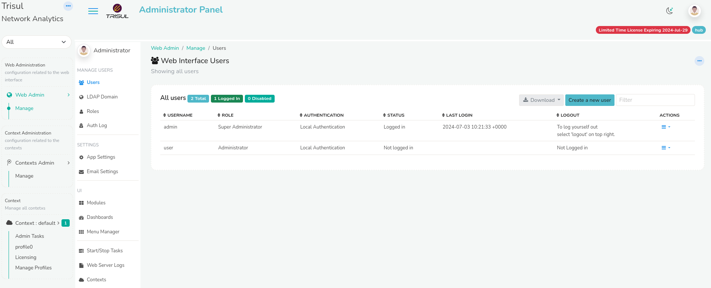

# Admin Menus

A Short description about the functions of all the menus in Admin. Each 
Menu has a specific role towards functioning of Trisul as a platform.

## Manage

It has all the functional level menus associated with the UI. Any changes to be done in UI can be configured or modified through several menus listed here.



*Figure: Admin Panel*

### Users

Provides a list of all active users or subscribers that can access 
the UI. Every Individual can be given a separate login and that can be 
done here.

To create a new User, Select **Create a new User** option

- You are shown the form with following fileds

| Field Name            | Description                                                                              |
| --------------------- | ---------------------------------------------------------------------------------------- |
| User Name             | A username or if using LDAP, a login atrribute like mail/uid/username                    |
| Authentication        | Local auth or a LDAP domain you have configured earlier                                  |
| Password              | Password for local authentication. Minimum 6 characters                                  |
| Full Name             | Optional: User full name                                                                 |
| Role                  | User role such as operator, admin etc.                                                   |
| Allow multiple Login  | Allow multiple concurrent login sessions for this user                                   |
| Default Dashboard     | Select a dashboard to send the user to after login                                       |
| Default Home Page URL | User will be redirected to this page after successful login, overrides default dashboard |
| Allowed Contexts      | User is only allowed to login to these contexts                                          |

Select **Create User** option to create a new user.

### LDAP Domain

The LDAP (Lightweight Directory Access Protocol) is a login option that authenticates users against an LDAP server.

There are two steps to setting up a user to login via LDAP

1. Configure LDAP domain
2. Create a user and specify he/she be authenticated against an LDAP domain

Refer to the [ldap login](/docs/ug/webadmin/ldap_login) for Instructions

### Roles

Provides a list of Roles and Permissions each operator has. Roles specify which category of user is allowed to do what operations

Refer to the [User Roles](/docs/ug/webadmin/userroles) for detailed information

### Auth Log

Auth Log is the System Authentication Log which keeps a track of each and every Login. It provides a list of Users with name,context,Location,Timestamp for every Login attempt.

### App Settings

App Settings are used to make modifications in the Web Interface. You can directly change few functionalities in UI with the help of this menu.

### Email Settings

This menu is dedicated to configure Email server for scheduling automatic Reports and Alert based reports. Any existing Email Reports will be listed here.

To know how to setup Email-Server and Alert based emails, Refer to the [Email Settings](/docs/ug/reports/emailsettings)

### Modules

Modules are the building blocks of the dashboard based user interface. Several Modules put together are dashboards. Modules are much more feature specific. This menu provides a list of available modules that are being actively used in the Web Interface.

To create a new module, Refer to the [Modules](/docs/ug/ui/modules#how-to-create-modules) for instructions.

### Dashboards

A dashboard is a web page that contains modules at various positions.Trisul has well defined column positions into which you can place modules.

Trisul supports two types of dashboards.

**Live Dashboards**  
Live Dashboards are used to present current or recent network activity. The to time is always now

**Retro Dashboards**  
Retro Dashboards are used for historical analysis hence need you to 
select a Time Interval. Retro Dashboards can be found in the Retro Tools
 page under [Commonly Used Retro Analysis](/docs/ug/cg/retrotools) tool

### Menu Manager

Menu Manager provides a list of menus that are available in the Web 
Interface. It allows you to change the order of menu items, edit menu 
links, or clone and add new items.

Select **Create New Menu** option to create a new menu.

- You are shown the form with following fields

| Field Name                  | Description                                                        |
| --------------------------- | ------------------------------------------------------------------ |
| Menu Name                   | This name will appear on the menu                                  |
| Parent Menu                 | Select a parent if this is a submenu or select 'No Parent'         |
| User role (permissions)     | Select the role of the user like admin, operator etc.              |
| Description                 | Optional: This string will show up in the Tooltip                  |
| URL to link to (controller) | The URL this menu links to, can be a full URL or a controller name |
| Action                      | Optional: The action within the controller                         |
| Params Json                 | Optional: Eg `{"key_name" : “key_value”, ..}` in JSON format       |

Click on **Create** option to create a new menu.

### Start/Stop Tasks

All the Administrative Tasks can be started and stopped by a single 
click from this menu. It also includes action to restart the web server.

### Web Server Logs

All the log files can be viewed here and optionally filtered. Here are the Webserver logs listed.

| Field Name           | Description                               |
| -------------------- | ----------------------------------------- |
| Web Server Log       | Logs for the web interface                |
| Background Tasks Log | Logs for the web interface                |
| Web sockets log      | Errors related to the real time stabbers  |
| Auth Log             | View user login including failed attempts |
| Email Logs           | View email log sent by trisul             |
| SNMP Dump Logs       | Download SNMP Dumps in txt file           |

### Contexts

Contexts are independent analysis domains, such as multiple networks.
 This menu provides a list of available contexts in the system.

You can create,delete a context by using the following commands in the terminal

- To create a context

```bash
trisulctl_hub create context [context_name]
```

- To delete a context  

```bash
trisulctl_hub delete context [context_name]
```
