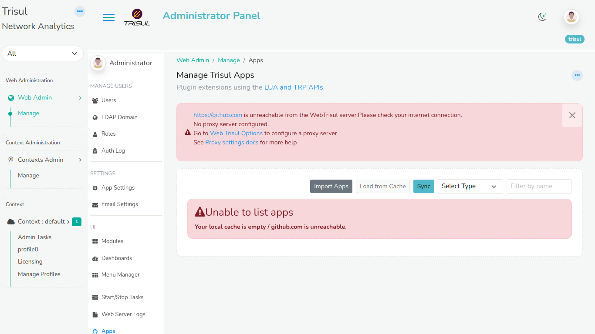
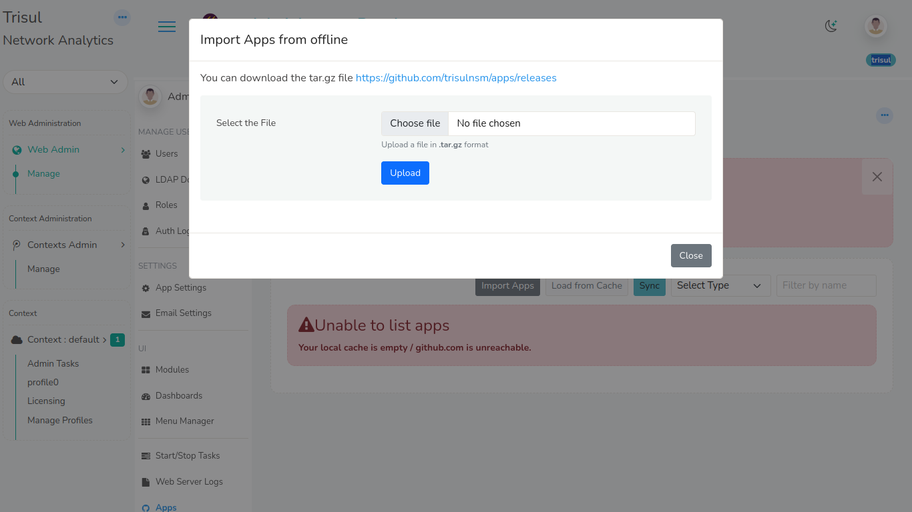

# Apps

Trisul Apps are plugins to enhance the capabilities of Trisul.

## Plugin Apps to Extend Trisul

You can install, upgrade, install Trisul Apps right from the web interface.

:::note

You need internet access to github.com to use this feature.  
Check [Proxy Settings](/docs/ag/webadmin/web_options#proxy-server) if you are behind a proxy server

:::

To access Trisul Apps, Login as admin user

:::info navigation

:point_right: Select Web Admin &rarr; Manage &rarr; Apps

:::

From here you can install, upgrade, or uninstall Trisul Apps.

*Figure: Showing a List of Trisul Apps*

## Repositories

Currently the only repository enabled is https://github.com/trisulnsm/apps

## Offline App Import
By default, Trisul fetches and displays apps from the online repository in the Apps Dashboard. When you try to access the apps offline github would be unreachable from the webtrisul server.

 Alternatively, you can download apps from the repository as a TAR file and later import them offline.

To access the Trisul Apps Dashboard while offline and import apps, Login as admin user 

:::info navigation

:point_right: Select Web Admin &rarr; Manage &rarr; Apps

:::

  
*Figure: Showing unreachability of apps in offline*

Click Import
From the *Import apps* dialog box choose the file by browsing and select the TAR file containing the apps.
Click Upload.

  
*Figure: Showing Offline Import*

> Note: This offline import feature allows for flexibility and convenience when internet connectivity is limited or unavailable.

## Types of Apps

There are four types of Trisul Apps

1. **JS/D3 Dashboard** — A Javascript dashboard that pulls directly from the backend hubs.
2. **Packaged Dashboard** — Modules and Dashboards shared by other users
3. **LUA Analytics** — Custom streaming analytics
4. **Meta Apps** — A software package that bundles and auto-installs related apps/components.

### Configuration

Click on README for instructions. Some of the LUA Analytics Apps need you to enable some features within Trisul.

### Deployment on Probes

When you install a Trisul App, it is automatically deployed to all Probe nodes.

## Creating your Own Apps

You can clone the [trisulnsm/apps](https://github.com/trisulnsm/apps) repository to see how an app is assembled.

Each apps lives inside a single directory

- /appname
  - pkg.yaml – information about the app, the files to be included
  - README.md – instructions
  - thumbnail.png – image shown in Web UI
  - file1,file2 – all files to be included with the app

When the version number changes, the user will be given a hint that a “New version is now available”.

## List of Apps

Here is a list of all the available apps. We are constantly adding new Apps, to view the latest list of apps go to [trisulnsm/apps](https://github.com/trisulnsm/apps)