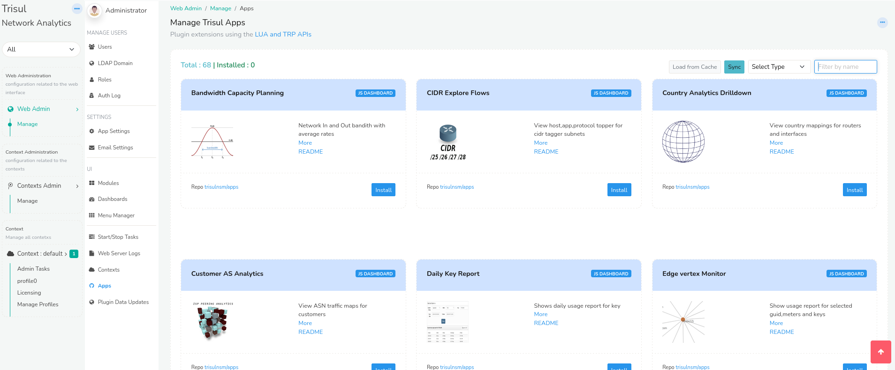

# Trisul Apps

Trisul Apps are plugins to enhance the capabilities of Trisul.

## Plugin Apps to Extend Trisul

You can install, upgrade, install Trisul Apps right from the web interface.

:::note

You need internet access to github.com to use this feature.  
Check [Proxy Settings](/docs/ag/webadmin/web_options#proxy-server) if you are behind a proxy server

:::

To access Trisul Apps, Login as admin user

:::note navigation

Select *Web Admin > Manage > Apps*

:::

From here you can install, upgrade, or uninstall Trisul Apps.

*Figure: Showing a List of Trisul Apps*

## Repositories

Currently the only repository enabled is https://github.com/trisulnsm/apps

## Types of Apps

There are three types of Trisul Apps

1. **JS/D3 Dashboard** — A Javascript dashboard that pulls directly from the backend hubs.
2. **Packaged Dashboard** — Modules and Dashboards shared by other users
3. **LUA Analytics** — Custom streaming analytics

### Configuration

Click on README for instructions. Some of the LUA Analytics Apps need you to enable some features within Trisul.

### Deployment on Probes

When you install a Trisul App, it is automatically deployed to all Probe nodes.

## Creating your Own Apps

You can clone the [trisulnsm/apps](https://github.com/trisulnsm/apps) repository to see how an app is assembled.

Each apps lives inside a single directory

- /appname
  - pkg.yaml – information about the app, the files to be included
  - README.md – instructions
  - thumbnail.png – image shown in Web UI
  - file1,file2 – all files to be included with the app

When the version number changes, the user will be given a hint that a “New version is now available”.

## List of Apps

Here is a list of all the available apps. We are constantly adding new Apps, to view the latest list of apps go to [trisulnsm/apps](https://github.com/trisulnsm/apps)

**JS Dashboard Apps**

| App                                | Description                                                                                                                                                                                                                               |
|:----------------------------------:| ----------------------------------------------------------------------------------------------------------------------------------------------------------------------------------------------------------------------------------------- |
| CIDR Explore Flows                 | View host,app,protocol topper for cidr tagger subnets                                                                                                                                                                                     |
| Country Analytics Drilldown        | View country mappings for routers and interfaces                                                                                                                                                                                          |
| Daily Key Report                   | Shows daily usage report for a key                                                                                                                                                                                                        |
| Edge vertex Monitor                | Show usage report for selected guid,meters and keys                                                                                                                                                                                       |
| Geo IP Lookup                      | Shows the ip look up. Shows ASNumber , ASNumber path,Country etc.                                                                                                                                                                         |
| ISP Country Analytics              | View country mappings for routers and interfaces                                                                                                                                                                                          |
| ISP External Prefixes Analytics    | View external prefixes mappings for routers and interfaces                                                                                                                                                                                |
| ISP OTT App Analytics              | View OTT Apps mappings for routers and interfaces                                                                                                                                                                                         |
| ISP Overview                       | Top level dashboard for ISP.Shows ASN, Peers, Prefixes, and BGP KPI for ISP                                                                                                                                                               |
| ISP Router Geo Map                 | View country locations for your router in vector map.                                                                                                                                                                                     |
| IXP Analytics                      | L2 IXP Traffic Analytics. Traffic Matrixat Internet Exchange Points Matrix, Per Member, traffic history of eacTX Flow for planning and billing                                                                                           |
| Interface Traffic Matrix           | View interface to interface traffic flows. A complete and long term accurate view of interface to interface transmit and receivefic flows within a router.                                                                                |
| Key Space Explorer                 | Search all active key space and get total usage.                                                                                                                                                                                          |
| Multi Probe Charts                 | Draw a multi-probe chart. Shows chart data from all probes You can plot any counter group, key, and meter.                                                                                                                                |
| PCAP Totals                        | Shows duraion,total bandwidth,packets and flows Shows total No.of Resources(http,dns,ssl) and FTS. Shows total No.of alerts for all alerts group(IDS,Blacklist,Flow Tracking,Threshold crossing). Shows No.of keys in each counter group. |
| Path Analytics                     | Shows the top used AS PATHS. Route Per Hop Analytics-Receive Usage of busiest route segments                                                                                                                                              |
| Peering Analytics                  | View ASN traffic maps for routers and interfaces                                                                                                                                                                                          |
| Peering Analytics Drilldown        | View ASN mappings for routers and interfaces                                                                                                                                                                                              |
| Prefix Analytics Drilldown         | View Prefix mappings for routers and interfaces                                                                                                                                                                                           |
| Protocol Tree Viewer               | View metrics in a Protocol Tree                                                                                                                                                                                                           |
| Sankey Crossdrill                  | Show sankey chart for crosskey filter counter group                                                                                                                                                                                       |
| Search Keys                        | Search keys to check any usage activity in your network                                                                                                                                                                                   |
| Security Overview – Internal Hosts | Shows IDS and Badfellas alerts count for internal hosts                                                                                                                                                                                   |
| Super search host                  | Search all hosts by domain name and print total usage of each.                                                                                                                                                                            |
| Usage Activity Heatmap             | Shows key activity usage in d3 heatmap visualization Day/Hour. Shows key usage activity hour by hour for recent 7 days. You can plotkey with any meter.                                                                                   |
| SNMP vs Netflow                    | Compare netflow traffic with snmp traffic from interfaces                                                                                                                                                                                 |

**Shared Dashboard Apps**

| App                      | Description                                                                                                                                                                                                    |
| ------------------------ | -------------------------------------------------------------------------------------------------------------------------------------------------------------------------------------------------------------- |
| DNS monitoring           | DNS Custom Metrics and dashboards                                                                                                                                                                              |
| ISP Dashboard Pack       | Some useful dashboards for ISP Analytics. Dashboards include Prefix analysis, Int, Ext, Toppers                                                                                                                |
| Probe Performance        | This dashboard shows CPU usage, Memory usage, Packet drops, Disk Bandwidth for PCAPs, Read IOPs, Write IOPs, am flush performance, along with Total Bandwidth.                                                 |
| Save Binaries Monitoring | Monitor performance metrics of File Extraction. Files extracted per minute, throughput, skipped. Top file types with extraction rate  time, etc                                                                |
| Simple executive         | This dashboard shows top Inbound source,destinations top outbound source,destinations,Top Apps top sources,destinations                                                                                        |
| TCP Analysis             | Dashboard for the TCP Analysis App. Shows Latency,Retransmisson for internal and external hosts Show hosts  high retransmisson rate and timout flows Shows poor quality flows  more than 5% retransmisson rate |

**Lua Analytics Apps**

| App                         | Description                                                                                                                                                                                                                                                                              |
| --------------------------- | ---------------------------------------------------------------------------------------------------------------------------------------------------------------------------------------------------------------------------------------------------------------------------------------- |
| Alienvault OTX              | Scan your traffic against AlienVault OTX intel needs the IOC-Harvestor app and Alien OTX Key.                                                                                                                                                                                            |
| FireHOL checker             | FireHOL is a well curated set of IP that must be blocked. Shows Alerts if activity seen from FireHOL blacklist                                                                                                                                                                           |
| Flexible CIDR Tagger        | Adds CIDR tags to flows and allows you to search fast for entire subnet flows,based on IP2Location db Country, ASN, City, and Proxy metrics based on the IP2Location databases                                                                                                           |
| HSRP Analyzer               | this plugin is to check active/standby roters                                                                                                                                                                                                                                            |
| HTTP Proxy                  | Interprets the HTTP and CONNECT methods to give you total visibility in Proxy environments such as squid.                                                                                                                                                                                |
| IOC Harvestor               | Harvests intel items into a single resource stream from different places in Trisul pipeline.                                                                                                                                                                                             |
| Passive DNS Extractor       | Builds a real time LevelDB database containing IP to Host Name lookup. A number of apps can be built on top of this mapping. Requires ldb installed on probes.                                                                                                                           |
| PingMON                     | Monitor thousands of endpoints for reachability and measure latency and packetloss. Email when nodes go down                                                                                                                                                                             |
| Protocol Tree Metrics       | Break up of traffic by protocol, not just the final protocol but by IP/IPv6/TCP/UDP                                                                                                                                                                                                      |
| Prune Encrypted PCAP        | Dramatically reduces disk storage and throughput requirements by automatically pruning raw PCAP storage. You do this by excluding high volume trusted and encrypted traffic from (youtube, netflix, facebook, etc). NOTE: This requires the Passive DNS Creator plugin                   |
| Prune TLS from PCAP storage | Dramatically reduce disk IOPs and storage by not storing SSL/TLS traffic on port 443. The app only prunes TLS traffic on 443 by inspecting the bytes at the start of the flow to ensure TLS handshake is present. This app also prunes Google QUIC protocol on UDP 443. Used by YouTube. |
| SNI TLS Metrics             | The Server Name Indication TLS Extension allows multi homeing of HTTPS servers behind a single IP. This app uses the SNI hostname to measure traffic carried over TLS that would otherwise be opaque                                                                                     |
| SNMP Poller                 | Basic SNMP Poller to measure traffic on interfaces. Requires snmp package on probes.                                                                                                                                                                                                     |
| SSH Events                  | Detect SSH Tunnel activity which can indicate serious deep breach undetectable by firewalls and IDS                                                                                                                                                                                      |
| Save Binaries               | extract files that are potentially malicious into a directory                                                                                                                                                                                                                            |
| Squid Proxy Metrics         | Extracts metrics from explict proxy servers which use CONNECT type tunnels. This is the most common type of proxy.                                                                                                                                                                       |
| Suricata via EVE UnixSocket | Listen to alerts from Suricata in EVE format on a Unix DGRAM Socket                                                                                                                                                                                                                      |
| TCP Analyzer                | Identify hosts and apps experiencing TCP performance issues by tracking retransmissions,connection setup latency, and timeouts. Marks flows experiencing high retransmissions  flow TAG                                                                                                  |
| TLS Fingerprinter           | TLS Fingerprinting can be used to identify TLS/SSL client applications including Malware                                                                                                                                                                                                 |
| TLS Metrics Pack            | Generates extra metrics and relationships in TLS traffic                                                                                                                                                                                                                                 |
| Umbrella Top-1M             | Uses the Cisco Umbrella Top-1M to mark and measure DNS hits outside of Cisco Umbrella Top-1Million domains                                                                                                                                                                               |
