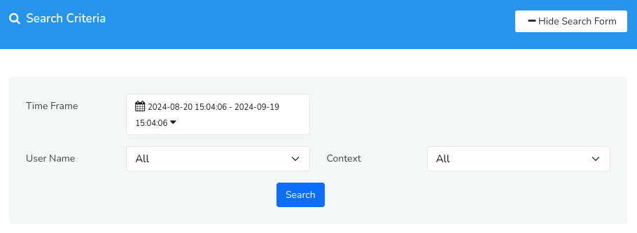
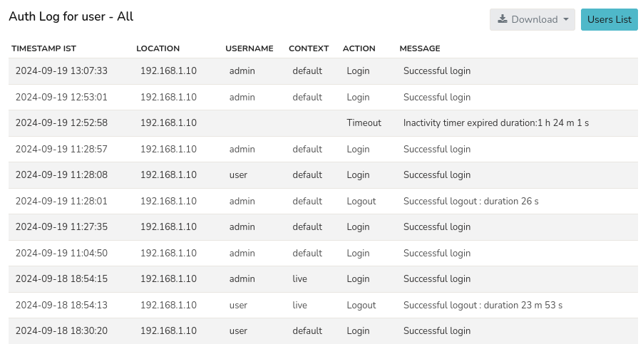

# Auth Log

The Auth log records and displays all login related activities including successful login, logout, inactivity, and timeout events to track and monitor user access activity.

:::info navigation
:point_right: Go to Web Admin:Manage&rarr; Auth Log
:::

## Search Criteria

Click on the [*Show Search Form*](/docs/ug/ui/elements#hide-show-search-form) to expand the *Search Criteria* Form for *Auth Log*. The *Search Criteria* form enables you to search for particular user/context at a selected time.

*Figure: Auth Log Search Criteria*

Provide the form with the search options using the following details.

| Option | Description |
|-------|---------------|
| Time Frame | Narrow down events by selecting a specific date and time range using the [*Time Selector*](/docs/ug/ui/elements#time-selector). |
| User Name | Select a user name from the dropdown to search for events associated with a specific user . |
| Context | Select a context from the dropdown to filter events by a particular context |

## Auth Log for User- All

By default the Auth log list displayed shows all the login related events. You can search for particular event by using the Search Criteria Form mentioned above.

*Figure: Auth Log List- All Users(Default)*

The Auth Log displays the table of following details and functionalities.

| Column | Description |
|--------|-------------|
| Timestamp IST | Displays the date and time of the authentication event in Indian Standard Time (IST) format. |
| Location | Shows the IP address from which the authentication event occured. |
| Username | Displays the username associated with the authentication event. |
| Context | Dsiplays the context on which the event occured. |
| Action | Describes the type of authentication event such as login, logout, and timeout. |
| Message | Provides a short message as an additional context of the action like succesful login, logout duration, or inactivity timer expired duration |

### Download

Click on the [*Donwload Button*] to download the list of auth logs in PDF, XLSV, or CSV formats.

### Users List

Click on the [*Users List*](/docs/ag/webadmin/manageusers) Button to view the list of all active users.