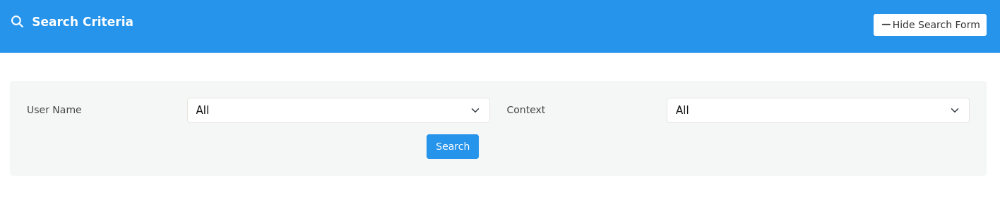
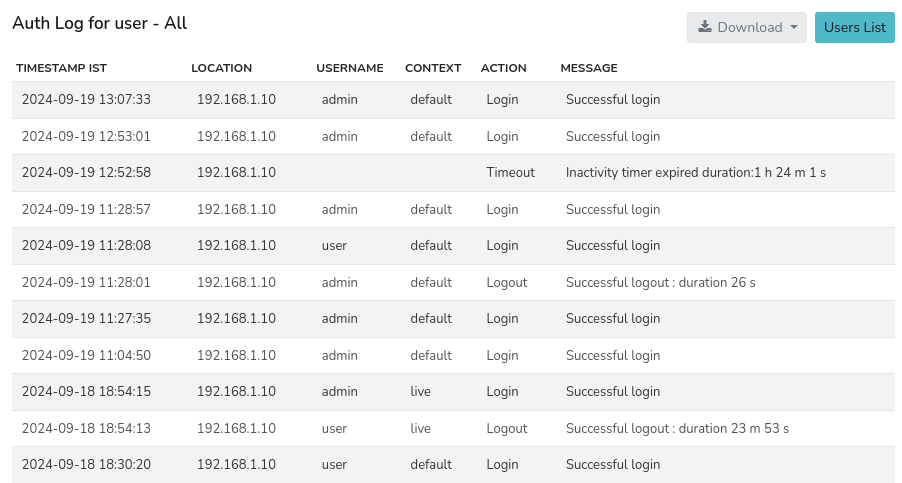

# Auth Log

The Auth Log records and displays all user authentication activities, providing a complete audit trail of user access. It logs successful and failed login attempts, login time, login IP address, login status, failure reasons, logout events, and inactivity timeouts, helping administrators monitor user activity and troubleshoot authentication issues.

:::info navigation
:point_right: Go to Web Admin:Manage&rarr; Auth Log
:::

## Search Criteria

Click on the [*Show Search Form*](/docs/ug/ui/elements#hide-show-search-form) to expand the *Search Criteria* Form for *Auth Log*. The *Search Criteria* form enables you to search for particular user/context and click **Search**.

*Figure: Auth Log Search Criteria*

Provide the form with the search options using the following details.

| Option | Description |
|-------|---------------|
| User Name | Select a user name from the dropdown to search for events associated with a specific user . |
| Context | Select a context from the dropdown to filter events by a particular context |

## Auth Log for User- All

By default the Auth log list displayed shows all the login related events. You can search for particular event by using the Search Criteria Form mentioned above.

*Figure: Auth Log List- All Users(Default)*

The Auth Log displays the table of following details and functionalities.

| Column | Description |
|--------|-------------|
| Timestamp IST | Displays the date and time of the authentication event in Indian Standard Time (IST) format. |
| Location | Shows the IP address from which the authentication event occured. |
| Username | Displays the username associated with the authentication event. |
| Context | Dsiplays the context on which the event occured. |
| Action | Describes the type of authentication event such as login, logout, and timeout. |
| Message | Provides a short message as an additional context of the action like succesful login, logout duration, or inactivity timer expired duration |

### Download

Click on the [*Download Button*](/docs/ug/ui/elements#download-button) to download the list of auth logs in PDF, XLSV, or CSV formats.

### Users List

Click on the [*Users List*](/docs/ag/webadmin/manageusers) Button to view the list of all active users.