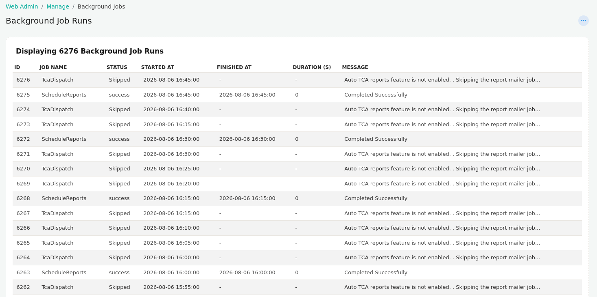

# Background Jobs

The **Background Jobs** page displays the execution history of scheduled background (cron) jobs running within Trisul. It provides visibility into job execution status, runtime, completion time, and any informational or error messages generated during execution, making it useful for monitoring scheduled tasks and troubleshooting failures.

:::info navigation

:point_right: Login as admin &rarr; Web Admin &rarr; Manage &rarr; Background Jobs

:::

  
*Figure: Background Jobs*

## Background Job Information

| Field | Description |
|-------|-------------|
| **ID** | Unique identifier assigned to each background job execution. |
| **Job Name** | Name of the scheduled background job that was executed. |
| **Status** | Current execution status of the job, such as **Success**, **Skipped**, or **Failed**. |
| **Started At** | Date and time when the job execution began. |
| **Finished At** | Date and time when the job completed. A value of `-` indicates the job did not complete or was skipped. |
| **Duration (s)** | Total execution time of the job in seconds. |
| **Message** | Detailed execution result, informational message, or error describing the outcome of the job. |

## Overview

The **Background Jobs** page provides a centralized view of scheduled task executions, allowing administrators to verify that periodic operations such as report generation, data synchronization, and maintenance tasks are running as expected. The **Message** column helps identify why a job succeeded, failed, or was skipped, making it easier to diagnose configuration issues or operational problems.