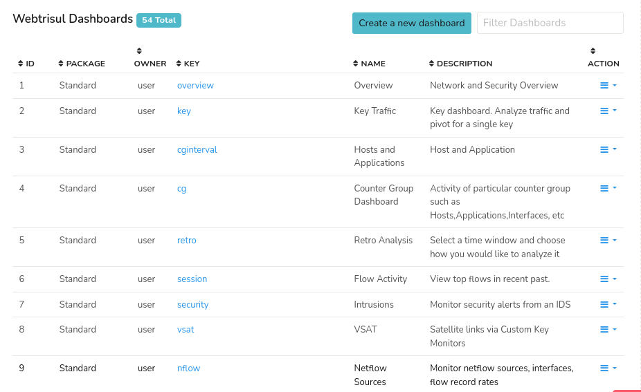

# Dashboards

## Overview

*Dashboards* in Admin section enables administrators to access a comprehensive list of all available dashboards in the UI, search and filter dashboards using various criteria, and manage dashboard configurations.

:::info navigation 
:point_right: Go to Web Admin: Manage&rarr; UI: Dashboards
:::

This will take you to the page where list of all available dashboards in the UI displayed as in the figure. The header contains the total number of dashboards count highlighted in blue (In Figure: 54 Total)

  
*Figure: All Dashboards*

The Dashboard details displayed in the table are as follows.

| Column  | Description |
|---------|-------------|
| ID      | The unique identifier number of the module. |
| Package | Name of the package that the module belongs to |
| Owner   | User name of the user who created the selected dashboard |
| Key     | 
| Name    | Name of the Dashboard |
| Description | Description of the selected Dashboard |
| Action  | A number of actions can be performed on the selected dashboard including customize, clone, delete, and export. |

> **Each column in the table is [column sortable](/docs/ug/ui/elements#column-sorter)**

### Action

**Customize**: Customize the selected dashboard's configurations.   
**Clone**: Creates an identical copy of the dashboard for creating variations of existing dashboard.   
**Delete**: Delete the selected dashboard.  

## Create a New Dashboard

Click *Create a New Dashboard* Button from the header to create a new dashboard from scratch. Fill out the fields to [create a new dashboard](/docs/ug/ui/create_dashboards#add-a-dashboard).

## Filter Dashboards
Enter a name of the dashboard on the *Filter Dashboards* Bar on the upper right hand side to narrow down the dashboards list using filtering.