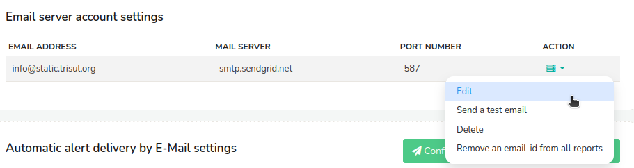
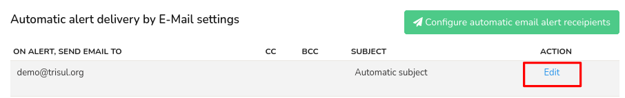

# Email Settings

This section explains the basic steps that are needed to configure email server and forward email alerts.

## Email Server Configuration

:::info navigation
:point_right: Go to Web Admin: Manage&rarr; Email Settings
:::

This is where you configure the email addresses that you want to be sent from and the recipient email addresses.
  

*Figure: Email Account Settings Module*
 
  
In this window, Click on *Configure email server*.  And a form with the following details opens up. By filling up the fields appropriately, you can configure an Email server using which Web Trisul will send outgoing mails.
  
| Fields                        | Description                                                                   |
| ----------------------------- | ----------------------------------------------------------------------------- |
| Email Server                  | Hostname or IP of the SMTP server                                             |
| SMTP Port Number              | SMTP Port (Usually 25. For Gmail use 587)                                     |
| Authentication Protocol       | Click from the drop down list of authenticaton protocols                                                                                                       |
| From Email Address            | This is displayed as the sender's address on the recipient's inbox                                                                                                           |
| Password/API Key              | Email Password,API Key,or Provider password like pepipost,sendgrid                                                                                               |
| Disable SSL Cert verification | Disable certificate verification. Eg, if your email server uses self signed certificates                                                                                                    |
| SMTP Relay User (optional)    | Use this to send SMTP email via relays like sendgrid,mailchimp,pepipost etc. This is the user id given to you by the provider. Leave it blank if not required                                |

Once providing all the fields, Click *Save* and the email server configuration for outgoing mails is done.

As you click *Save*, you can see the configured email server account settings as in the figure.

*Figure: Configured Email Accounts* 

It contains the details of email server configuration as in the following.
| Column | Description |
|--------|-------------|
| Email Address | This address will be displayed in the "From" field of emails sent by Web Trisul. |
| Mail Server | Host name of the SMTP server that handles the outgoing mails. |
| Port Number | Port number used by mail server for outgoing emails. |
| [Action](/docs/ag/webadmin/emailsettings#action) | Dropdown options to performa a number of actions including edit, delete, send a test mail, and remove an email id from all reports. |

### Action

i) **Edit**: Click to modify the configured email server settings.  
ii) **Send a Test Mail**: Click to send a test mail to verify successful configuration.  
iii) **Delete**: Click to delete the selected email server configuration setting.  
iv) **Remove an Email ID from All Reports**: Click to exclude the selected email id from reports.  

## Ensure Who Receives the Alert Emails
  
Again, from the Email server account settings, Click *Configure automatic email alert recipients*. This is where you specify where to send emails when alerts fire. 
  
Provide the following fields to configure automatic email alert delivery to the recipients.
  
| Fields                   | Descriptions                                                                      |
| ------------------------ | --------------------------------------------------------------------------------- |
| Send alerts via email To | Email address of receiver. You can only enter one address, use cc to add multiple |
| Cc                       | Add multiple recipient addresses seperated by comma(,)                            |
| Bcc                      | Add multiple recipient addresses seperated by comma(,)                            |
| Signature                | Enter a block of text that can be automatically appended to the end of your email |
  
Once providing all the fields, Click *Save* and the configuration for automatic email alert delivery to the recipients is done!

### Edit Configured Email Alert Recipients

You can modify the configured email alert recipients by clicking on the *Edit* Button.

*Figure: Edit Email Alerts Receipients*

