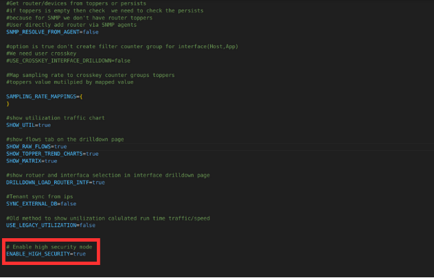

# High Security

## Overview
Trisul's VAPT feature, when enabled in OEM settings, protects your system against various vulnerabilities, including:

- Cross-Site Scripting (XSS)
- SQL injection
- Unexpected errors
- Unprotected credentials

## Functionality
When enabled, Trisul's VAPT feature:

- Detects and blocks XSS attacks, logging the offending code and redirecting users to an error page.
- Neutralizes SQL injection attacks by detecting and blocking suspicious SQL syntax, logging the attempt and redirecting users to a secure error page.
- Conceals sensitive information, such as socket paths and code errors, on error pages to prevent exposure.
- Enforces strict password policies, requiring a combination of characters, numbers, and special characters.
- Prevents saving credentials for the login page, adding an extra layer of security.

  
*Figure: High Security Enabled*

By default Trisul's High Security feature will not be enbaled. You can activate High Security by enabling the mode with `ENABLE_HIGH_SECURITY=true` in OEM settings.

