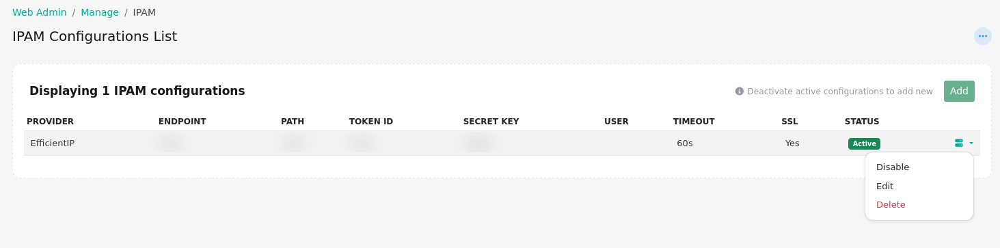
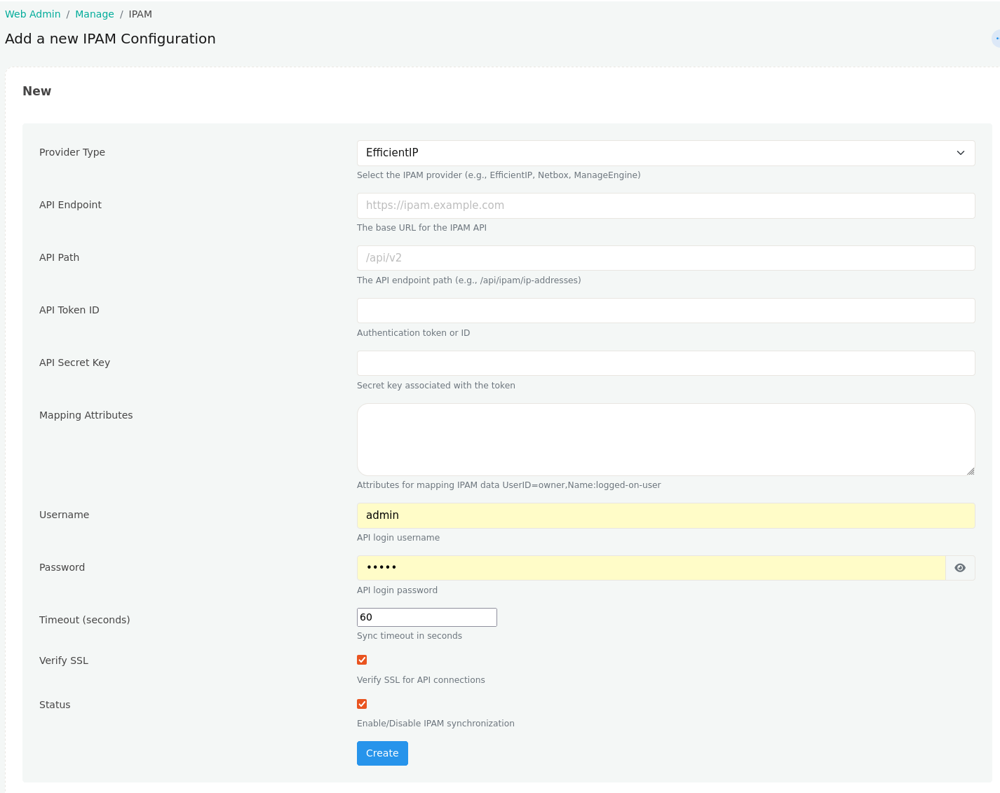

# IPAM

The **IPAM** page allows you to configure integration with an external IP Address Management (IPAM) platform. Once configured, Trisul synchronizes IP address metadata from the configured IPAM server, allowing IP ownership and related information to be displayed throughout the platform.

:::info navigation

:point_right: Login as admin &rarr; Web Admin &rarr; Manage &rarr; IPAM

:::

  
*Figure: IPAM Configurations Table*  

## IPAM Configuration Information

| Field | Description |
|-------|-------------|
| **Provider** | Name of the configured IPAM provider (for example, EfficientIP, NetBox, or ManageEngine). |
| **Endpoint** | Base URL of the configured IPAM server. |
| **Path** | API endpoint path used to communicate with the IPAM server. |
| **Token ID** | Authentication token identifier used to access the IPAM API. |
| **Secret Key** | Secret key associated with the configured authentication token. |
| **User** | Username used to authenticate with the IPAM server, if applicable. |
| **Timeout** | Maximum time allowed for API requests before they time out. |
| **SSL** | Indicates whether SSL certificate verification is enabled for the IPAM connection. |
| **Status** | Displays whether the IPAM configuration is currently **Active** or **Inactive**. |

## Available Actions

Each IPAM configuration provides the following management options:

| Action | Description |
|--------|-------------|
| **Add** | Create a new IPAM configuration. The **Add** option is available only when there is no active IPAM configuration. |
| **Edit** | Modify the settings of an existing IPAM configuration. |
| **Disable** | Deactivate the currently active IPAM configuration, allowing another configuration to be activated. |
| **Delete** | Permanently remove the IPAM configuration from Trisul. |

> Only one IPAM configuration can be active at a time. To create and activate a new IPAM configuration, first disable the currently active configuration.

## Creating a New IPAM Configuration

Click **Add** to create a new IPAM configuration.

  
*Figure: Creating a new IPAM configuration*

### Configuration Fields

| Field | Description |
|-------|-------------|
| **Provider Type** | Select the IPAM provider to integrate with (for example, EfficientIP, NetBox, or ManageEngine). |
| **API Endpoint** | Base URL of the IPAM server. |
| **API Path** | API endpoint path used for communication with the IPAM server. |
| **API Token ID** | Authentication token or API token identifier. |
| **API Secret Key** | Secret key associated with the authentication token. |
| **Mapping Attributes** | Maps attributes received from the IPAM server to Trisul fields. Multiple mappings can be configured using key-value pairs. |
| **Username** | Username used to authenticate with the IPAM server. |
| **Password** | Password used for authentication. |
| **Timeout (seconds)** | Maximum time Trisul waits for the IPAM server to respond before the request times out. |
| **Verify SSL** | Enables SSL certificate validation when connecting to the IPAM server. Disable only if using self-signed certificates in trusted environments. |
| **Status** | Enables or disables the IPAM synchronization configuration. |
| **Create** | Saves the configuration and creates the IPAM integration. |