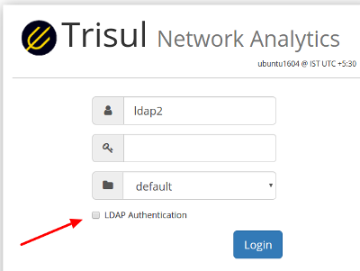

# LDAP Login

The LDAP (Lightweight Directory Access Protocol) is a login option that
authenticates users against an LDAP server.

There are two steps to setting up a user to login via LDAP

1. Configure LDAP domain
2. Create a user and specify he/she be authenticated against an LDAP
   domain

After you have created a LDAP Domain , a checkbox called “LDAP
Authentication” appears at the login screen as shown below.

  
*Figure: If you configure an LDAP domain, a checkbox will be shown on the login
page*

## View LDAP Domains

This page shows a list of LDAP domains configured in Trisul.

:::info navigation

:point_right: Login as admin and select Web Admin &rarr; Manage &rarr; LDAP Domain

:::

A list of configured domains is shown with the following details

1. Domain name : the default domain which cannot be deleted is called
   *Local authentication* this is for normal users who will be able to
   login without LDAP
2. Server / Port
3. User name: this is used to bind to the LDAP server
4. Base DN : under which users are queried
5. Filter : the username is taken from this attribute, usually the `mail`

### LDAP Domain Options

For each LDAP domain shown, the following options are shown at the right
side of each row.

| Option               | Description                                                                  |
| -------------------- | ---------------------------------------------------------------------------- |
| Edit                 | Modify this LDAP domain entry                                                |
| Delete               | Delete the LDAP domain without deleting the users                            |
| Check authentication | Check if Trisul is able to successfully bind with the LDAP server            |
| Sync users           | **Synchronize Users** - contact the LDAP domain server and query for users with the *Sync Users Filter* parameter then add all the users to Trisul with the username taken from the *Search Filter*. At the end of the synchronize operation you should be able to see all the users added under *Manage &rarr; Users* |
| Delete synced users  | Only delete the users automatically added by an earlier “Sync Users” operation. You can then go back and synchronize or manually add LDAP users                                               |
| Search               | Searches for entries in a LDAP directory tree                                |

### Synchronize Users from LDAP

This feature allows Trisul to automatically query a LDAP directory using
a particular attribute value then create users in Trisul based on its
results. You do not have to manually create users and associate them to
a LDAP domain.

1. Login and bind to the LDAP server using the connection details
2. Using the *Sync Users Filter* string a LDAP search filter is
   constructed
3. An LDAP search is performed
4. In the returned user matches the user name is extracted from the
   *Search Filter* field. This is usually like mail or uid
5. Trisul users are then created using this information.

## Configure LDAP Domain

The first step is to configure the LDAP domain against which the
authentication will be done.

:::info navigation

:point_right: Login as admin and select Web Admin &rarr; Manage &rarr; LDAP Domain and Click Add Domain

:::

Fill in the details as shown below.

| Field                         | Description                                                                |
| ----------------------------- | -------------------------------------------------------------------------- |
| Domain Name                   | A descriptive name given to this LDAP domain                               |
| Domain Server                 | DNS name or IP address of the LDAP Domain Server                           |
| Port                          | LDAP port number, usually 389. If using secure LDAP , LDAPS use 636        |
| Use SSL                       | Check if box is using LDAPS. LDAP over SSL/LDAP. If this option is checked, ensure the *Port* is set correctly                                                                           |
| Disable SSL Cert verification | When using LDAPS (LDAP over SSL/TLS) if the server is not using a certificate issued by a valid root certificate authority the SSL connection can fail. Check this box to disable SSL certificate verification.                                                                                    |
| Connection Login Name         | User name of the account used to connect to the LDAP server. All query operations will use this name.                                                                               |
| Connection Password           | Password for the connection login name                                     |
| Base DN                       | Base DN or Search DN refers to the structure of the LDAP server against which searches will be performed.                                                                                  |
| Search Filter                 | The actual attribute name that is used to match the user. Examples : `email` or `uid` `dn` `cn`. If you specify `email` then the username would have to be the email ID eg `email=tim@company.com` |
| Sync Users Filter             | When LDAP is used to automatically synchronize use from the LDAP server, query users with this filter and automatically add them to Trisul (only used if you want to automatically synchronize users from LDAP directory, if you want to add users manually leave this blank)                               |
| Login with user bind only          | If checked, the LDAP login process only uses the user name to bind rather than the default way of using the connection user name and password first and then bind the user                  |
| Append to username            | The string specified in this field will automatically appended to the user name. A features to help the user avoid typing the full login names. For example : if you set this to *`unitedfederalbankname.com_ then the user who had to type  _mike`unitedfederalbankname.com* only has to type *mike* at the login screen                                                                                          |

## Create a LDAP Enabled User

Next you need to create a new LDAP user.

:::info navigation

:point_right: Login as admin and select Web Admin &rarr; Manage &rarr; Users &rarr; New User

:::

> You can also use the Synchronize Users to automatically search and add
> users from LDAP. See *Synchronize users from LDAP*

Here there are two options

| Option            | Description                                                         |
| ----------------- | ------------------------------------------------------------------- |
| LDAP Only login   | The user can only login via LDAP auth and not have a local password |
| LDAP + Local auth | The user can choose to login locally or via LDAP auth               |

As per your company policy you can choose to create any one of the two
types of users.

## Admin User is Always Local

The super admin user with login name = *admin* always uses a local
login.

## Login Mode

After you create a LDAP Domain, the login screen will show a checkbox
called “LDAP authentication”.

1. **For users with LDAP Only auth** — they have no choice but to enter
   their LDAP password
2. **For users with LDAP or Local auth** — if they do not check the
   “LDAP authentication” checkbox they will use the local
   login/password.

## Troubleshooting

If you experience errors you can try the following.

1. Test the LDAP domain by clicking the *Check Authentication* like on
   the *Options* link
2. Login using a LDAP enabled user and check the “LDAP Authentication”
   check box
3. Then check the Webtrisul log file for errors using *Manage &rarr; Web
   Server Logs &rarr; Web server logs*
