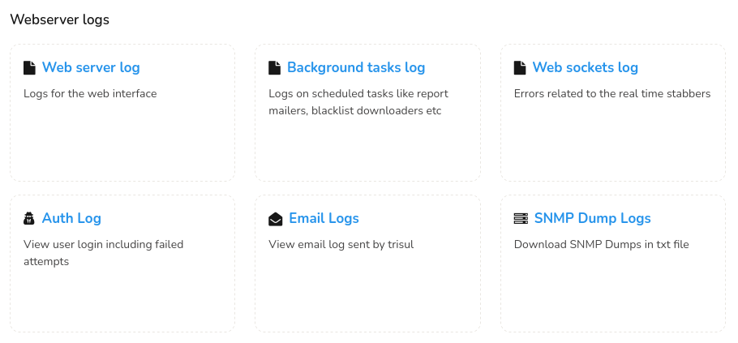
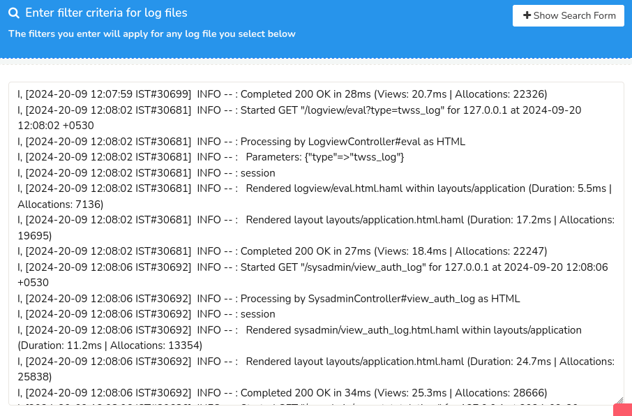
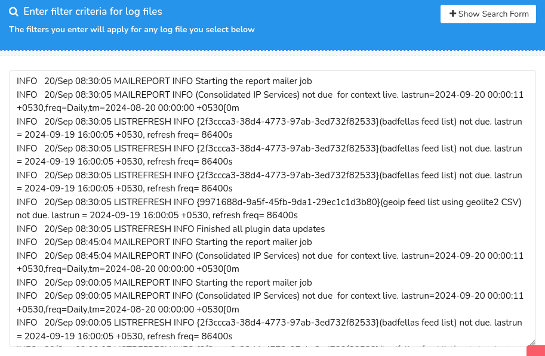
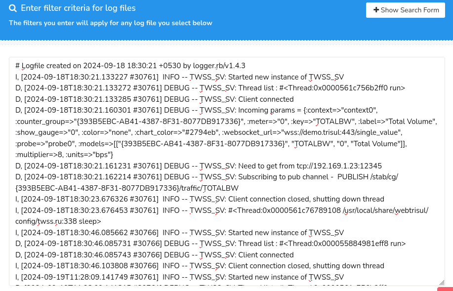
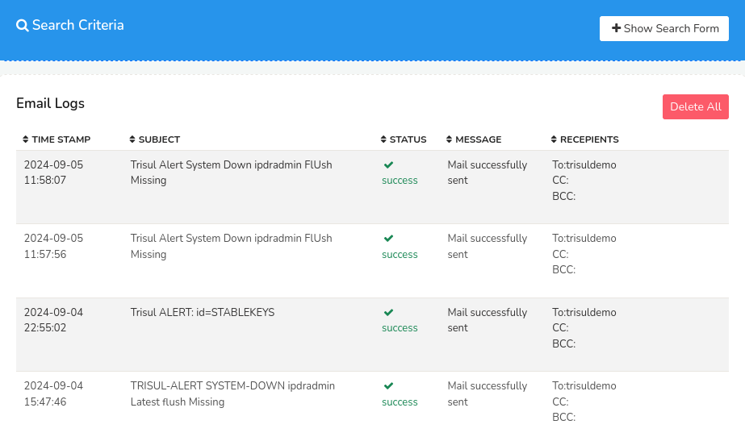

# Web Server Logs

Trisul provides access to various logs through the web interface to facilitate troubleshooting. The following log types are available for monitoring:

| Log Type | Description |
|----------|-------------|
| Web Server Log | Displays logs specific to the Trisul web server. |
| Background Tasks Log | Provides logs for scheduled tasks, including report mailers, blacklist downloaders. You can use this to check status of automatic downloads of threat intelligance, geo, and various other lists. |
| Web Sockets Log | Captures errors related to real-time stabbers. |
| Auth Log | Records user login attempts, including successful and failed logins. |
| Email Log | Displays email logs sent by Trisul. |
| SNMP Dump Log | Allows download of SNMP dumps for advanced debugging purposes. |

## Viewing Web Server Logs

:::info navigation
:point_right: Login as admin and select Web Admin → Manage → Web Server Logs
:::

Select the type of log you would like to view from the list of log categories.

  
*Figure: Web Server Logs*

### Web Server Log

Click *Web Server Log* to view the logs as in the figure. 

  
*Figure: Web Server Logs*

To search for a particular log from the log entries, click on the [*Show Search Form*](/docs/ug/ui/elements#hide-show-search-form) to open up the search criteria form. Search and locate a particular log by filling in the following fields.

#### Search Criteria

| Field | Description |
|-------|-------------|
| Show All Messages Above Level | Click on the dropdown to view the list of severity levels including all, fatal, alert, crit, error, warn, notice, info and debug.  Select a severity level to display the logs that pertain above the selected level of severity. |
| Number of Lines to Display | Click on the dropdown to select a number to display that many lines on the page. |
| Filter | Enter a string to display the log entries containing that particular string. |

And, Click *Search* to view the web server log entry.

## Background Tasks Log

Click *Background Tasks Log* to view the background tasks log entries as in the figure.

  
*Figure: Background Tasks Log*

To search for a particular log from the background tasks log entries, click on the *Show Search Form* and fill in the [search criteria form](/docs/ag/webadmin/logs#search-criteria).

## Web Sockets Log

Click *Web Sockets Log* to view the web socket log entries as in the figure.

  
*Figure: Web Socket Logs*

To search for a particular log from the web socket log entries, click on the *Show Search Form* and fill in the [search criteria form](/docs/ag/webadmin/logs#search-criteria).

## Auth Log 

See : [Auth Log](/docs/ag/webadmin/authlog)

## Email Logs

Click *Email Logs* to view the email logs sent by Trisul.

  
*Figure: Email Logs*

To search for particular email logs, click on the *Show Search Form* and select the time range using the [*Time Selector*](/docs/ug/ui/elements#time-selector) to narrow down the email log entries in the selected time range.

The email logs contain the following details.
| Column | Description |
|--------|-------------|
| Time Stamp | Displays the date and time when the alert mail has been sent to the recipient. |
| Subject | Contains the subject of the email sent |
| Status | Displays the status of the sent mail to ensure successful alert delivery |
| Message | Shows a short message on the status of the mail delivery with additional context |
| Recipients | Displays a list of recipients who received emails sent by Trisul. |

## SNMP Dump Logs

You can simply click on the *SNMP Dump Logs* button to download the SNMP dumps as a text file. 

## Viewing Probe and Hub Logs

Hub and Probe logs represent the actual Trisul processes running
processing network traffic. They are linked to a particular context. To
view Hub and Probe logs

:::info navigation

:point_right: Login as admin and select Context: default &rarr; Admin Tasks &rarr; Start/Stop
Tasks

:::

This shows the list of hubs and probes. To view Hub and Probe logs click
on the *More Options* link and select the view options link as shown
below.

*Figure: View Options in Hubs and Probes*

## Log Directory

If you want the raw webserver log it can be found on the Trisul Hub
server at `/usr/local/var/log/trisul-hub/webtrisul`  
The files are named production.log or productionssl.log (if you are
running webtrisul on HTTPS)

Also see `trisbashrc:“/docs/ref/trisbashrc.html` which contains helper
aliases to locate various log files on the probe and hub server systems.
