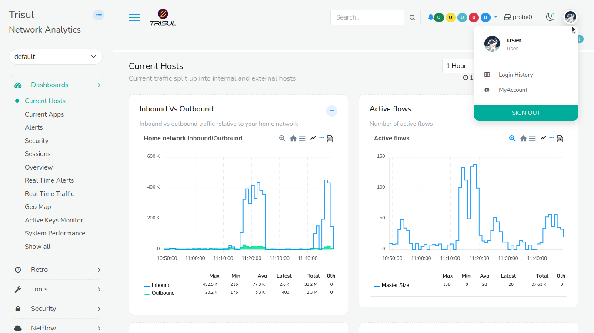
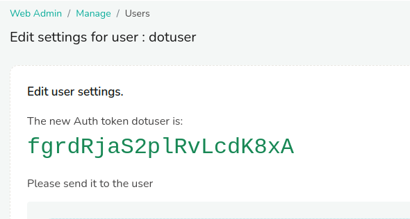
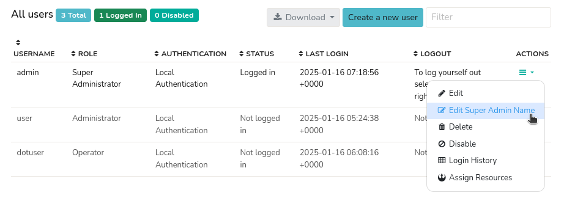
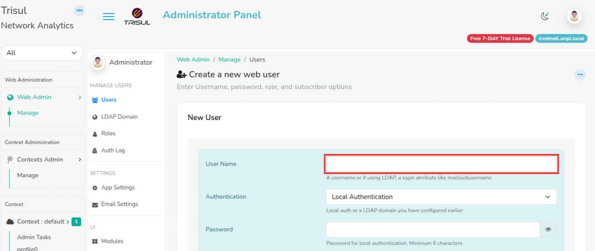
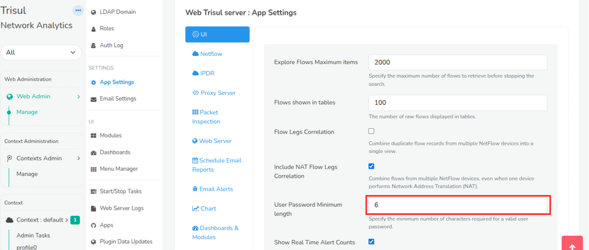

# Users

Manage users and their access levels.

## Types of Users

A brand new install of Trisul has two users pre-provisioned

- **admin** - username `admin` and password `admin`

The `admin` login must be used to perform all tasks that involve system
configuration change, starting and stopping Trisul processes, user and
role management.

- **user** - username `user` and password `user`

The `user` login is for all other operations like viewing and scheduling
reports, packet analysis, viewing alerts, and pretty much everything
else a normal operator would do on a regular basis.

## Create a New User

Login as `admin` user to create a new user

:::info 

:point_right: Select Web Admin &rarr; Manage &rarr; Users

:::

* A list of current users is shown  
* Click **Create a new user** button  
* Fill up details below

| Field                | Description                                                         |
| -------------------- | ------------------------------------------------------------------- |
| User Name            | The long name of user                                               |
| Name                 | Login name for user, no spaces, keep it short                       |
| Role                 | Webtrisul user Roles .See [Roles](userroles) section for more  |
| LDAP Login           | User can use [LDAP](/docs/ag/webadmin/ldap_login) password to login |
| Password             | Password for user                                                   |
| Password Again       | Repeat the password again                                           |
| Allow multiple Login | Allow concurrent login option to user. The default is `true` which means concurrent logins are allowed.  When set to `false`  If a user logs in with an ID that is already logged in, the older login session will be terminated.|
| Default Home Page    | If set, when user logs in he/she is taken to this page. Any page not just Dashboard can be set as the Default Home Page. The user can also set this themselves by pressing the Home :house: icon. |
| Default Dashboard    | If set, When user logs in he/she is taken directly to this dashboard. If Default Home Page is also set, that has a higher priority and that is used instead. |
| Allowed Context      | Restrict user to these selected contexts only|
| Change User Avatar | Click to choose file and upload the avatar to set it as user avatar. This shows in the top right of the page. |

:::note For LDAP Users

For LDAP Login User Name should be LDAP filter attribute value.  
For Example if you specified `Email` as filter attribute in LDAP domain
configuration then you need to enter the users email attribute  in the  User Name field.

:::

### Changing Avatar Logo

:::info 

:point_right: Select Web Admin &rarr; Manage &rarr; Users &rarr; Change Avatar Logo

:::

Click choose file and upload the avatar to set it as user avatar. The figure shows the user avatar.

  
*Figure: Avatar Logo*   

## Edit Existing User

Login as `admin` user to create a new user

:::info navigation

:point_right: Select Web Admin &rarr; Manage &rarr; Users

:::

- Click the **Edit** link

- Edit the fields described as under “Add User”

#### Reset Password

Click the `Reset password` button at bottom left side in **Edit User**
form to reset password. You will be shown the new automatically
generated password. Please send it to the user and have them create a
new password immediately on login.

## Delete User

You have to have admin rights as well as the user you are trying to
delete must be logged off.

Login as `admin` user to create a new user

:::info navigation

:point_right: Select Web Admin &rarr; Manage &rarr; Users

:::

Click the **Delete** link next to the user

## Change Own Password

- Click the [*Account button*](/docs/ug/ui/userlayout#account) to open the dropdown menu at the upper right hand side of the page.

- Click *My Account*

- Click **Change Password** button to change the password.

## Reset password by admin

The `admin` user can reset the password of any user.

:::info navigation
:point_right: Select Web Admin &rarr; Manage &rarr; Users &rarr; Select Edit against any user 
:::

Select "Reset Password" from the Admin Operations menu button on the top right corner.

## Generate API Token

Trisul supports login as well as API access using a login token for any user you choose.

:::info navigation
:point_right: Select Web Admin &rarr; Manage &rarr; Users &rarr; Select Edit against any user 
:::

Select *Generate Login* Token from the *Admin Operations* menu on the top right.

You will get a API Token like this, you need to copy and share it with the user. This will not be displayed again.

*Figure: API Token for user* 

## Changing Super Admin Name

:::info navigation
:point_right: Select Web Admin &rarr; Manage &rarr; Users &rarr; Select Action button against admin user.
:::

  
*Figure: Changing Super Admin Name*

To modify the admin name to "Super Admin", navigate to the Action button and select "Edit Super Admin Name" from the dropdown menu. This will prompt a dialog box, allowing you to edit the admin name. Enter the desired name, click "Update", and the changes will be reflected immediately, displaying the updated name in the top right corner of the admin user name section.

## Username Guidelines

  
*Figure: Showing Username in Webadmin*

- There are no specific constraints for choosing a username.
- You may use any username that is not already taken.

## Password Guidelines

  
*Figure: Showing Password Minimum Length in Webadmin*

- There are no restrictions on the characters you can use in your password.
- Passwords are **case-sensitive**.
- You can include repeated characters, special characters, numbers, or any combination.
- The only password constraint is the minimum number of characters i.e.length which can be customized through the [**Web Trisul server : App Settings**](/docs/ag/webadmin/web_options#ui) and specify the minimum number of characters by specifying in the "User Password Minimum length".

## Password Policy

- For security reasons, we do **not** store previously entered passwords.
- Passwords do **not** expire.
- You can reset your password at any time using [**Reset Settings**](/docs/ag/webadmin/manageusers#reset-password-by-admin)