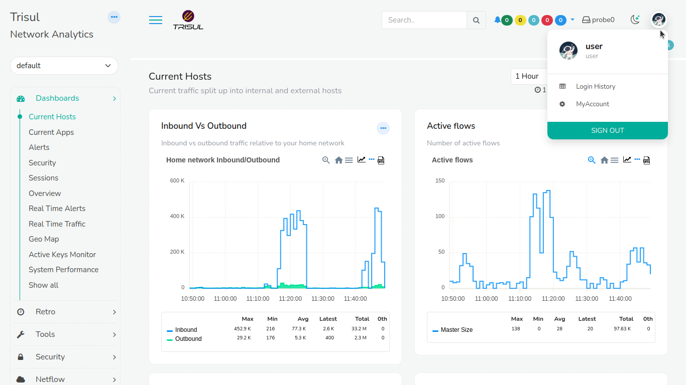
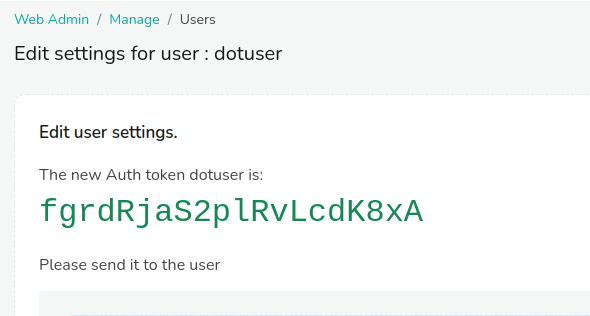
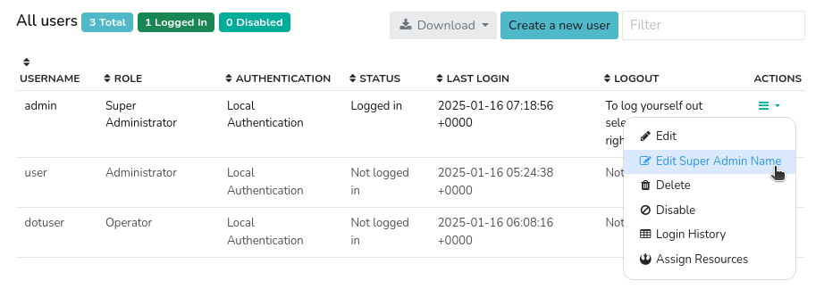
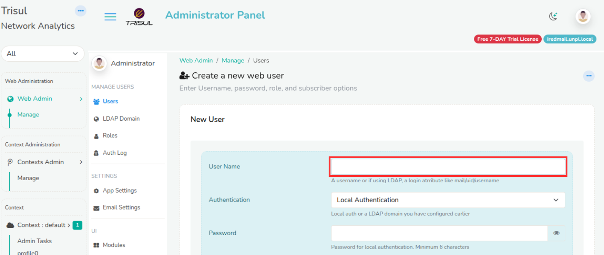
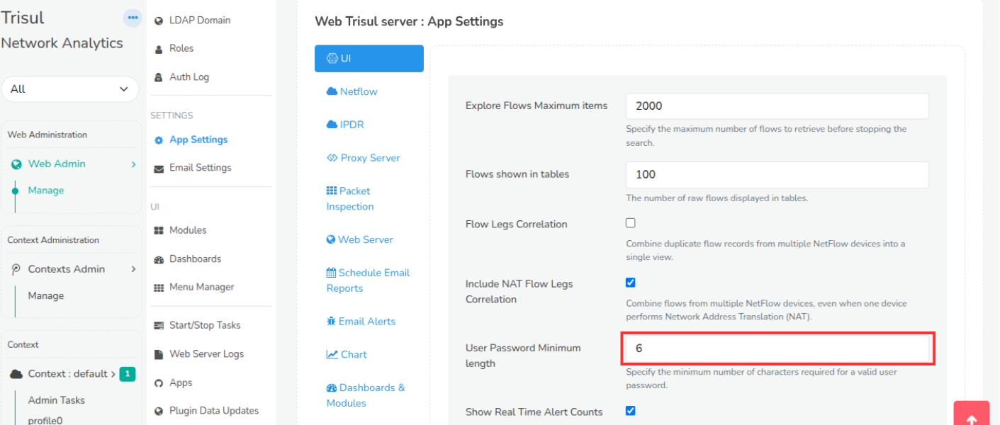
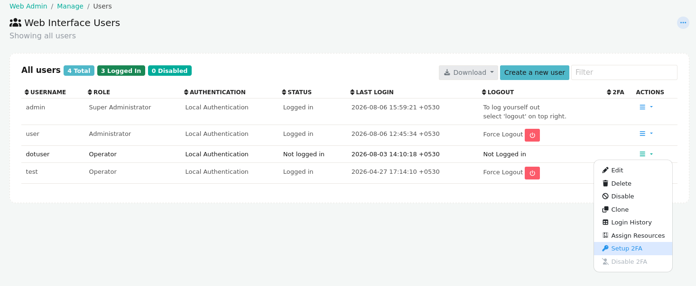
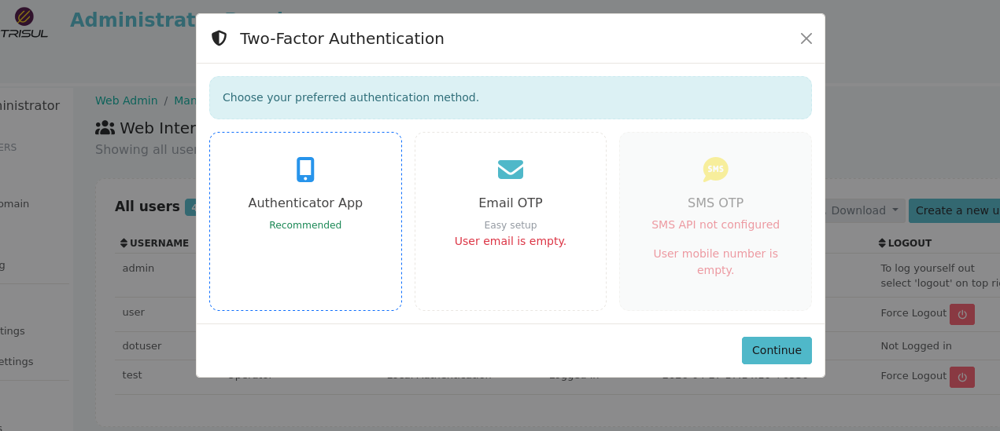

# Users

Manage users and their access levels.

## Types of Users

A brand new install of Trisul has two users pre-provisioned

- **admin** - username `admin` and password `admin`

The `admin` login must be used to perform all tasks that involve system
configuration change, starting and stopping Trisul processes, user and
role management.

- **user** - username `user` and password `user`

The `user` login is for all other operations like viewing and scheduling
reports, packet analysis, viewing alerts, and pretty much everything
else a normal operator would do on a regular basis.

## Create a New User

Login as `admin` user to create a new user

:::info 

:point_right: Select Web Admin &rarr; Manage &rarr; Users

:::

* A list of current users is shown  
* Click **Create a new user** button  
* Fill up details below

| Field                | Description                                                         |
| -------------------- | ------------------------------------------------------------------- |
| User Name            | The long name of user                                               |
| Authentication       | User can use [LDAP](/docs/ag/webadmin/ldap_login) password to login |
| Password             | Password for local authentication of the user                       |
| Password Again       | Repeat the password again                                           |
| Full Name            | Login name for user, no spaces, keep it short                       |
| Email                | (Optional) Email address associated with the user account. Required only when using Email OTP as the Two-Factor Authentication (2FA) method.                     |
| Mobile Number        | (Optional) Mobile number associated with the user account. Required only when using SMS OTP as the Two-Factor Authentication (2FA) method.                     |
| Role                 | Webtrisul user Roles .See [Roles](userroles) section for more  |
| Allow multiple Login | Allows concurrent login option to user. The tickbox is checked by default which means concurrent logins are allowed.  When unchecked, If a user logs in with an ID that is already logged in, the older login session will be terminated.|
| Default Dashboard    | If you set a Default Dashboard, the user will be taken directly to that dashboard after logging in. |
| Default Home Page URL | If you set a Default Home Page URL, that takes priority over the Default Dashboard. After logging in, the user will be taken to the specified page (it can be any page, not just a dashboard).  Users can also set their own home page by clicking the Home 🏠 icon from within their dashboards. |
| Allowed Context      | Restrict user to these selected contexts only|
| Change User Avatar   | Click to choose file and upload the avatar to set it as user avatar. This shows in the top right of the page. |

:::note For LDAP Users

For LDAP Login User Name should be LDAP filter attribute value.  
For Example if you specified `Email` as filter attribute in LDAP domain
configuration then you need to enter the users email attribute  in the  User Name field.

:::

### Changing Avatar Logo

:::info 

:point_right: Select Web Admin &rarr; Manage &rarr; Users 

:::

Click on the **Edit** option (from the action button) against the user and in the  **Change User Avatar** field Click **Browse** to choose a file and upload the avatar to set it as user avatar. The figure below shows the user avatar.

  
*Figure: Avatar Logo*   

## Edit Existing User

Login as `admin` user to create a new user

:::info navigation

:point_right: Select Web Admin &rarr; Manage &rarr; Users

:::

Click the **Edit** option (from the action button dropdown) against the user and modify the fields.

#### Reset Password

In the **Admin Operations** button from the top right corner, click the **Reset password** option. You will be shown the new automatically
generated password (This can be viewed only once). Please send it to the user and have them create a new password immediately on login.

## Delete User

You have to have admin rights as well as the user you are trying to
delete must be logged off.

Login as `admin` user to create a new user

:::info navigation

:point_right: Select Web Admin &rarr; Manage &rarr; Users

:::

Click the **Delete** option (from the action button dropdown) against the user

## Change Own Password

- Click the [*Account button*](/docs/ug/ui/userlayout#account) at the upper right hand side of the page to open the dropdown menu and
- Click *My Account*  
- Click **Change Password** button to change your password.  

## Reset password by admin

The `admin` user can reset the password of any user.

:::info navigation
:point_right: Select Web Admin &rarr; Manage &rarr; Users &rarr; Select **Edit** (from the action button dropdown) against any user. 
:::

Select **Reset Password** from the Admin Operations menu button on the top right corner.

## Generate API Token

Trisul supports login as well as API access using a login token for any user you choose.

:::info navigation
:point_right: Select Web Admin &rarr; Manage &rarr; Users &rarr; Select **Edit** (from the action button dropdown) against any user.
:::

:::info navigation
Select **Generate Login Token** from the **Admin Operations** menu on the top right.
:::

You will get a API Token like the one shown in the figure below, you can copy and share it with the user.  

*Figure: API Token for user* 

This token can be viewed again by 
:::info navigation
:point_right: Clicking **View Login/API Token** from the **Admin Operations** menu on the top right.
:::

## Changing Super Admin Name

:::info navigation
:point_right: Select Web Admin &rarr; Manage &rarr; Users &rarr; Select Action button against admin user.
:::

  
*Figure: Changing Super Admin Name*

To change the Superadmin username, click the **Action button** next to it and select **Edit Super Admin Name**. In the dialog box, enter the new name, click **Update**, and the change will appear immediately in the top-right username display.

## Username Guidelines

  
*Figure: Showing Username in Webadmin*

- There are no specific constraints for choosing a username.
- You may use any username that is not already taken.

## Password Guidelines

  
*Figure: Showing Password Minimum Length in Webadmin*

- There are no restrictions on the characters you can use in your password.
- Passwords are **case-sensitive**.
- You can include repeated characters, special characters, numbers, or any combination.
- The only password constraint is the minimum number of characters i.e.length which can be customized through the [**Web Trisul server : App Settings**](/docs/ag/webadmin/web_options#ui) and specify the minimum number of characters by specifying in the "User Password Minimum length".

## Password Policy

- For security reasons, we do **not** store previously entered passwords.
- Passwords do **not** expire.
- You can reset your password at any time using [**Reset Settings**](/docs/ag/webadmin/manageusers#reset-password-by-admin)

## Configure Two-Factor Authentication (2FA)

Trisul allows administrators to enable **Two-Factor Authentication (2FA)** for individual users, providing an additional layer of security during login. Users can authenticate using one of the supported verification methods, depending on the system configuration.

:::info Configure 2FA for a User

1. Navigate to **Web Admin &rarr; Manage &rarr; Users**.
2. Locate the required user.
3. Click the **Actions** menu.
4. Select **Setup 2FA**.

:::

  
*Figure: Navigation to 2FA Setup*

## Select an Authentication Method

The setup wizard displays the available authentication methods. The methods shown depend on the system configuration and the user's account information.

  
*Figure: Selecting 2FA Method*

The available authentication methods are described below.

| Authentication Method | Description |
|-----------------------|-------------|
| **Authenticator App** | Uses a Time-based One-Time Password (TOTP) application such as Google Authenticator, Microsoft Authenticator, or Authy. This is the recommended authentication method. |
| **Email OTP** | Sends a one-time verification code to the user's registered email address. This option is available only if the user has a valid email address configured. |
| **SMS OTP** | Sends a one-time verification code to the user's registered mobile number using the configured SMS gateway. This option is available only if SMS gateway settings are configured and the user has a registered mobile number. |

If a required prerequisite is missing, the corresponding authentication method is displayed as unavailable.

### Configure Authenticator App

1. Select **Authenticator App** and click **Continue**.
2. A QR code is generated for the user account.
3. Open your preferred authenticator application.
4. Add a new account by scanning the displayed QR code.
5. Enter the six-digit verification code generated by the authenticator application.
6. Click **Enable** to activate Two-Factor Authentication.

After successful verification, the user must provide a valid authenticator code during every login.

### Configure Email OTP

1. Select **Email OTP** and click **Continue**.
2. Verify that the displayed email address is correct.
3. Click **Send Email OTP**.
4. Retrieve the verification code sent to the registered email address.
5. Enter the six-digit verification code.
6. Click **Enable**.

The user will receive an email-based one-time password whenever authentication is required.

### Configure SMS OTP

1. Select **SMS OTP** and click **Continue**.

If SMS notifications are configured and the user has a registered mobile number, Trisul sends a one-time verification code to the user's mobile device.

2. Request the SMS verification code.
3. Enter the received verification code.
4. Click **Enable**.

> **SMS OTP** is available only when:
> - An active SMS gateway has been configured under [**Web Admin → Manage → SMS Configurations**](/docs/ag/webadmin/smsconfig).
> - The user account has a valid mobile number configured.

### Disable Two-Factor Authentication

To disable Two-Factor Authentication for a user:

:::info Disable 2FA for a User

1. Navigate to **Web Admin → Manage → Users**.
2. Click the **Actions** menu for the required user.
3. Select **Disable 2FA**.

:::

Once disabled, the user will authenticate using their configured primary authentication method without requiring a second verification factor.