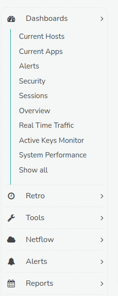
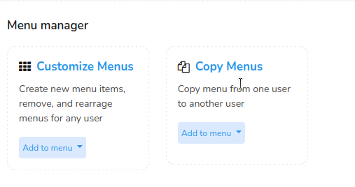
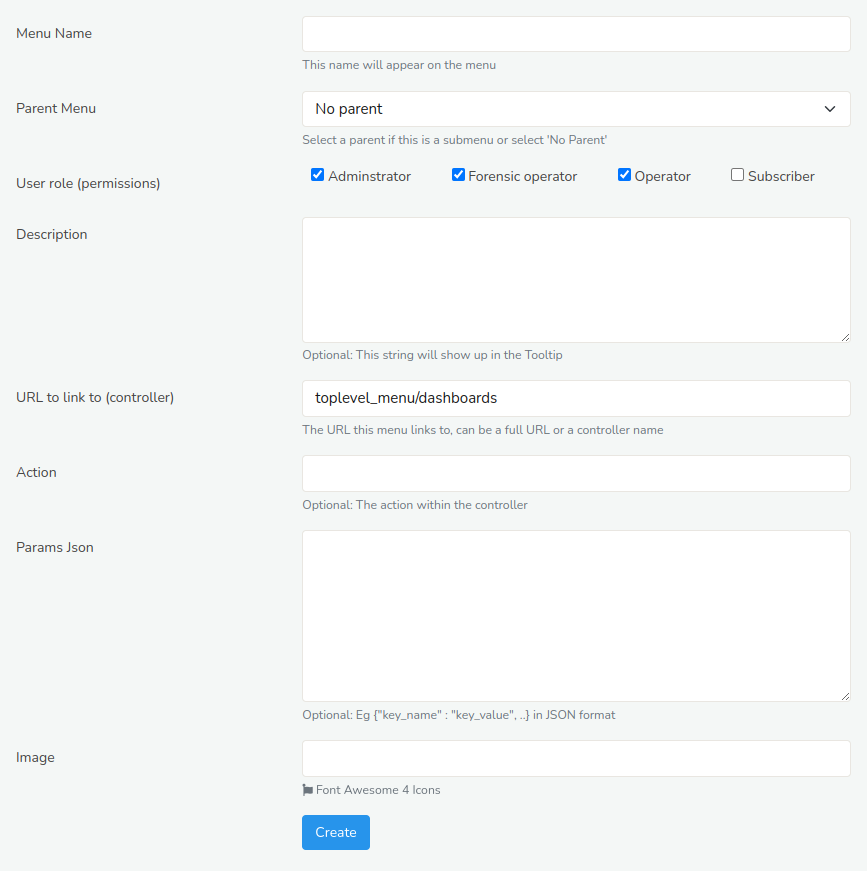
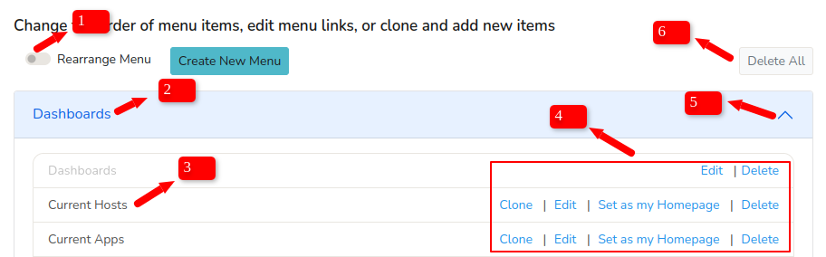
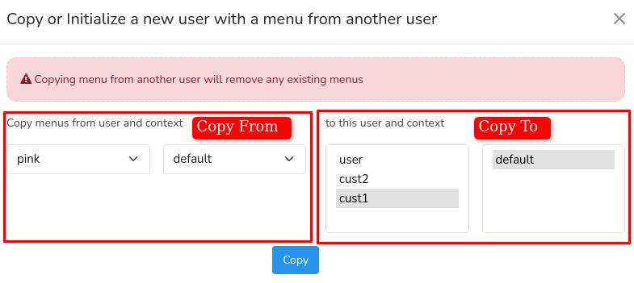

# Menu Manager

Trisul *Menus* are the navigation options that allow users to interact with the software and access various features and functions. These are the main menus and their submenus that you can find on the left hand side of the Trisul platform. Here are some examples: Dashboards, Retro, Tools, and more. These *menus* help you navigate to various features and perform analytic operations.

  
*Figure: Menus and Submenus*

## Manage Menus
*Manage Menus* in Trisul refers to the customization of navigation menus for the Trisul web interface for different users and contexts. To customize menus, Login as `admin` and 

:::info navigation
:point_right: Go to Webadmin-Manage&rarr; And click UI- Menu Manager
:::

This will take you to the *Menu Manager* page with two customizations as shown in the following.

  
*Figure: Menu Manager*

1) [Customize Menus](/docs/ag/webadmin/menus#customize-menus)
2) [Copy Menus](/docs/ag/webadmin/menus#copy-menus)

### Customize Menus

Trisul's *Customize Menus* feature enables administrators to tailor navigation menus for individual users based on their login context.

With *Customize Menus* you can,
- Assign context-specific menus to users
- Customize menus for each user login context
- Control access to features and functionality

For context-based menu customization,
Choose *Customize Menus* in *Menu Manager* and select a *user* and select a *context* for that user and Click *Create New Menu*. 
*Create a new menu item* window opens up with the following fields.

*Figure: Create a New Menu Item*

| Fields                                | Description                                                              |
|---------------------------------------|--------------------------------------------------------------------------|
| Menu Name                             | Enter a name for the Menu                                                |
| Parent Menu                           | Choose from the dropdown list a parent for the menu you want to add      |
| User Role (permissions)               | Choose from the user roles you want this menu to be available to         |
| Description							| Enter a short description. This description will show up in the tooltip  |
| URL to link to (controller)  			| The URL this menu links to, can be a full URL or a controller name   	   |
| Action 								| Actions are the actual pages with number of elements  				   |
| Params Json  							| Enter the parameters in JSON format									   |
| Image 								| Choose an image for the menu 											   |

Once you have filled all the details for these fields, Click *Create*. A New menu is now created!

And the newly created menu will be reflecting on the index page of *Customize menus*

*Figure: Customize Menus Index Page*

1) You can enable the **Rearrange Menu** on the upper left hand side to allow you to click and drag to rearrange the menu order.
2) The Name on the blue header of each of the *Customize Menus* table represents the name of the **Parent Menu**
3) The list inside the table represents the **Sub Menus**.
4) You can **Clone**, **Edit**, **Set as my homepage**, and **Delete** the menus and submenus by clicking on the options from the right hand side against each menu and submenu.
5) Click on the small arrow on the upper right hand side of the header to **Expand and Collapse** the menus
6) You can delete all the menus (including the parent menus) by clicking on the **Delete All** button the upper right hand side.

### Copy Menus

*Copy Menus* allows administrators to duplicate existing menu configurations for efficient reuse across different users, contexts, or roles.

With *Copy Menus* you can,
- Duplicate menu structures and settings
- Copy menus from one user or context to another
- Edit the copied menu to make modifications

To copy menus from different users and contexts,

Choose *Copy Menus* in *Menu Manager* and select a *user* and select a *context* from the left hand side to "copy from" and select a *user* and a *context* from the right hand side to "copy to". And Click *Copy*  
  

*Figure: Copy Menus*

You have now successfully copied the menus.
