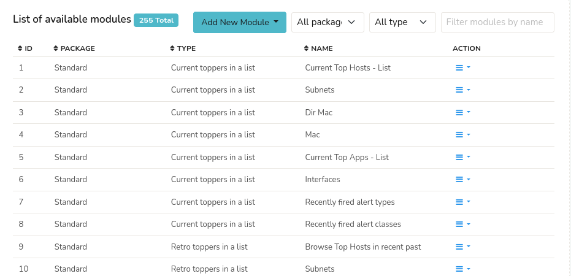
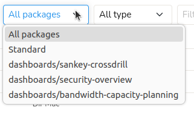
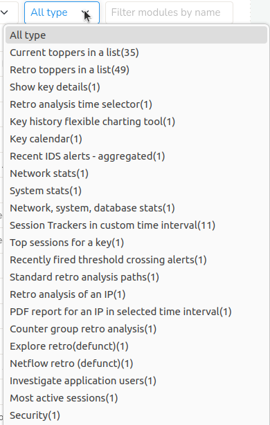

# Modules

## Overview

*Modules* in Admin section is a centralized repository of all available modules, that allows you to browse and search modules, manage and apply filters to refine module listings.

:::info navigation 
:point_right: Go to Web Admin: Manage&rarr; UI: Modules
:::

This will take you to the page where list of all available modules in the UI displayed as in the figure. The header contains the total number of module count highlighted in blue (In Figure: 255 Total)

  
*Figure: All Modules*

The module details displayed in the table are as follows.

| Column  | Description |
|---------|-------------|
| ID      | The unique identifier number of the module. |
| Package | Name of the package that the module belongs to |
| Type    | Type of the Module |
| Name    | Name of the Module |
| Action  | A number of actions can be performed on the selected module including clone, edit, and delete |

> **Each column in the table is [column sortable](/docs/ug/ui/elements#column-sorter)**

### Action

**Clone**: Creates an identical copy of the module for creating variations of existing modules or templates.
**Edit**: Modify the selected module's properties.  
**Delete**: Delete the selected module.

## Add New Module

Click *Add New Module* Button from the header to create a new module from scratch. Select a module template and fill out the fields to [create a new module](/docs/ug/ui/modules#creating-modules).

## All Packages

Click the *All Packages* Filter button and select a package name from the dropdown to refine and display only the modules that belong to the selected package.

  
*Figure: Filter by Packages*

## All Types
Click the *All Types* Filter button and select a module type from the dropdown to refine and display only the modules that are of the selected module type. You can also see the number of modules (count) of the particular type in each type listed in the dropdown.

  
*Figure: Filter by Types*

## Filter Modules by Name

Enter a name of the module on the *Filter Modules by Name* Bar on the upper right hand side to narrow down the module list using filtering.