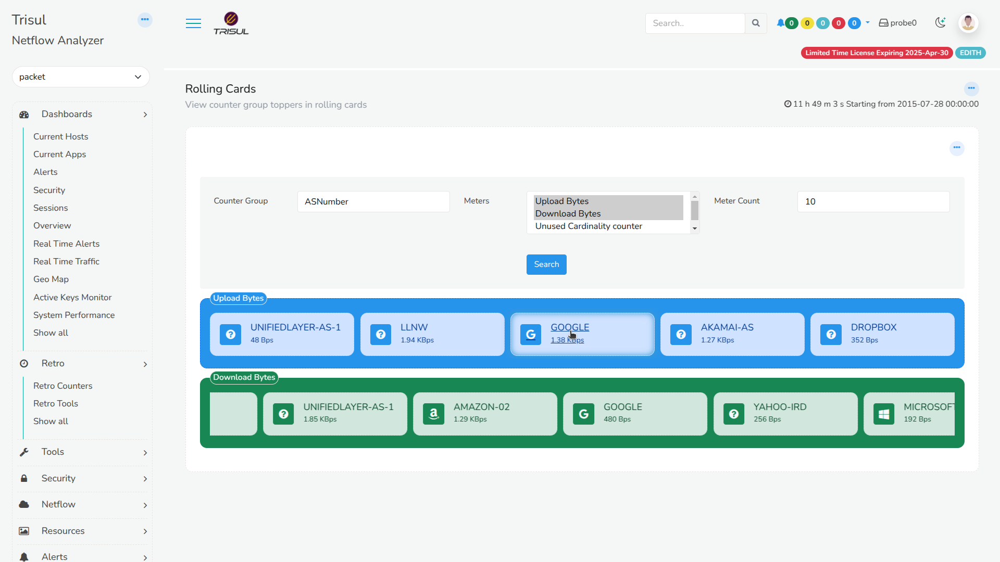
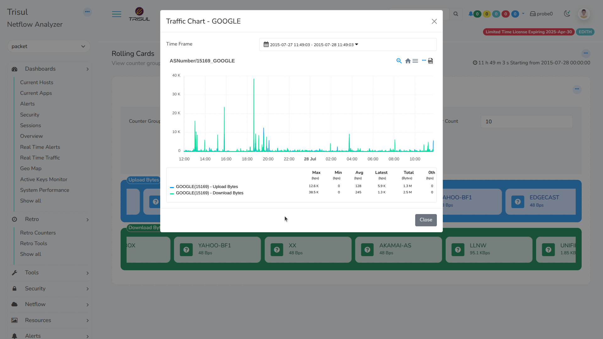

# Rolling Cards

Rolling Cards provide a carousel-like display of top performers from selected countergroups. This feature allows users to choose multiple metrics for a countergroup, which are then displayed separately in distinct rolling cards, enabling a comprehensive and organized view of key performance indicators.

  
*Figure: Rollings Cards* 

## Downloading Rolling Cards

Login as admin and,

:::info navigation
:point_right: Go to Web Admin &rarr; Manage &rarr; Apps
:::

From the list of [Trisul apps](/docs/ag/webadmin/apps), download *Rolling cards*.

## Viewing Rolling Cards

Login as user and,

:::info navigation
:point_right: Go to Dashboard &rarr; Show All &rarr; Rolling Cards
:::

Click on a countergroup from the drop down list, required meters, and enter a meter count. And click Search. You ll now see the rolling cards for the selected counter group for the entered meter count and also separate rolling cards if you have selected more than one meter.

Clicking on a topper from the Rolling Cards display redirects to a detailed view, showcasing the traffic history chart of the selected entity. Furthermore, when the Counter Group is set to ASN, the interface also displays the logos of well-known Autonomous Systems, such as Microsoft and Google, providing an enhanced visual experience and facilitating easy recognition of prominent ASNs.

  
*Figure: Showing Traffic Chart of Selected Topper from Rolling Cards*

