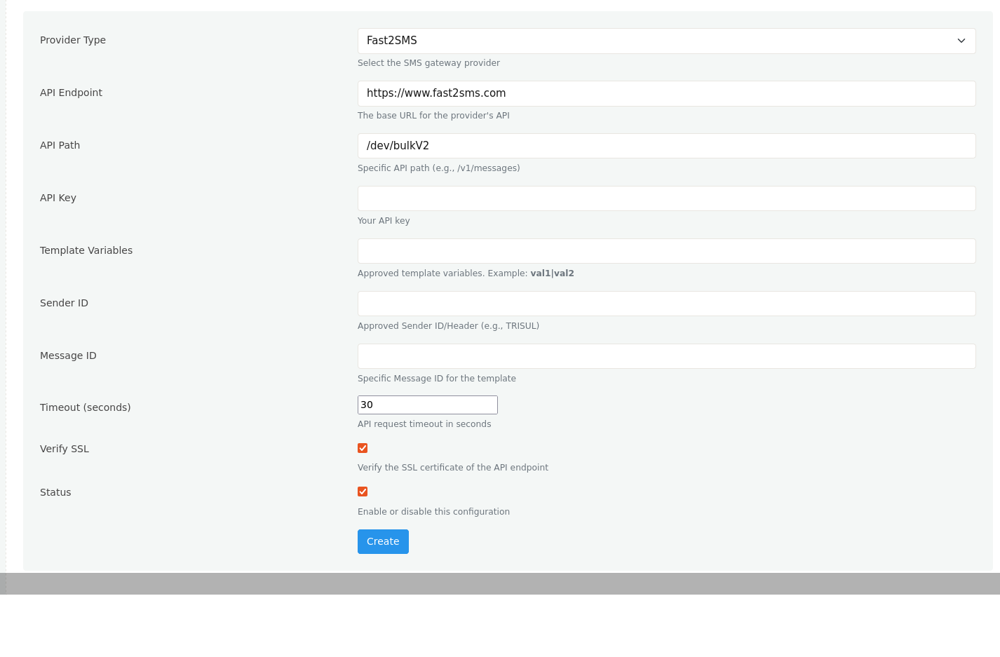

# SMS Configurations

The **SMS Configurations** page allows administrators to configure an SMS gateway for Two-Factor Authentication (2FA). Once configured, Trisul can send one-time passwords (OTPs) or verification messages using the selected SMS provider.

:::info navigation

:point_right: Login as admin &rarr; Web Admin &rarr; Manage &rarr; SMS Configurations

:::

  
*Figure: Creating a new SMS configuration*

## Configuration Fields

| Field | Description |
|-------|-------------|
| **Provider Type** | Select the SMS gateway provider. |
| **API Endpoint** | Base URL of the SMS provider's API. |
| **API Path** | API endpoint path used to send SMS messages. |
| **API Key** | Authentication key provided by the SMS gateway provider. |
| **Template Variables** | Variables defined in the approved SMS template. Configure multiple variables by separating them with the pipe (`\|`) character. |
| **Sender ID** | Registered sender ID or SMS header approved by the SMS service provider. |
| **Message ID** | Approved template or message identifier associated with the SMS template. |
| **Timeout (seconds)** | Maximum time Trisul waits for the SMS provider to respond before timing out. |
| **Verify SSL** | Enables SSL certificate validation for API communication. |
| **Status** | Enables or disables the SMS configuration. Only enabled configurations are used for sending SMS messages. |
| **Create** | Saves the SMS gateway configuration. |

## Notes

- These settings are primarily used for sending Two-Factor Authentication (2FA) messages to users during the login process.
- Multiple SMS configurations can be created, but only **enabled** configurations are used by the platform.