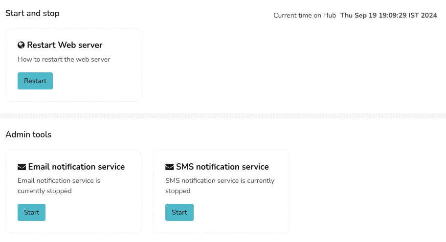
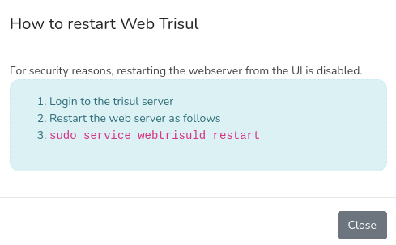

# Start/Stop Tasks

:::info navigation
:point_right: Go to Web Admin &rarr; Manage &rarr; Start/Stop Tasks
:::

This is where admins start or stop tasks including
1) [Restart Web Server](/docs/ag/webadmin/startorstop_tasks#restart-web-server)
2) [Restart Email Notification Service](/docs/ag/webadmin/startorstop_tasks#email-notification-service)

  
*Figure: Start or Stop Tasks*

## Restart Web Server

:::info navigation
:point_right: Go to Web Admin &rarr; Manage &rarr; Start/Stop Tasks &rarr; Restart Web Server
:::

Due to security considerations, the option of restarting your web server is not available through the user interface. To restart your web server, click the *Restart* button in this module to access instructions on how to manually restart from your Trisul Server.

  
*Figure: Instructions to Restart Web Server*

## Email Notification Service

:::info navigation
:point_right: Go to Web Admin &rarr; Manage &rarr; Start/Stop Tasks &rarr; Email Notification Service
:::
  
Here you can Start or Stop the email notification service. In this module as shown in this example, you can see if the email notification service is enabled or stopped. 
- If email notification service is **stopped**: A short description in the module reads "Email notification service is currently stopped" with a *Start* button. 
- If email notification service is **enabled**: The description reads "Email notification service is running with pid xxxxx" with a *Stop* button.
  
You can click *Start* to start sending alerts as email notifications. Otherwise click *Stop* to stop the email notification service.
  
The email notification service logtails the syslog and dispatches alerts. The service is careful not to flood < 5 minutes and can automatically create digests if alert volumes are too high.

