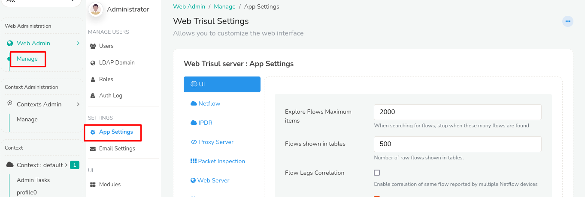
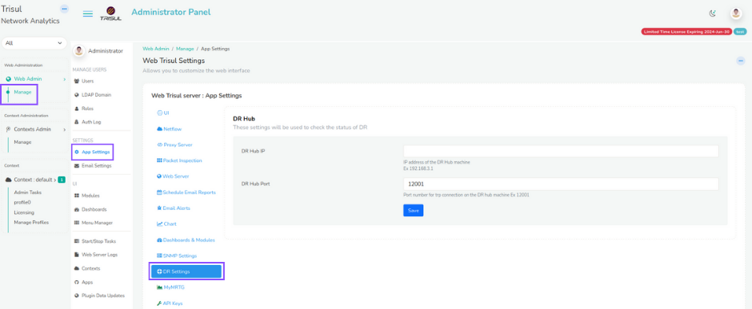

# App Settings

This page describes the web application settings.

## Customize

To access application setting, Login as admin and,

:::info navigation

:point_right: Select Web Admin &rarr; Manage &rarr; App Settings

:::

*Figure: App Settings in Web Admin*

## UI

:::info navigation
:point_right: Go to Web Admin: Manage &rarr; App Settings &rarr; UI
:::

| Option                            | Default Value | Description   |
| --------------------------------- | ------------- | --------------|
| Explore Flows Max Items           | 2000          | When retrieving flows stop when these many flows are reached. All flow based calculations will be done using these many flows. The next parameter *Explore Flows Show In Tables* specifies how many of these will show up in raw flow tables on the web UI. |
| Flows shown in tables             | 100           | Show these many ‘top flows’ in raw flow tables.  |
| Flow Legs Correlation             | No            | Enable correlation of same flow reported by multiple Netflow devices                                                                               |
| Include NAT Flow Legs Correlation | Yes           | Correlate flows from multiple netwflow devices even if one of them does NAT                                                                      |
| User Password Minimum length      | 6             | Minimum characters you can use in user password    |
| Show Real-time alert counts       | Yes           | Show the alert count box which is usually found on the top right corner of each page                                                                                |
| Real Time Alert Groups            |               | Select the group items for the alerts to be generated  |
| Enable Captcha                    | false         | Enable captcha validation in login page                |
| Test Mode                         | false         | Disables some features while using test_project        |
| Show others in topper list        | true          | Show others not shown item in the toppers list         |
| Disk usage alert percentage       | 90            | shows disk usage alert for the specified percentage    |
| Hide context selection            | false         | Keep in unchecked if you dont want to hide context selection in login page                                                                                                |

## NetFlow

:::info navigation
:point_right: Go to Web Admin: Manage &rarr; App Settings &rarr; NetFlow
:::

| Option                           | Default Value | Description                                          |
| -------------------------------- | ------------- | ---------------------------------------------------- |
| Show Routers count in drilldown  | 500           | Shows top routers and interfaces in drilldown        |
| Show Interfaces Per Router       | 100           | Per router show these many top interfaces in Netflow mode |
| Include Dest Port(Conversations) | false         | Show port name or number like http and https in inteface drilldown page |

## IPDR

:::info navigation
:point_right: Go to Web Admin: Manage &rarr; App Settings &rarr; IPDR
:::

| Option                           | Default Value | Description                                          |
| -------------------------------- | ------------- | ---------------------------------------------------- |
| Query Logs Maxcount              | 100           | Show top n list in the submited query logs           |

## Proxy Server

:::info navigation
:point_right: Go to Web Admin: Manage &rarr; App Settings &rarr; Proxy Server
:::

Web Trisul needs to reach out to the internet for two things.

1. To download latest threat feeds for the BadFellas plugin
2. To install Trisul Apps which are hosted on Github

If your Trisul-Hub node does not have internet access you need to
configure a proxy server.

| Option                 | Description                                   |
| ---------------------- | --------------------------------------------- |
| Proxy Server IP        | Address of the proxy server                   |
| Proxy Server User Name | Specify the Username if required by the proxy |
| Proxy Server Password  | Specify the Password if required by the proxy |

#### Test It

- Login as admin
- Go to *Webadmin &rarr; Manage &rarr; Apps*
- If you get a list of packages without the error “Check your internet
  connection error”, the connection is working.

## Packet Inspection

:::info navigation
:point_right: Go to Web Admin: Manage &rarr; App Settings &rarr; Packet Inspection
:::

| Option                            | Default Value | Description                                    |
| --------------------------------- | ------------- | ---------------------------------------------- |
| Deep Packet Inspection limit      | 21600 Secs    | Time limit for deep packet inspection          |
| Deep packet inspection size limit | 100 M         | Maximum number of bytes to be retrieved as a result of the packet retrieval \ Pull packets operation |

## Web Server

:::info navigation
:point_right: Go to Web Admin: Manage &rarr; App Settings &rarr; Web Server
:::

| Option                 | Default Value | Description                                |
| ---------------------- | ------------- | ------------------------------------------ |
| Idle Timeout (minutes) | 60            | Time set to logged webtrisul when idle. see [Inactivity Security Timeout](/docs/ag/context/login#inactivity-security-timeout)     |
| Web Server Port        | 3000          | The webserver port. This setting is used by some cron tasks (like report mailers). If you move the default nginx port make sure you reflect that change here. |
| Web Server Security    | NONE          | Used by report jobs. Is web server using SSL?    |

## Schedule and Email Reports

:::info navigation
:point_right: Go to Web Admin: Manage &rarr; App Settings &rarr; Schedule Email Reports
:::

| Option                                                 | Default Value     | Description   |
| ------------------------------------------------------ | ----------------- | ------------- |
| Business Hour                                          | 00:00:00-23:59:59 | Business hours time used to restrict default report generation time window for each day |
| Default mail to send schedule report                   |                   | Automatic scheduled report will be send to this E-Mail                                  |
| Automatically email scheduled reports                  | YES               | Global setting that controls if scheduled reports are mailed out                        |
| Automatically email threshold crossing alert summaries | No                | Global setting that controls if TCA reports are mailed out                              |
| Show generated in report page header                   | true              | show generated time in report page title                                                |
| Attachment Format                                      | PDF               | Schedule report email attached format                                                   |

## Email Alerts

:::info navigation
:point_right: Go to Web Admin: Manage &rarr; App Settings &rarr; Email Alerts
:::

| Option                     | Default Value     | Description                          |
| -------------------------- | ----------------- | ------------------------------------ |
| Email Alert Business Days  | M,T,W,T,-,-,-     | When you want to receive email alerts  |
| Email Alert Business Hours | 00:00:00-23:59:59 | Business hours time used to restrict default report generation time window for each day                                                                |

## Chart

:::info navigation
:point_right: Go to Web Admin: Manage &rarr; App Settings &rarr; Chart
:::

| Option                        | Default Value | Description                                   |
| ----------------------------- | ------------- | --------------------------------------------- |
| Conversation Chart Ring items | 10            | Number of peers to be shown in the conversation ring. This chart appears in the ***Tools &rarr; Investigate IP Activity*** analysis |
| Show data value tooltips      | false         | Show timeseries data point as a tooltip   |
| Show Percentile               | 0             | Show a 95th percentile line on charts. Enter 98 to show 98th percentile, 0 to disable                                            |
| Enable Animation              | true          | Show animation while rendring chart    |
| Real Time Data Display        | 1 Hour        | How many data points to be retined in the real time graph  |
| Long Term Chart Day Limit     | 7             | Shows separate charts for each day for these many number of days. If the selected time range by the user exceeds this limit, the chart will be shown as a single chart of aggregated data for the selected time range                                                                  |

## Dashboard and Modules

:::info navigation
:point_right: Go to Web Admin: Manage &rarr; App Settings &rarr; Dashboards & Modules
:::

| Option                            | Default Value | Description                                        |
| --------------------------------- | ------------- | -------------------------------------------------- |
| Default items in Top-N Dashboards | 10            | All Top-N starts show these many by default, with a “More” button to expand. |
| Show module description           | Yes           | A description if shown below each module to help you understand what is being shown. If you are a power user and would like to hide this text, then set this to False |
| Show help tips for menu items     | Yes           | A tooltip is shown for menu items to help you learn about the various options. You can turn these off if you are already familiar with the UI                         |
| Show country flags for IPs        | true          | Show country flags for IPs in dashbaord                                                                                                                               |

## SNMP Settings 

:::info navigation
:point_right: Go to Web Admin: Manage &rarr; App Settings &rarr; SNMP Settings
:::

| Option              | Default Value | Description                                                       |
| ------------------- | ------------- | ----------------------------------------------------------------- |
| SNMP Version        | 1             | SNMP version v1 or v2c or v3. Select V3 to show SNMPv3 parameters |
| SNMP Read Community | 0             | SNMP read community string                                        |

### Advanced SNMP Settings

| Option                   | Default value | Description                          |
| ------------------------ | ------------- | ------------------------------------ |
| Use Huawei SNMP Port Map | false         | Use Huawei proprietary SNMP mapping to map Netstream ifIndex to SNMP ifIndex (for Huawei only)                                                         |
| Auto Resolve SNMP        | true          | Daily automatically resolve ifname, ifalias, ifspeed, etc.|
| Resolve ifSpeed          | true          | Sync ifSpeed from SNMP.Set false to keep overrided value  |
| Resolve Router Name      | true          | Update label from snmp router name.Set false to keep overrided value |
| SNMP Command Prefix      |               | Append the text before the SNMP commmand |

## DR Settings

:::info navigation
:point_right: Go to Web Admin: Manage &rarr; App Settings &rarr; DR Settings
:::

  
*Figure: DR Settings*

| Option      | Description                                      |
| ----------- | ------------------------------------------------ |
| DR Hub IP   | IP address of the DR Hub machine. Eg:192.168.3.1 |
| DR Hub Port | Port number for trp connection                   |

## MyMRTG

:::info navigation
:point_right: Go to Web Admin: Manage &rarr; App Settings &rarr; MyMRTG
:::

| Option                | Default Value       | Description                                 |
| --------------------- | ------------------- | ------------------------------------------- |
| Refresh Page Interval | 60                  | MRTG customer page default refresh interval |
| Chart Title           | routerip_routername | Customize chart tile for MRTG customer      |
| Chart Subtitle        | ifname_ifalias      | Customize chart subtile for MRTG customer   |

## API Keys

:::info navigation
:point_right: Go to Web Admin: Manage &rarr; App Settings &rarr; API Keys
:::

| Option                      | Description                                                 |
| --------------------------- | ----------------------------------------------------------- |
| Google API Key              | Google map API key. You need this to view the Geo map       |
| Microsoft Teams Webhook URL | Incoming MS Teams Webhook URL. This is used to automatically send alerts to a Team channel.                                                                                    |
