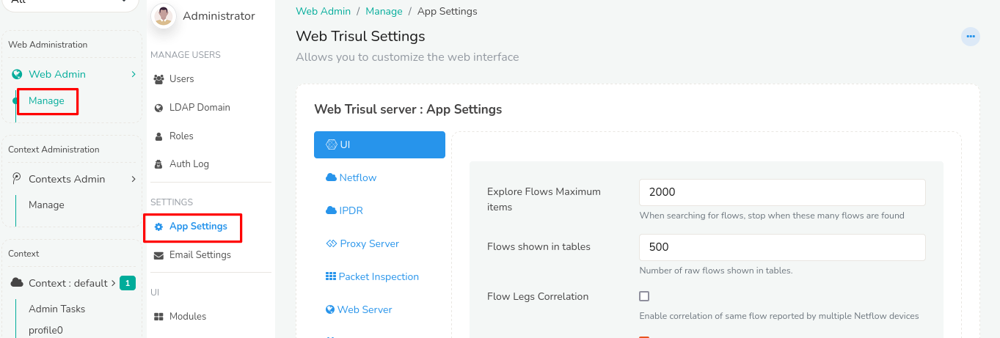
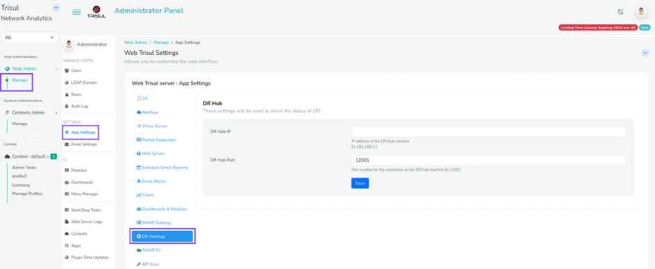
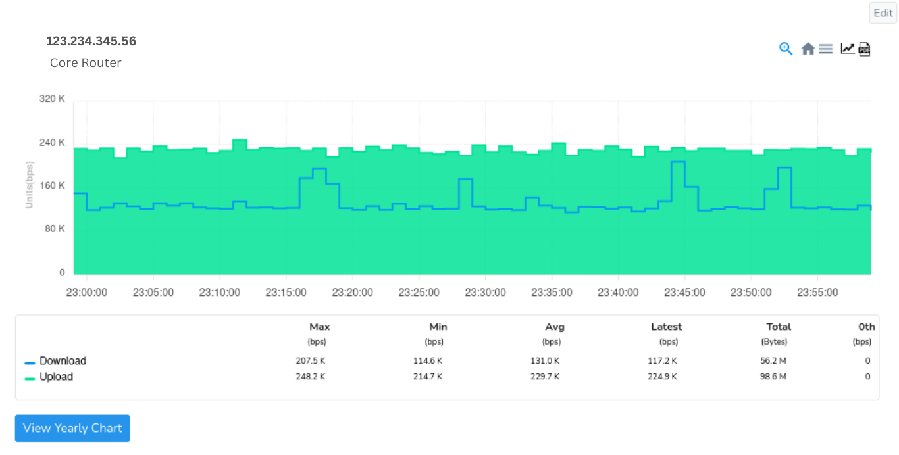
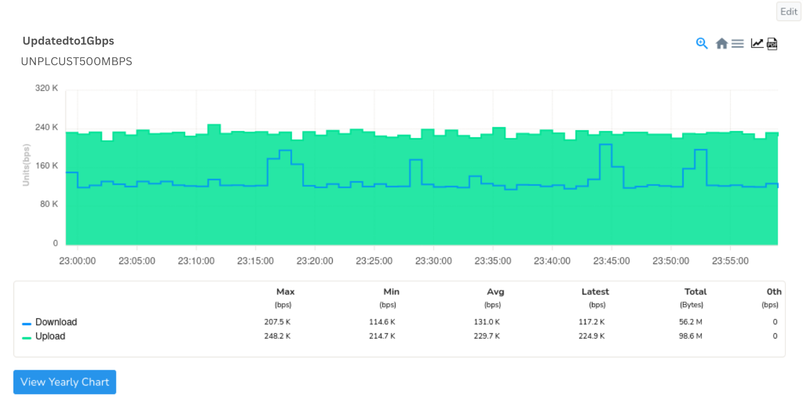
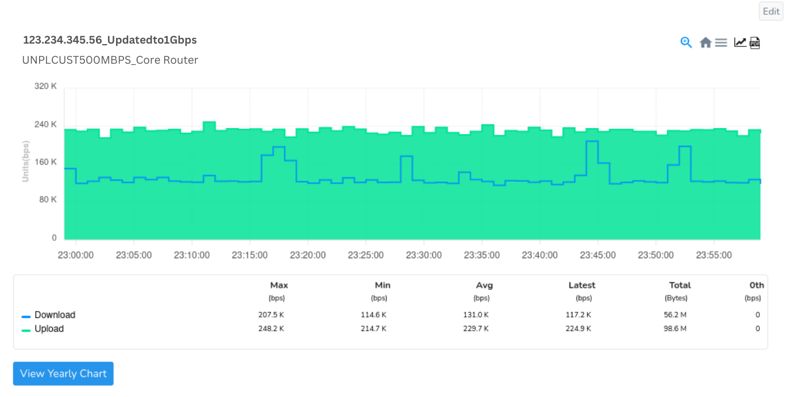

# App Settings

This page describes the web application settings.

## Customize

To access application setting, Login as admin and,

:::info navigation

:point_right: Select Web Admin &rarr; Manage &rarr; App Settings

:::

*Figure: App Settings in Web Admin*

## UI

:::info navigation
:point_right: Go to Web Admin: Manage &rarr; App Settings &rarr; UI
:::

| Option                            | Default Value | Description   |
| --------------------------------- | ------------- | --------------|
| Explore Flows Max Items           | 2000          | When retrieving flows stop when these many flows are reached. All flow based calculations will be done using these many flows. The next parameter *Explore Flows Show In Tables* specifies how many of these will show up in raw flow tables on the web UI. |
| Flows shown in tables             | 100           | Show these many ‘top flows’ in raw flow tables.  |
| Flow Legs Correlation             | No            | Enable correlation of same flow reported by multiple Netflow devices                                                                               |
| Include NAT Flow Legs Correlation | Yes           | Correlate flows from multiple netwflow devices even if one of them does NAT                                                                      |
| User Password Minimum length      | 6             | Minimum characters you can use in user password    |
| Show Real-time alert counts       | Yes           | Show the alert count box which is usually found on the top right corner of each page                                                                                |
| Real Time Alert Groups            |               | SSelect the number of alerts to display in the Alerts bar from the dropdown menu. |
| Enable Captcha                    | false         | Enable captcha validation in login page                |
| Test Mode                         | false         | Disables some features while using test_project        |
| Show others in topper list        | true          | Show others not shown item in the toppers list         |
| Page Title                        |               | Enter the text to be displayed in the login page as title |
| Disk usage alert percentage       | 90            | shows disk usage alert for the specified percentage    |
| Hide context selection            | false         | Keep it checked if you dont want to hide context selection in login page         |
| Show mode selection               |               | Check this checkbox to show product mode selector window to select a different mode |
| Set Custom Key Monitor Refresh Time | 60          | Set the frequency (in seconds) at which the key monitor updates its data, with 0 disabling refreshes                                                                 |

## Password/Security

The **Password/Security** settings allow administrators to configure password policies and account security controls for all WebTrisul users. These settings help enforce strong authentication requirements, reduce the risk of unauthorized access, and define account lockout behavior after repeated failed login attempts.

:::info navigation
:point_right: Go to Web Admin: Manage &rarr; App Settings &rarr; Password/Security
:::

| Setting | Description |
|---------|-------------|
| Enable Two-Factor Authentication| Enables Two-Factor Authentication (2FA) for all users. When enabled, users are required to configure a supported 2FA method during their first login. |
| User Password Minimum Length | Specifies the minimum number of characters required for a valid user password. |
| Maximum Failed Login Attempts | Specifies the maximum number of consecutive failed login attempts allowed before the user account is locked. |
| Account Lock Duration (seconds) | Specifies how long, in seconds, a locked account remains inaccessible after exceeding the maximum failed login attempts. |
| Password Expiry (days) | Specifies the number of days a password remains valid before users are required to change it. A value of `0` disables password expiration. |
| Password History Count | Specifies the number of previously used passwords that cannot be reused when setting a new password. |
| Save | Saves the configured password and security settings. |

## NetFlow

:::info navigation
:point_right: Go to Web Admin: Manage &rarr; App Settings &rarr; NetFlow
:::

| Option                           | Default Value | Description     |
| -------------------------------- | ------------- | ---------- |
| Show Routers count in drilldown  | 500           | Shows top routers and interfaces in drilldown        |
| Show Interfaces Per Router       | 100           | Per router show these many top interfaces in Netflow mode |
| Include Dest Port(Conversations) | false         | Show port name or number like http and https in inteface drilldown page |

## IPDR

:::info navigation
:point_right: Go to Web Admin: Manage &rarr; App Settings &rarr; IPDR
:::

| Option | Default Value | Description |
|--------|---------------|-------------|
| Query Logs Maxcount | `100` | Specifies the maximum number of query log entries displayed in the submitted query logs. |
| Show OEM Logo | `Enabled` | Displays the OEM logo in generated IPDR reports when enabled. |
| Report Title|  | Specifies the title displayed at the top of generated IPDR reports. |
| Excel Download Max Rows| `200000` | Specifies the maximum number of rows allowed for Excel downloads. If a report exceeds this limit, Excel download is unavailable and users are prompted to export the report in **CSV** or **TRAI Report** format instead. |
| Footer Text |    | Specifies the custom footer text displayed at the bottom of generated IPDR reports. |

## Proxy Server

:::info navigation
:point_right: Go to Web Admin: Manage &rarr; App Settings &rarr; Proxy Server
:::

Web Trisul needs to reach out to the internet for two things.

1. To download latest threat feeds for the BadFellas plugin
2. To install Trisul Apps which are hosted on Github

If your Trisul-Hub node does not have internet access you need to
configure a proxy server.

| Option                 | Description                                   |
| ---------------------- | --------------------------------------------- |
| Proxy Server IP        | Address of the proxy server                   |
| Proxy Server User Name | Specify the Username if required by the proxy |
| Proxy Server Password  | Specify the Password if required by the proxy |

#### Test It

- Login as admin
- Go to *Webadmin &rarr; Manage &rarr; Apps*
- If you get a list of packages without the error “Check your internet
  connection error”, the connection is working.

## Packet Inspection

:::info navigation
:point_right: Go to Web Admin: Manage &rarr; App Settings &rarr; Packet Inspection
:::

| Option                            | Default Value | Description |
| --------------------------------- | ------------- | ----- |
| Deep Packet Inspection time limit      | 21600 Secs    | Time limit for deep packet inspection          |
| Deep packet inspection size limit | 100 M         | Maximum number of bytes to be retrieved as a result of the packet retrieval \ Pull packets operation |

## Web Server

:::info navigation
:point_right: Go to Web Admin: Manage &rarr; App Settings &rarr; Web Server
:::

| Option                 | Default Value | Description                                |
| ---------------------- | ------------- | ------------------------------------------ |
| Idle Timeout (minutes) | 60            | Time set to logged webtrisul when idle. See [Inactivity Security Timeout](/docs/ag/context/login#inactivity-security-timeout)     |
| Web Server Port        | 3000          | The webserver port. This setting is used by WebSockets for real time features and some cron tasks (like report mailers). If you move the default nginx port make sure you reflect that change here. If you are using a Linux Container and doing port forward ensure this setting matches the port forward |
| Web Server Security    | NONE          | Used by report jobs. Is web server using SSL?    |

## Schedule and Email Reports

:::info navigation
:point_right: Go to Web Admin: Manage &rarr; App Settings &rarr; Schedule Email Reports
:::

| Option                                                 | Default Value     | Description   |
| ------------------------------------------------------ | ----------------- | ------------- |
| Business Hour                                          | 00:00:00-23:59:59 | Business hours time used to restrict default report generation time window for each day |
| Default mail to send schedule report                   |                   | Automatic scheduled report will be send to this E-Mail                                  |
| Automatically email scheduled reports                  | YES               | Global setting that controls if scheduled reports are mailed out                        |
| Automatically email TCA (threshold crossing alert) summaries | No                | Global setting that controls if TCA reports are mailed out                              |
| Show generated time in report page header                   | true              | show generated time in report page title                                                |
| Attachment Format                                      | PDF               | Schedule report email attached format                                                   |

## Email Alerts

:::info navigation
:point_right: Go to Web Admin: Manage &rarr; App Settings &rarr; Email Alerts
:::

| Option                     | Default Value     | Description                          |
| -------------------------- | ----------------- | ------------------------------------ |
| Email Alert Business Days  | M,T,W,T,-,-,-     | When you want to receive email alerts  |
| Email Alert Business Hours | 00:00:00-23:59:59 | Business hours time used to restrict default report generation time window for each day                                                                |

## Chart

:::info navigation
:point_right: Go to Web Admin: Manage &rarr; App Settings &rarr; Chart
:::

| Option                        | Default Value | Description       |
| ----------------------------- | ------------- | ------------------ |
| Show Percentile               | 0             | Show a 95th percentile line on charts. Enter 98 to show 98th percentile, 0 to disable                                            |
| Enable Animation              | true          | Show animation while rendring chart    |
| Real Time Data Display        | 1 Hour        | How many data points to be retined in the real time graph  |
| Long Term Chart Day Limit     | 7             | Shows separate charts for each day for these many number of days. If the selected time range by the user exceeds this limit, the chart will be shown as a single chart of aggregated data for the selected time range                                                                  |

## Dashboard and Modules

:::info navigation
:point_right: Go to Web Admin: Manage &rarr; App Settings &rarr; Dashboards & Modules
:::

| Option                            | Default Value | Description                                        |
| --------------------------------- | ------------- | -------------------------------------------------- |
| Default items in Top-N Dashboards | 10            | All Top-N starts show these many by default, with a “More” button to expand. |
| Show module description           | Yes           | A description if shown below each module to help you understand what is being shown. If you are a power user and would like to hide this text, then set this to False |
| Show help tips for menu items     | Yes           | A tooltip is shown for menu items to help you learn about the various options. You can turn these off if you are already familiar with the UI                         |
| Show country flags for IPs        | true          | Show country flags for IPs in dashbaord                                                                                                                               |

## SNMP Settings 

:::info navigation
:point_right: Go to Web Admin: Manage &rarr; App Settings &rarr; SNMP Settings
:::

| Option              | Default Value | Description                                                       |
| ------------------- | ------------- | ----------------------------------------------------------------- |
| SNMP Version        | 1             | SNMP version v1 or v2c or v3. Select V3 to show SNMPv3 parameters |
| SNMP Read Community | 0             | SNMP read community string                                        |
| Management IP  | Optional: IP address to communicate with SNMP agents on managed devices |

### Advanced SNMP Settings

| Option                   | Default value | Description                          |
| ------------------------ | ------------- | ------------------------------------ |
| Use Huawei SNMP Port Map | false         | Use Huawei proprietary SNMP mapping to map Netstream ifIndex to SNMP ifIndex (for Huawei only)                                                         |
| Auto Resolve SNMP        | true          | Daily automatically resolve ifname, ifalias, ifspeed, etc.|
| Resolve ifSpeed          | true          | Sync ifSpeed from SNMP.Set false to keep overrided value  |
| Resolve Router Name      | true          | Update label from snmp router name.Set false to keep overrided value |
| Resolve Advanced SNMP    | true          | Resolves additional SNMP attributes via SNMP queries, including Resolve Type, VLAN, and Attributes. |
| Resolve Velocloud vceLinkCapacityBpsGauge | | Resolves vceLinkCapacityBpsGauges via SNMP queries, including Tx and Rx capacities. |
| SNMP Command Prefix      |               | Append the text before the SNMP commmand |

## DR Settings

:::info navigation
:point_right: Go to Web Admin: Manage &rarr; App Settings &rarr; DR Settings
:::

  
*Figure: DR Settings*

| Option      | Description                                      |
| ----------- | ------------------------------------------------ |
| DR Hub IP   | IP address of the DR Hub machine. Eg:192.168.3.1 |
| DR Hub Port | Port number for trp connection                   |

## MyMRTG

:::info navigation
:point_right: Go to Web Admin: Manage &rarr; App Settings &rarr; MyMRTG
:::

| Option                | Default Value       | Description                                 |
| --------------------- | ------------------- | ------------------------------------------- |
| Refresh Page Interval | 60                  | MRTG customer page default refresh interval |
| Chart Title           | routerip_routername | Customize chart tile for MRTG customer      |
| Chart Subtitle        | ifname_ifalias      | Customize chart subtile for MRTG customer   |
| Show Yearly Button    | Checked             | When checkbox is checked it shows the button in the traffic grapher to generate chart for daily, weekly, monthly, and yearly.                           |

### Customizing Chart Titles and Subtitles

Chart titles and subtitles can be easily customized using a combination of formulas with the following variables:

`routerip`: The IP address of the router  
`routername`: The name of the router  
`ifname`: The interface name  
`ifalias`: The interface alias  

Examples of Customization Options

The following examples demonstrate how chart titles and subtitles can be customized:

**Option 1**: Simple Combination

Chart title: `routerip`  
Chart subtitle: `routername`

**Option 2**: Interface-Based

Chart title: `ifname`  
Chart subtitle: `ifalias`

**Option 3**: Detailed Combination

Chart title: `routerip_routername`  
Chart subtitle: `ifname_ifalias`

**Option 4**: Comprehensive Details

Chart title: `routerip_routername_ifname_ifalias`  
Chart subtitle: Customizable using any of the above variables.

**Option 5**: Other Combination

Chart title: `routerip_ifalias`  
Chart subtitle: `ifname_routername`

By using these variables and customization options, you can tailor your chart titles and subtitles to suit your specific needs.

## API Keys

:::info navigation
:point_right: Go to Web Admin: Manage &rarr; App Settings &rarr; API Keys
:::

| Option | Description |
|--------|-------------|
| **Google API Key** | Google Maps API key used to enable Geo Map visualization within Trisul. |
| **Microsoft Teams Webhook URL** | Incoming Microsoft Teams Webhook URL used to send alerts and notifications to a Microsoft Teams channel. |
| **Zoho Cliq Webhook URL** | Incoming Zoho Cliq Webhook URL used to send alerts and notifications to a Zoho Cliq channel. |
| **LLM Provider** | Selects the Large Language Model (LLM) provider used by the Trisul IPDR AI query assistant. |
| **LLM Model** | Specifies the model or deployment name used by the selected LLM provider for Trisul IPDR AI queries, such as **gemini-2.5-flash**, **gpt-4o-mini**, or a custom deployment name. |
| **API Key** | API key used to authenticate with the selected cloud-based LLM provider. This field is optional when using a local LLM that does not require authentication. |
| **Custom Endpoint** | Base URL of an OpenAI-compatible endpoint used by Trisul IPDR AI when connecting to a locally hosted or self-hosted LLM, such as **Ollama** or **LM Studio**. |
| **Save** | Saves the configured API integration settings. |

# Trisul AI

The **Trisul AI** settings page allows administrators to configure the endpoint used by the Trisul AI service. These settings define how the WebTrisul interface communicates with the Trisul AI backend, including the network endpoint and SSL configuration.

:::info navigation
:point_right: Go to **Web Admin → Manage → App Settings → Trisul AI**
:::

| Option | Description |
|--------|-------------|
| **AI SSL Mode** | Enables SSL/TLS for communication between WebTrisul and the Trisul AI endpoint. Enable this option if the AI service is configured to accept secure HTTPS connections. |
| **AI Endpoint IP** | IP address or hostname of the Trisul AI endpoint that WebTrisul connects to for AI requests. |
| **AI Endpoint Port** | TCP port on which the Trisul AI service is listening. |
| **Save** | Saves the configured Trisul AI endpoint settings. |

:::note

Configure the **AI Endpoint IP** and **AI Endpoint Port** to match the Trisul AI service deployment. If **AI SSL Mode** is enabled, ensure that the endpoint is configured to accept secure SSL/TLS connections.

:::