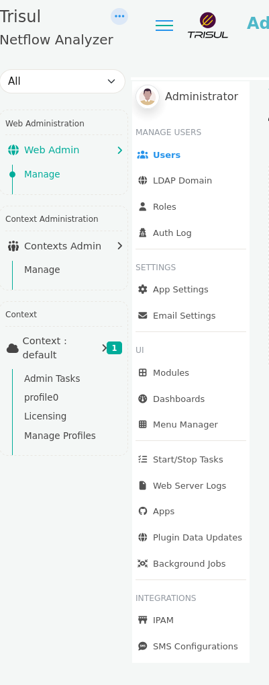

# Web Admin: Manage

This section provides access to the Trisul administration functions, a centralized management interface for configuring and monitoring the Trisul platform.  

From here, administrators can manage user access, configure system settings, monitor logs, customize dashboards and menus, and restart web server. 

## Manage

:::info navigation
Go to Web Admin: Manage &rarr; (*List of all Admin Menus*)
:::

  
*Figure: Admin Menus*

Explore the documentation to access detailed information and controls for administrative functions, organized into the following functional menus.

| Menu | Description |
|-------|------------|
| [Users](/docs/documentation/ag/webadmin/manageusers) | Manage system access, create/modify/delete user accounts, assign roles, and set login permissions for all users. |
| [LDAP Domain](/docs/documentation/ag/webadmin/ldap_login) | Configure LDAP domain and create login option that authenticates users against an LDAP server.|
| [Roles](/docs/documentation/ag/webadmin/userroles) | Lists roles and associated permissions, specifying authorized actions for each user category. |
| [Auth Log](/docs/documentation/ag/webadmin/authlog) | System authentication Log to keep track of each and every Login that provides a list of users with name,context,location,timestamp for every login attempt. |
| [App Settings](/docs/documentation/ag/webadmin/web_options) | Make modifications in the web interface directly change few functionalities in UI with the help of this menu. |
| [Modules](/docs/documentation/ag/webadmin/modules) | View and manage list of available modules that are being actively used in the web interface. |
| [Dashboards](/docs/documentation/ag/webadmin/dashboards) | View and manage list of all dashboards in the UI. |
| [Menu Manager](/docs/documentation/ag/webadmin/menus) | Menu manager allows you to change the order of menu items, edit menu links, or clone and add new items. |
| [Start/Stop Tasks](/docs/documentation/ag/webadmin/startorstop_tasks) | Administrative Tasks can be started and stopped by a single click from this menu including web server and email alert notification service. |
| [Web Server Logs](/docs/documentation/ag/webadmin/logs) | Monitor web server logs, email logs, background tasks logs, auth log, web socket logs for troubleshooting. |
| [Apps](/docs/documentation/ag/webadmin/apps) | Explore all Trisul apps in the platform that can extend support for your analyses. |
| [Plugin Data Updates](/docs/documentation/ag/webadmin/plugin_data_update) | Shows status of automatic feed updates for Badfellas, Geo, URL filter plugins. |
| [Background Jobs](/docs/documentation/ag/webadmin/bgjobs) | View all scheduled background (cron) jobs along with their execution status, duration, job name, execution time, and status messages for monitoring and troubleshooting. |
| [IPAM](/docs/documentation/ag/webadmin/ipam) | Configure and manage integrations with supported IP Address Management (IPAM) solutions for automatic metadata synchronization. |
| [SMS Configurations](/docs/documentation/ag/webadmin/smsconfig) | Configure SMS gateway providers used for Two-Factor Authentication (2FA) message delivery. |