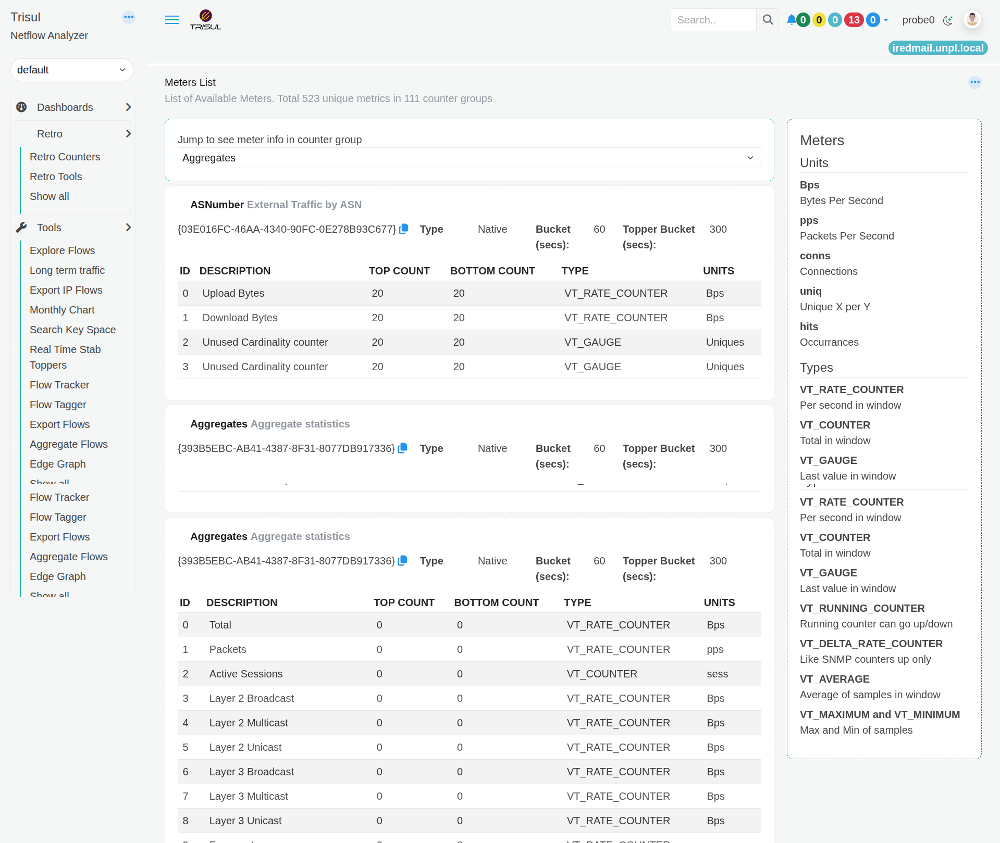

# View Meters

The **View Meters** page lists the measurements available for each [Counter Group](/docs/learntrisul/terminology#counter-group) in Trisul. This page describes all the meters available out of the box in Trisul.
Installing additional plugins will usually give you even more meters -
which will be described in detail by the documentation accompanying each
plugin.

A meter defines **what Trisul measures** for a counter group. For example, the **Aggregates** counter group includes meters such as **Total**, **Packets**, and **Active Sessions**.

You normally do not need this page for day-to-day traffic monitoring. Use it when you need to find out **what measurements are available for a counter group, what each measurement means, and which units are used**.

### To open View Meters:

:::info To view all counter groups and meters
Goto Customize -> View Meters
:::

*Figure: View Meters*

## Choose a Counter Group

The **Jump to see meter info in counter group** list lets you select a counter group and move directly to its meter information.

Each counter group represents a particular type of information that Trisul tracks. The selected counter group displays the measurements available for it.

For example, selecting **Aggregates** shows measurements such as **Total**, **Packets**, and **Active Sessions**.

## Understand the meter information

Each counter group displays its available meters in a table.

| Column | Description |
| --- | --- |
| **ID** | Identifies the meter within the counter group. |
| **Description** | Describes what the meter measures. |
| **Top Count** | Shows how many top values can be tracked for the meter. |
| **Bottom Count** | Shows how many bottom values can be tracked for the meter. |
| **Type** | Shows how the meter value is calculated or stored. |
| **Units** | Shows the unit used for the measurement, such as **Bps**, **pps**, **conns**, or **hits**. |

## When would I use View Meters?

Use **View Meters** when you need to answer questions such as:

- What measurements are available for a particular counter group?
- What does a particular meter measure?
- Is the measurement a rate, count, or current value?
- What unit is used for the measurement?
- Which meters are available for a counter group before using it in another Trisul feature?

For example, if you need to work with the **Hosts** counter group and want to know whether Trisul provides a measurement for connections, you can select **Hosts** and check its meter list.

### Special key SYS:GROUP_TOTAL

- `SYS:GROUP_TOTALS`  
  Each counter group has a special key named `SYS:GROUP_TOTALS` This
  meter represents the cumulative total of all keys in a given time
  interval. You can type use this instead of a key if you want the
  totals.

# Common groups 

Here are some common groups,  you can also select the group from the menu on the left side. 

