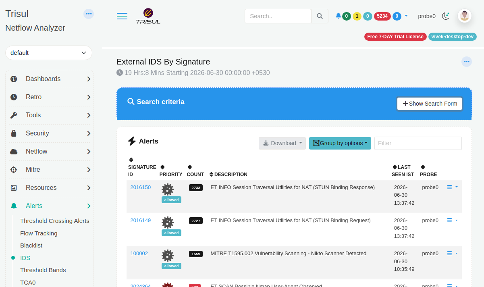

# Reducing False Positive Alerts

Trisul interfaces with IDS over Unix sockets / EVE JSON, so any signature that
fires too often in IDS surfaces directly as IDS alert noise inside Trisul. One of
the most effective ways to cut down false positives from this alert class is to
suppress the specific signature at the IDS layer, rather than trying to filter it
out after the fact in Trisul.

:::info What is a false positive 
A false positive is an alert raised for traffic that is actually legitimate  the detection engine flags it as suspicious or malicious, but there is no real threat.  False positives typically come from signatures that are too broad, or from legitimate but unusual traffic patterns internal vulnerability scanners, health checks, backup jobs, or custom applications that happen to match a signature's pattern. Left unaddressed, they add noise that makes it harder to spot genuine alerts. 
:::


This page walks through identifying a noisy signature and disabling it cleanly.

## 1. Identify the noisy signature

In the Trisul UI, open **Alerts > IDS Alerts** and sort/filter by signature message
(`msg`) or signature ID (`sid`) over a representative time window (a week is usually
enough to spot chronic offenders). Look for:

- A single `sid` responsible for a disproportionate share of alerts.
- Alerts consistently tied to known-good hosts, internal scanners, monitoring tools,
  or expected application behavior (e.g. health checks, internal vulnerability
  scanners, backup agents).


*Example of noisy false positives. Note down the signatures*

Note down the  **signature ID (sid)** in the above screenshot `2016150` for example.

## 2. Disable the signature using `disable.conf`


Edit (or create) the disable file:

```bash
sudo vi /etc/suricata/disable.conf
```

Add the offending `sid` (one per line):

```
# Suppressing noisy signature - internal scanner alerts 
2019401
```

You can also disable by regex match on the signature message if several related sids
need to go at once:

```
re:internal-scanner-detected
```

## 3. Apply the change

Re-run `suricata-update` so it regenerates the active ruleset with the disabled
signature excluded:

```bash
sudo suricata-update
sudo systemctl restart suricata
```

Verify the signature is gone from the compiled ruleset:

```bash
grep "2019401" /var/lib/suricata/rules/suricata.rules
```

This should return nothing (or show the rule commented out, depending on your
Suricata version's convention).

## 4. Confirm in Trisul

After this signature is suppressed navigate back to **Alerts > IDS Alerts**  and sort/filter, the false positive will not be fired. 

