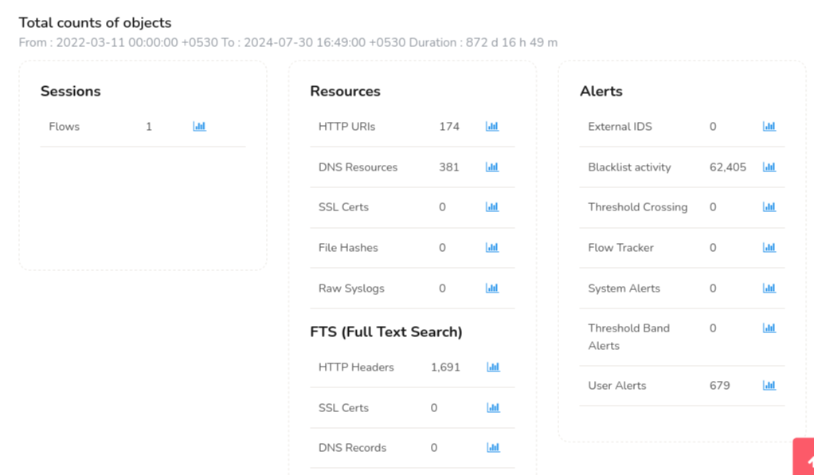
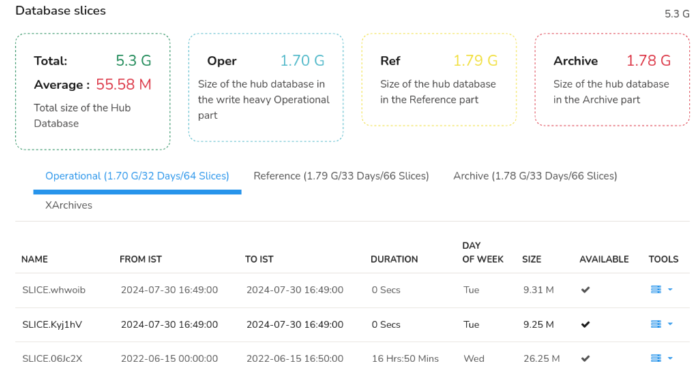
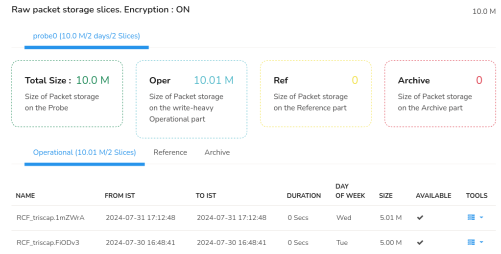

# DB Status

## Overview

At this stage, Trisul is already running and storing data.
The **DB Status** page is used to understand **what is being stored, how much, and how it is distributed across the database**.

It provides detailed information on Session Flows, Resources, Alerts, FTS (Full Text Search) objects.

## Database Segments  
The Trisul database is divided into three segments, based on how many days Trisul has to store data.

- **Oper**:  
Stores the most recent data.
- **Reference**:  
Stores data that has aged beyond the operational window, based on configured retention.
- **Archive**:  
Stores older historical data. 

You can view how much data is written per day into each segment and use this information to estimate how long data can be retained based on available disk capacity.

> **To configure the DB storage retention policy refer to [Configure Retention Policy](/docs/guide/ag/basictasks/configure_storage)**

You can also view the disk occupied by each counter-group in a SLICE
every-day. This is helpful in tuning the system.
:::info navigation
:point_right: Go to Context: default &rarr; Admin Tasks &rarr; DB Status
:::
## DB Status Dashboard  
On the **DB Status** dashboard, click on the little graph button against each object to view the DB Status trend for that particular object. You can also customize the number of days for which you want to view the traffic data trends by clicking on the graph button.

  
*Figure: DB Status Dashboard showing total count of objects*

The DB Status dashboard contains several sections, which can be broken down in to:

1. **Sessions**: 
   
   The total number of flow records stored in the database over its available time range (shown as *Flows*). This is not a live count of active flows.
2) **Resources**:
- *HTTP URIs*: The number of unique HTTP URIs (Uniform Resource Identifiers) tracked by Trisul. This includes URLs, query strings, and other HTTP request metadata.

- *DNS Resources*: The number of unique DNS (Domain Name System) resources tracked by Trisul, such as domain names, IP addresses, and DNS query metadata.

- *SSL Certs*: The number of unique SSL/TLS certificates tracked by Trisul, including certificate metadata like subject, header etc.

- *File Hashes*: The number of unique file hashes tracked by Trisul, which helps identify files and detect potential malware or unauthorized data transfer.
3) **Alerts**:
- Lists every configured alert group by name, with the total number of alerts of that group stored in the database.
4) **FTS (Full Text Search)**:
- *HTTP Headers*: The number of HTTP headers indexed for full-text search, enabling quick searches for specific header values.

- *SSL Certs*: The number of SSL/TLS certificates indexed for full-text search, allowing searches by certificate metadata.

- *DNS Records*: The number of DNS records indexed for full-text search, enabling searches by domain, IP, or other DNS metadata.

## Database Slices

The *Database Slices* Dashboard is similar to the one in Storage Status which shows you the overview of the size of all the storage pools used and the total size of the database.

*Figure: DB Status dashboard showing Database Slices*

## Raw Packet Storage Slices

Raw Packet Storage Slices dashboard shows the amount of disk space used to store raw network traffic data in sliced format. Unlike NetFlow, all the raw PCAP slices are stored in Trisul probe.

*Figure: DB Status dashboard showing raw packet storage slices*

It displays the following,

| Information | Description                                      |
| ----------- | ------------------------------------------------ |
| Total Size  | The total size of packet storage on the probe    |
| Oper        | Size of packet storage on the Operational part   |
| Ref         | Size of the packet storage on the reference part |
| Archive     | Size of the packet storage on the archive part   |

The PCAP tabular data below the probe slices is similar to the [Storage Status tabular data](/docs/guide/ag/admintasks/storage_status#storage-status-tabular-data) which shows the PCAP information in each storage pools: oper, ref, and archive.
