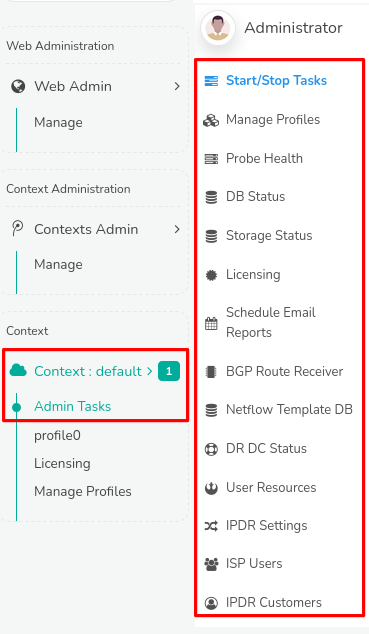

# Admin Tasks

*Admin Tasks* is the menu where administrators start and stop Trisul, manage profiles, and check probe health, storage and licensing. It also holds user resources, the BGP route receiver, NetFlow templates and disaster-recovery status.

## Admin Tasks Menus {#manage}

:::info navigation
Go to Context: default &rarr; Admin Tasks, then select a menu from the table below.
:::

  
*Figure: Admin Tasks*

Explore the documentation to access detailed information and controls for admin tasks, organized into the following functional menus.

| Menu                   | Description                                         |
| ---------------------- | --------------------------------------------------- |
| [Start/Stop Tasks](/docs/guide/ag/admintasks/startstop) | Enables starting and stopping Hub and Probe nodes associated with each context directly through the Web Interface.                                                     |
| [Manage Profiles](/docs/guide/ag/admintasks/manage_profiles) | Provides a list of available profiles used by multiple probes to manage.                                                                        |
| [Probe Health](/docs/guide/ag/admintasks/probe_health) | Shows the reachability, current traffic, and latency of Trisul Probes in this particular context.                                                                       |
| [DB Status](/docs/guide/ag/admintasks/dbstatus) | Displays Trisul Data Base Statistics, showing storage volumes and usage across Oper, Reference, and Archive segments, facilitating storage planning and configuration. |
| [Storage Status](/docs/guide/ag/admintasks/storage_status) | Check availability of disk space, storage devices, and file systems. |
| Licensing              | See [Licensing](/docs/guide/starthere/setuptrisul/license/intro)           |
| Schedule Email Reports | See [Schedule Email Reports](/docs/guide/ug/reports/schedreports) |
| BGP Route Receiver     | See [BGP Route Receiver](/docs/prodguide/isp/bgp#i-bgp-route-receiver) |
| [NetFlow Template DB](/docs/guide/ag/admintasks/netflow_templatedb) | Provides NetFlow/IPFIX template database received by all probes. |
| [Audit Log](/docs/guide/ag/admintasks/auditlog) | Search and download the record of logins, administrative actions and configuration changes. |
| [DR DC Status](/docs/guide/ag/admintasks/drdc_status) | Check configuration of Disaster Recovery when the Primary Site crashes. |
| [User Resources](/docs/guide/ag/admintasks/userresources) | Assign network devices, interfaces, IP addresses, IP subnets or any other network entity to Users.                                                                     |
| IPDR Settings          |  See [IPDR Settings](/docs/prodguide/ipdr/ipdr-settings)     |
| IPDR Customers         |  See [Set IPDR Mode](/docs/prodguide/ipdr/ipdr-settings#set-mode--manually-set-ipdr-mode) |
