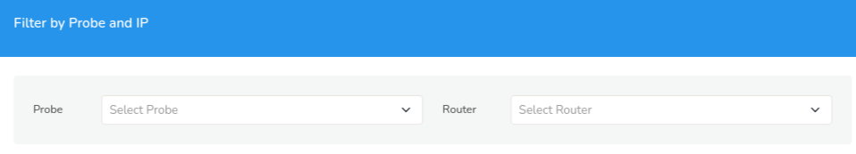
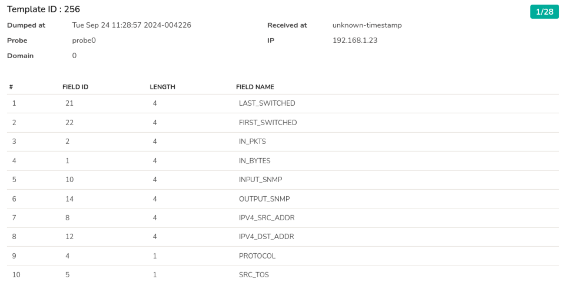

# NetFlow Template DB

:::note Applies to
NetFlow input (NetFlow v9, IPFIX, JFlow, NetStream).
:::

NetFlow v9, IPFIX, JFlow and NetStream use template records. A router sends these special records to describe the metrics contained in its normal flow records. Viewing the template records helps you troubleshoot NetFlow.

This menu shows the NetFlow/IPFIX template database received by all probes.

:::info navigation
:point_right: Go to Context: default &rarr; Admin Tasks &rarr; NetFlow Template DB
:::

  
*Figure: NetFlow Template DB Form*

Select a probe and a router from the dropdown to view the NetFlow template DB. You can see the template database on each probe. This is updated every 10 minutes or when a new template is received.

  
*Figure: NetFlow Template DB*

The header contains details on the date and time the NetFlow got dumped at and received at, the probe name, domain name, and the router IP. 

On the upper right hand side corner you can see the number of templates received highlighted in green color (in the figure: 28)  The NetFlow Template contains the following details as received from the router.

| Detail | Description |
|--------|-------------|
| # | Position of the field in the template. |
| Field ID | Unique ID for the field. |
| Length | Length of the field in bytes. |
| Field Name | Name of the field. |