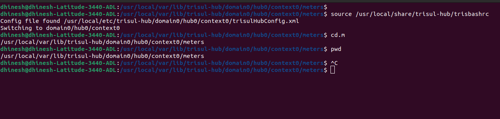

# Backups

There are two categories of data you might want back up :

**Configuration**  
This includes all the config files, analytics configuration, users, web
config, context configuration, and such.

**Data**  
This includes the metrics, flows, alerts, packets

For a large data platform like Trisul , configuration backup is of main
importance. The databases can grow to several terabytes. The
recommended solution for full scale data backup is to setup a DR node.

## Directories

:::note **Backing up a small deployment** 

For small deployments, back up the `/usr/local` directory. Ensure to first check the directory size using `du -sh /usr/local`

:::

The following directories need to be backed up. If your Trisul installation is small, back up these directories with normal Linux backup tools.

| Directories      | Description                                          |
| ---------------- | ---------------------------------------------------- |
| /usr/local/share | data                                                 |
| /usr/local/lib   | libraries                                            |
| /usr/local/var   | data and log files. This directory can be large |
| /usr/local/etc   | config                                               |
| /usr/local/bin   | executables                                          |

## How to take Trisul Data Backup Manually

To ensure business continuity, it is essential to regularly back up Trisul data and configuration. Here's a step-by-step guide:

### Trisul Data Backup

:::warning Stop the context first
Stop the context before you copy the data, and start it again when the copy finishes:

~~~
$ trisulctl_hub
trisul_hub(domain0)> stop context default
...
trisul_hub(domain0)> start context default
~~~
:::

Step 1: Load Trisul Environment Variables
```Bash
source /usr/local/share/trisul-hub/trisbashrc
```
This command loads the Trisul environment variables.

Step 2: Navigate to the Trisul Data Directory
```Bash
cd.m
```
This command changes the directory to the Trisul data path.

Step 3: Verify the Current Working Directory
```Bash
pwd
```
This command prints the current working directory to verify that you are in the correct location.

Step 4: Backup Trisul Data and Configuration
For example: 

```Bash
cp -r /usr/local/var/lib/trisul-hub/domain0/hub0/context0/meters <backup folder>
```

    
*Figure: Showing Example of Trisul Data Backup*

## How to take Trisul Configuration Backup

### Trisul Configuration Backup

Back up the following directories. A complete configuration backup needs both the Hub and the Probe directories.

| Config | Path | Description |
|--------|------|-------------|
| Trisul Hub config | `/usr/local/etc/trisul-hub/` | Hub configuration files |
| Trisul Hub data | `/usr/local/share/trisul-hub/` | Hub data |
| Trisul Probe config | `/usr/local/etc/trisul-probe/` | Probe configuration files |
| Trisul Probe data | `/usr/local/share/trisul-probe/` | Probe data |
| WebTrisul config | `/usr/local/var/lib/trisul-config/` | WebTrisul database (users, roles, dashboards, App Settings), licence files and profile configuration |

### Running install_setup_backup.sh

> **For Secured Backups Using ssh/scp**: You need to setup automatic login
> use `ssh-copy-id`

The steps are :

1. Go to /usr/local/share/trisul-hub
2. Type ./install_setup_backup.sh
3. You will be asked to enter the SFTP login details , or FTP login
   details
4. You will be asked to enter a remote directory

Once completed, a crontab entry will be automatically created to backup at
4:00AM daily. You may adjust this later.

### Backup Trisul Configuration

`install_setup_backup.sh` creates `setup_backup.conf` from the template `install_setup_backup.conf` and adds this crontab entry. The entry runs `setup_backup.sh`, the script that does the backup, with the settings in `setup_backup.conf`:

`0 4 * * * /usr/local/share/trisul-hub/setup_backup.sh /usr/local/share/trisul-hub/setup_backup.conf`

To take a one-time backup now, run `setup_backup.sh` directly:

~~~
/usr/local/share/trisul-hub/setup_backup.sh /usr/local/share/trisul-hub/setup_backup.conf
~~~

The backups are placed in the remote directory in a single tar.gz file
with the HOSTNAME and TIMESTAMP of the backup


### Distributed Probe

If you have a distributed setup, copy the `install_setup_backup.sh`
`install_setup_backup.conf` and `setup_backup.sh` files to each node
into the /usr/local/share/trisul-probe or trisul-hub directories and
repeat the above steps.

## Restoring Trisul Data

To restore the backup. Locate the backup with the correct timestamp you
wish to use and untar the backup file.

:::warning Stop the context before you restore
Stop the context before you restore the data, and start it again when the copy finishes:

~~~
$ trisulctl_hub
trisul_hub(domain0)> stop context default
...
trisul_hub(domain0)> start context default
~~~
:::

Step 1: Load Trisul Environment Variables
```Bash
source /usr/local/share/trisul-hub/trisbashrc
```
This command loads the Trisul environment variables.

Step 2: Navigate to the Trisul Data Directory
```Bash
cd.m
```
This command changes the directory to the Trisul data path.

Step 3: Verify the Current Working Directory
```Bash
pwd
```
This command prints the current working directory to verify that you are in the correct location.

Step 4: Restore Trisul Data   
For example: 

```Bash
cp -r <backup folder> /usr/local/var/lib/trisul-hub/domain0/hub0/context0/meters 
```