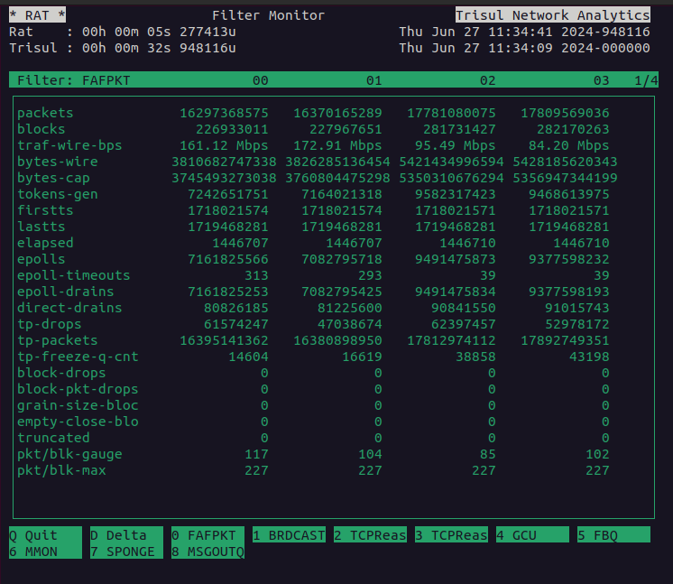
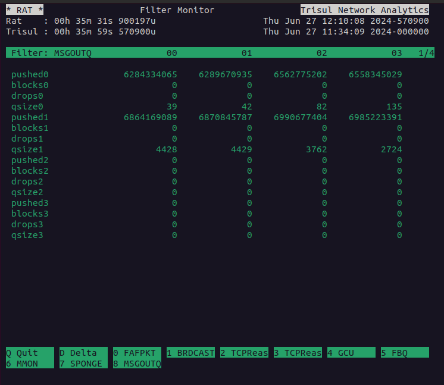

# RAT - The Trisul real time system monitor

The *rat* executable is located in `/usr/local/bin/`.

RAT monitors the internal performance characteristics of Trisul pipelines. Use it when you are trying
to tune the performance of the packet capture and analytics pipelines.

## Full Command line

```bash
[root@li76-90 ~]# rat probe-config-file packet-capture-method
```

The second parameter is the name of the capture pipeline to watch. RAT matches it as a prefix against the stats files in the context's `run` directory, so use the method the probe runs with, such as `rxring`, `afp` (AF_PACKET), `lpcap` (libpcap), `pfring` or `ffpcap` (capture from file). If you leave it out, RAT uses `tokenpipe_`.

An example run

```bash
[root@li76-90 ~]# rat /usr/local/etc/trisul-probe/domain0/probe0/context0/trisulProbeConfig.xml rxring 
```

You can also use the [helper aliases defined in trisbashrc](/docs/guide/ref/trisbashrc) to make it easier to start RAT. See the screenshots below.

## Demo

The following screenshots show RAT in action.






