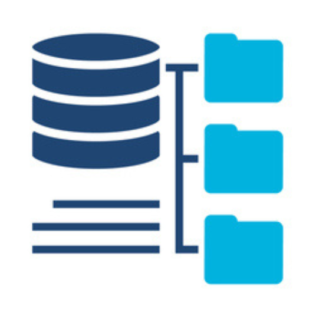
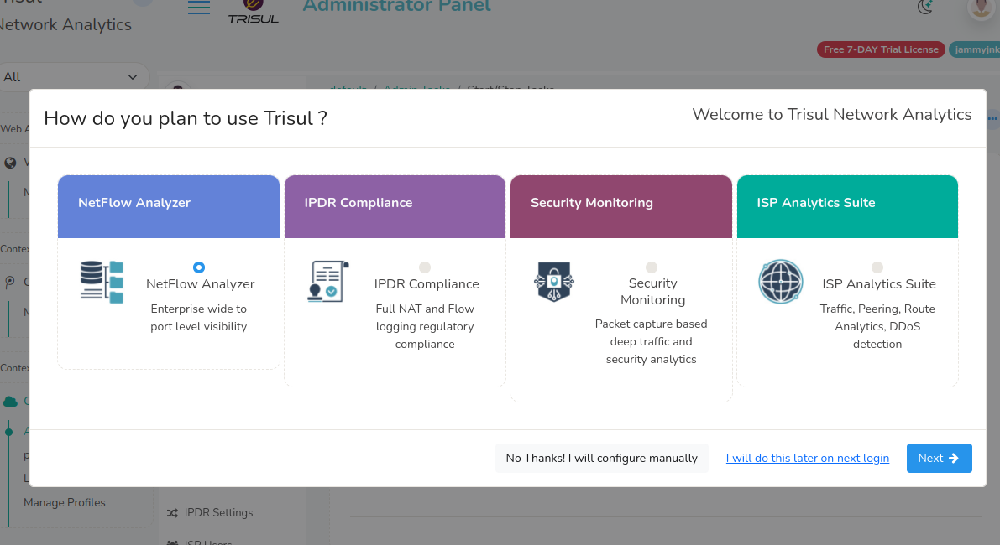
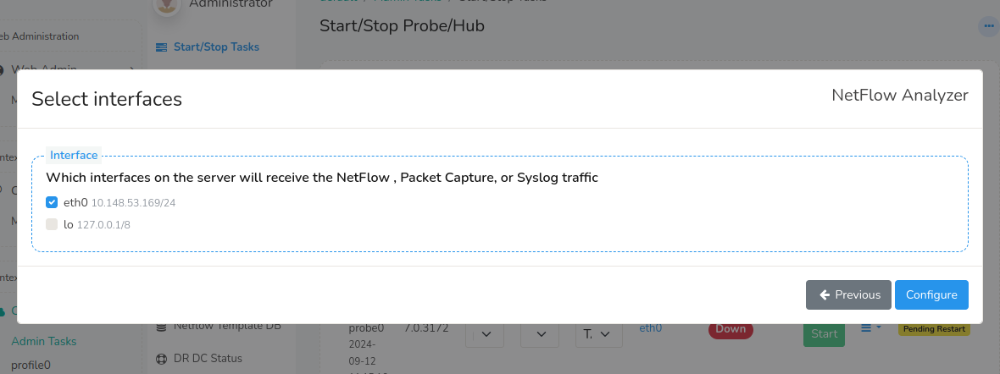
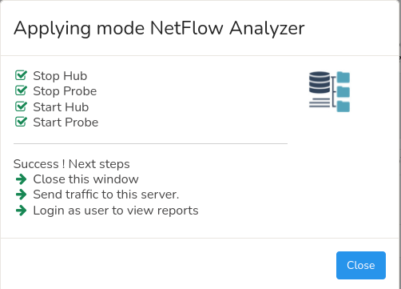
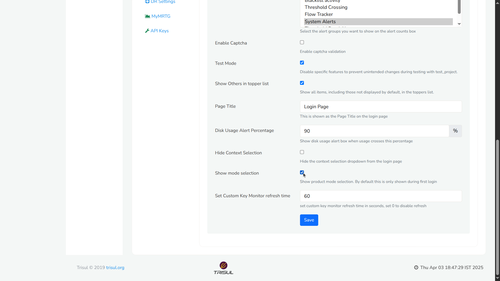

# Selecting the Product Mode

:::note after install
After installing on the server you need to select the product mode as the first step.
:::
Trisul Network Analytics is a general platform which can be reconfigured to very specific use cases.  

This *product*-izing process consists of customizing counters, flows, menus, dashboards and so on. You can select the whole configuration up front, after installation.

:::tip Pick a mode
If you skip this step, Trisul runs in Trisul NSM mode (packet capture). If you plan to use Trisul NetFlow Analyzer, Trisul IPDR DoT Compliance Solution or Trisul ISP Analytics, select that mode here. You can configure Trisul manually instead, but the mode selector sets up the counters, flows, menus and dashboards for you.
:::

## Four Product Modes

<!-- TODO(verify): card labels copied from images/selectmode.png; confirm against the current build -->

| Trisul NSM | Trisul NetFlow Analyzer | Trisul IPDR DoT Compliance Solution | Trisul ISP Analytics |
|:---|:---|:---|:---|
|  |  |  |  |
| Card in the selector: **Security Monitoring** | Card in the selector: **NetFlow Analyzer** | Card in the selector: **IPDR Compliance** | Card in the selector: **ISP Analytics Suite** |
| **Choose this for:** packet-based network security monitoring, deep traffic visibility, troubleshooting, investigation, and forensics. | **Choose this for:** flow-based network traffic monitoring using NetFlow, IPFIX, or sFlow. | **Choose this for:** IPDR and NAT logging, subscriber activity records, and regulatory compliance requirements. | **Choose this for:** ISP traffic analytics using NetFlow and BGP, including peering, AS, prefix, routing, and geographic analysis. |

Not Sure Which Product Mode to Choose? Refer to [**Product Modes**](/docs/guide/starthere/what_is_trisul/productmodes) documentation to select the product mode that best fits your intended use.

## First Login

After following the steps in [Installing](/docs/guide/starthere/setuptrisul/install/doinstall), You should be able to login to the UI by opening 

:::info navigation

:point_right:  Open your browser and go to `http://ipaddress:3000`  
default username = `admin` and  
pwd = `admin` 
:::

## Screen 1: Configure Product Mode

The first screen you encounter will present the 4 product modes as shown below. 

Using the guidance above, choose the product mode that best fits your intended use.

Once selected, choose how you’d like to proceed:

* **No Thanks! I will configure manually** &rarr; Best suited for Advanced users who already know the way around Trisul.
* **I will do this later on next login** &rarr;  Not ready to commit yet? You can explore the system now and come back to this setup the next time you log in.
* **Next** &rarr; Continue with the guided setup using the product mode you selected.

You can always revisit or adjust your choices later. Nothing here locks you in.

## Screen 2: Select Interface

Upon selecting "Next" in screen 1 

The dialog shows a list of interfaces found on the Trisul Probe node along with their IP Addresses. Select one or more interfaces that will receive NetFlow, Packet Capture (via SPAN port) or Syslog traffic. To go back to Screen 1, click **Previous**.

Press the **Configure** button to finish.

## Screen 3: View Status

The hub and probe nodes are restarted with the selected mode.

:::success Complete
Now you can start sending traffic, either NetFlow or packets to Trisul.
Log out and log in as `user`, the view-only account, to start viewing reports. See [Logging In](/docs/guide/starthere/setuptrisul/login) for the default credentials.
:::

:memo: To learn the user interface, see the User Guide [Introduction](/docs/guide/ug/ui/).

## Re-Enabling Product Mode Selector

If you skipped product selection during the initial setup (Screen 1: Configure Product Mode) or selected a mode and later decide to switch to another mode, you’ll need to re-enable the Product Mode selector.

This restores the same Product Mode selection screen you saw during first-time onboarding.

:::info navigation
:point_right: Go to Web Admin &rarr; Manage &rarr; App Settings &rarr; UI
:::

  
*Figure: Showing Re-enabling Product Mode Selector*

- Select the **Show mode selection** checkbox.
- Click **Save**.

Once you have completed these steps, you can select the desired mode in the **How do you plan to use Trisul ?** dialog.