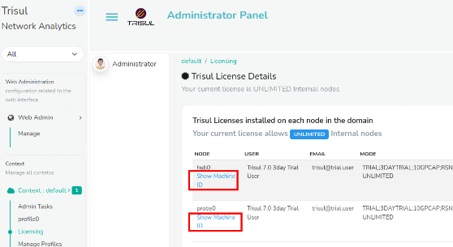
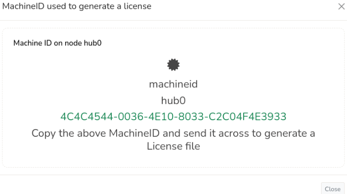
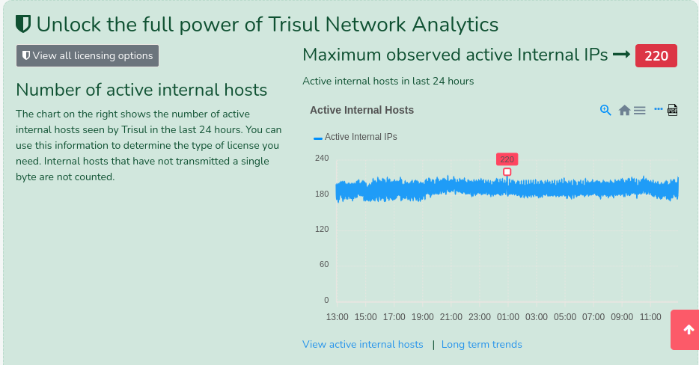

# Introduction 

Trisul Network Analytics licenses are :

1. Perpetual
2. Need one license per physical node
3. Tied to a machine ID

License types are :

1. **7-Day Trial License** : The trial license includes all real-time analytics and the most recent 7 days of historical analysis.
2. **Production License** : depends on the number of active internal endpoints in your [Home Network](/docs/guide/learntrisul/homenetwork_concepts) space
   1. Small Business : 500 simultaneously active Internal IPs
   2. Medium : 3000 simultaneously active Internal IPs
   3. Unlimited : As many as your hardware can support

For more information, see the [Trisul pricing page](https://trisul.org/pricing).

## Machine ID

Once you have decided which license type suits you, you need to get the Trisul Machine ID that uniquely identifies the server or VM on which you are running Trisul.

### Getting the Machine ID

:::info navigation

:point_right: Login as Admin → **Context : default** → **Licensing**

:::

  
*Figure: Getting the machine-id from the Admin UI*  

Click **Show Machine ID** against each node to get the Machine ID, as shown below.

  
*Figure: Showing a sample of Machine ID*


### Alternate Method: Get Machine ID Using Command Line

Run the following command and send us its output.

 ```BASH
sudo trisul --machineid

4087ACCD-4B0B-DE11-833A-00248CB93BDE
```

That number 4087ACCD-4B0B-DE11-833A-00248CB93BDE is called the MachineID.


## Finding Out How Many Internal IPs I Have

Before choosing a license size, you need to know how many internal IPs are active on your network at peak usage. Trisul tracks this automatically for you.

To view this information:

:::info navigation

:point_right: Login as Admin → **Context : default** → **Licensing**

:::

  
*Figure: The chart shows the active internal hosts in the past 24 hours*

Use this chart to identify the maximum number of simultaneously active internal IPs, which is the value used for license sizing.

Click **Long term trends** to see a longer time window.