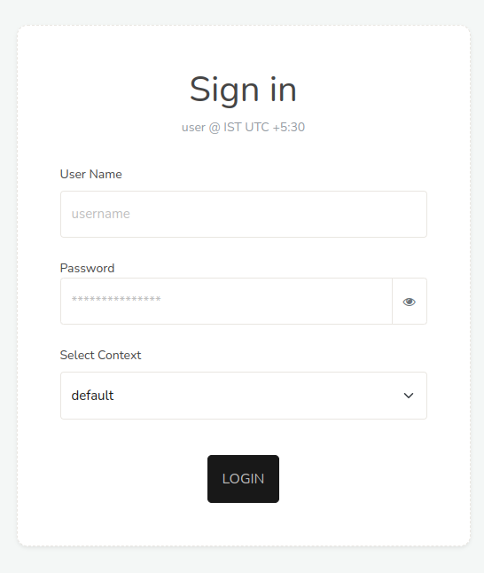

# Logging In

:::tip
For best results, use a current version of **Firefox** or **Chrome**.
:::

Trisul can be accessed by pointing your browser to :  

- Via HTTP on port *3000*. To use another port, see [Change the Trisul webserver port](/docs/guide/howto/change_web_port).

- Via HTTPS. See [Using HTTPS](/docs/guide/howto/sslforwebtr).

## First Login

If this is the first time you are logging in , use the built-in `admin`
user or `user` user.

#### To Configure

username = `admin`  
password = `admin`

#### To View Stats

user name = `user`  
password = `user`

After you log in, change the default password. See [Change Own Password](/docs/guide/ag/webadmin/manageusers#change-own-password).

## Contexts

[Contexts](/docs/guide/learntrisul/concepts/contexts) are multiple analysis domains in Trisul. At login time you must select the context you wish to analyze. Hover your mouse over each context name to get a description of what the context contains.

If you only have one context, which is the most common case, the choice
is not shown.

*Figure: Login Screen*

## Logout

You can logout by clicking the **logout** at the top left.

## Inactivity Security Timeout

Due to the sensitive nature of the data presented by Trisul, there is an
inactivity timeout associated with each user. If no user interaction is
seen by the WebTrisul server for a certain period of time, the user is
automatically logged out. They will then have to present their
login/password again to re-enter the system.

You can increase inactivity timeout

:::info navigation

:point_right: To access, Login as **Admin**. Select Manage &rarr; App Settings &rarr; Web
Server &rarr; Idle Timeout

:::

If you want to disable it - set it to some **huge value** (1000000
seconds)

## Login Rules

- If you login from a second location, Trisul will kick the first
  session out.

- The superadmin (ie the user with username `admin` ) can login from
  any number of places.  

- All other users can have only one active session. For example, if you log in at home, forget to log out, and then log in at work, your home session is logged out automatically.

- The admin user can ***Force Logout*** any user with a **stuck**
  session. 

- *Remember me* functionality is not available 

- The same inactivity timeout applies to all users including admin

- All login activity including inactivity timeout is logged (See *Admin
  &rarr; Tasks &rarr; User Auth Log*)
<!-- TODO(verify): menu path to User Auth Log -->

> You can allow specific users to also login from multiple locations at a time
