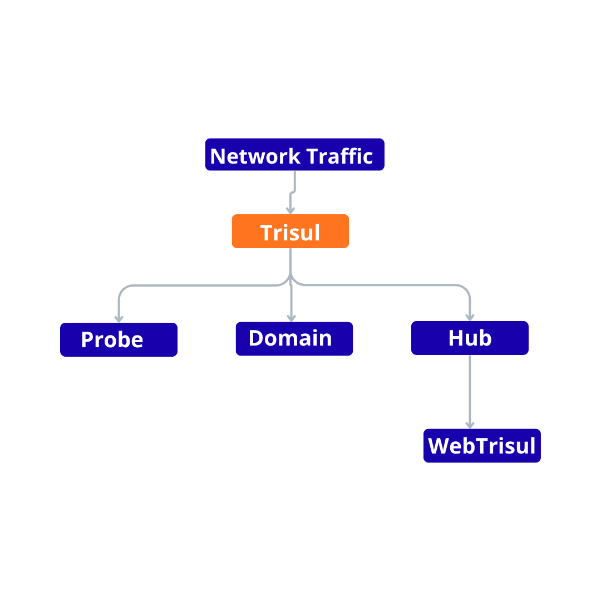

# Trisul Basic Architecture

Trisul's core components are the **Probe**, which processes traffic, and the **Hub**, which stores the results. They communicate inside a **Domain**. The list below also covers three related terms: Profile, Context and WebTrisul.

*Figure: Trisul Basic Architecture*

At a high level:

- [**Probe**](/docs/guide/learntrisul/terminology#probe) is the **streaming analytics engine** that processes network traffic.

- [**Domain**](/docs/guide/learntrisul/terminology#domain) is the **trusted group of Probes and Hubs** that can communicate securely. The Domain Certificate authenticates each node and provides its network endpoints.

- [**Hub**](/docs/guide/learntrisul/terminology#hub) is the **database and data management layer** that stores the processed data.

- [**Profile**](/docs/guide/learntrisul/terminology#profile) is the configuration associated with a Probe. Each Probe can have its own Profile.

- [**Context**](/docs/guide/learntrisul/terminology#context) provides the logical environment in which traffic data is organized and stored.

- [**WebTrisul**](/docs/guide/learntrisul/terminology#webtrisul) provides the user interface for accessing and analyzing the data managed by the Hub.

:::note
This is a high-level view of the main components and how they relate to each other. It is not a complete representation of the Trisul architecture. For a detailed view, see [**Distributed Domain Concepts**](/docs/guide/learntrisul/concepts/).
:::
