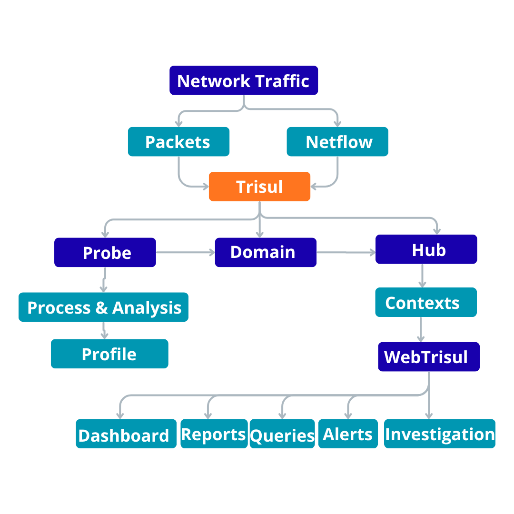
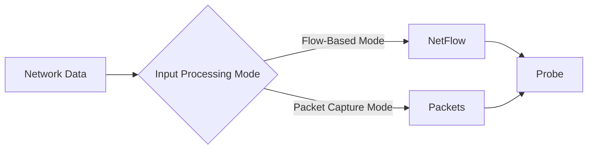

# Trisul Data Flow

This page provides a high-level summary of how network data flows through Trisul, **from the point** it enters the platform **to the point** where it becomes available for monitoring and analysis.

*Figure: Data Flow*

The sections below explain the different input modes and the main stages involved in processing and storing the data.

## What Happens to the Data

<!-- TODO(verify): data-flow wording pending product-team sign-off -->

1. The network traffic is received in the form of packets and netflow in the probe. Once the input reaches the **Probe**, Trisul performs streaming analytics on the incoming data.

2. The Probe processes and analyses the metadata and sends it to the Hub.

3. The **Domain** is the trusted group of Probes and Hubs that can communicate securely. The Probe and the Hub exchange data inside the Domain.

4. The **Hub** stores the data per **Context**. A Context is an isolated instance (tenant) with its own database.

5. The stored data is then available through **WebTrisul**, where users can view and analyze it through dashboards, reports, queries, alerts, and investigation tools.

In both input processing modes, the data follows the same overall path:

<!-- TODO(verify): path string pending product-team sign-off -->
**Network Input → Probe → Domain → Context → Hub → WebTrisul**

The difference is in the **type of network input** received by the Probe:

## Input Processing Modes

Trisul supports two input processing modes based on how network data enters the platform:

- **Flow-Based Mode** - Trisul receives flow records such as **NetFlow, IPFIX, or sFlow** from network devices and processes those records for analysis.
- **Packet Capture Mode** - Trisul receives and analyzes **network packets** directly from the network.

Processing Mode therefore describes **how network data enters Trisul and how the Probe processes that input**.

:::note
Processing Mode is different from **Product Mode**, which describes how Trisul is intended to be used for certain use cases. See [Product Modes](/docs/guide/starthere/what_is_trisul/productmodes).
:::
