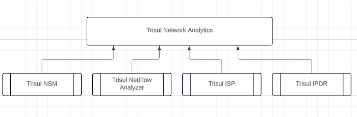

# How Trisul Works

## What is Trisul

**Trisul Network Analytics** is a software suite that takes network packets or flow data and extracts traffic metrics, flow analysis, alerts, and metadata from them.
The applications of Trisul include deep network traffic management, network security monitoring, threat hunting, incident detection, and audit.

Users of Trisul view these analytics reports through a dashboard that opens in any web browser.

### Platforms

:::info  Software based 
**Linux based** Trisul runs on Ubuntu and RHEL/CentOS/OracleLinux based systems. 

It has native support for advanced high speed packet capture and load balancing mechanisms like RX_RING, PF_RING, AF_PACKET, and various proprietary hardware acceleration.
:::

## Products

Using specialized configuration and extensions we've tailored the Trisul platform into products that fit specific use cases. 

The four product modes are:

- **Trisul NetFlow Analyzer**: traffic analytics from flow records exported by routers and switches.
- **Trisul NSM**: network security monitoring from raw packets (SPAN or TAP), plus IDS alerts.
- **Trisul IPDR DoT Compliance Solution**: IPDR logging for ISPs that must meet India DoT rules.
- **Trisul ISP Analytics**: AS, prefix and peering analytics for carriers and ISPs.

To compare them, see [Product Modes](/docs/guide/starthere/what_is_trisul/productmodes).

:::tip[Doc Note]
:memo:  The Trisul documentation covers the parts common to all four products. Each product's own workflows are in its [product guide](/docs/prodguide).
:::

## Who Benefits From Trisul

Typical users of Trisul:

- **Enterprises**: Both traffic monitoring and security teams in
  enterprises will benefit from the deep visibility provided by Trisul.
- **NSM teams**: Network security monitoring teams can monitor all the entities and metadata in a practical manner using Trisul. Down to
  the packet level.
- **ISP**: ISPs use Trisul for compliance and large scale Netflow based
  visibility.
- **Analysts**: Analysts can analyze large PCAP dumps using Trisul to
  investigate deeply
- **MSP/SOC**: Managed Security services use Trisul for consulting to
  build a complete baseline from traffic, flow, security angles. They
  can also use Trisul to build a Security Operations Centre using the
  Multi Homing capabilities.
- **Developers/Enthusiasts**: Advanced users can use the Trisul APIs to
  build their own tools on top of the Trisul platform. We feature an
  open and well documented API using plain Lua and Ruby.

## Quick Features List

The following table lists what you can do with Trisul.

| Feature               | Description    |
| --------------------- | ----------|
| Platform              | Built on Linux with support for specialized hardware accelerators for high-performance processing.   |
| Technology            | Uses a custom-built backend with streaming analytics, storage, and reporting integrated—eliminating the need for external systems like Elasticsearch or high-cost log management platforms.  |
| Traffic Analysis      | Goes beyond basic bandwidth, SNMP, or NetFlow monitoring. Offers more than 150 traffic metrics across all network layers out of the box.   |
| Flow Monitoring       | Supports ingestion via NetFlow protocols. When processing raw packets, Trisul constructs and stores flow records in a purpose-built database that scales to billions of flows per day while maintaining instant query response times.   |
| Metadata collection   | Essential for Network Security Monitoring (NSM), Trisul captures and logs rich metadata including HTTP URLs, domain names, SSL/TLS certificates, and even reconstructed binaries. |
| Security Alerts       | Integrates with IDS systems like Suricata to ingest and correlate alerts seamlessly with other monitored data.    |
| Packet storage        | Includes an advanced packet indexing and storage system. Allows users to define granular retention policies—even at the individual flow level—to manage storage efficiently.   |
| Graph Analytics | Introduces Trisul EDGE, a feature set for graph-based network analysis. Graph analytics builds relationship networks between various network entities seen by Trisul. For example, you can click on a particular “Certificate Authority” to open up its neighbors and see which organizations and IPs have used certificates issued by them. |

