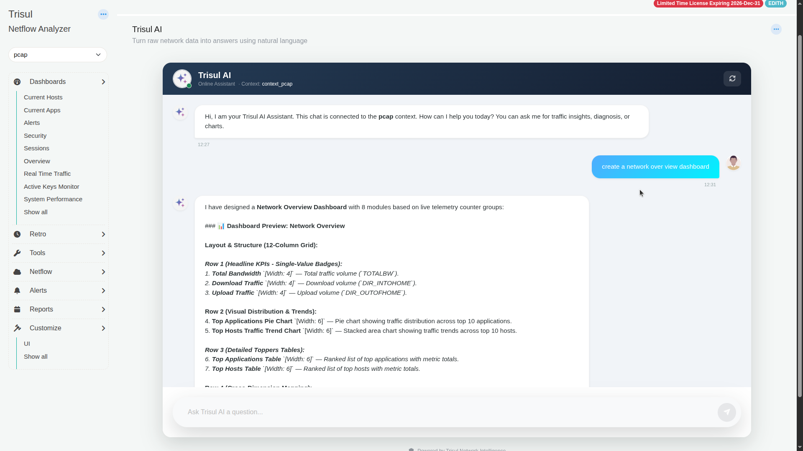
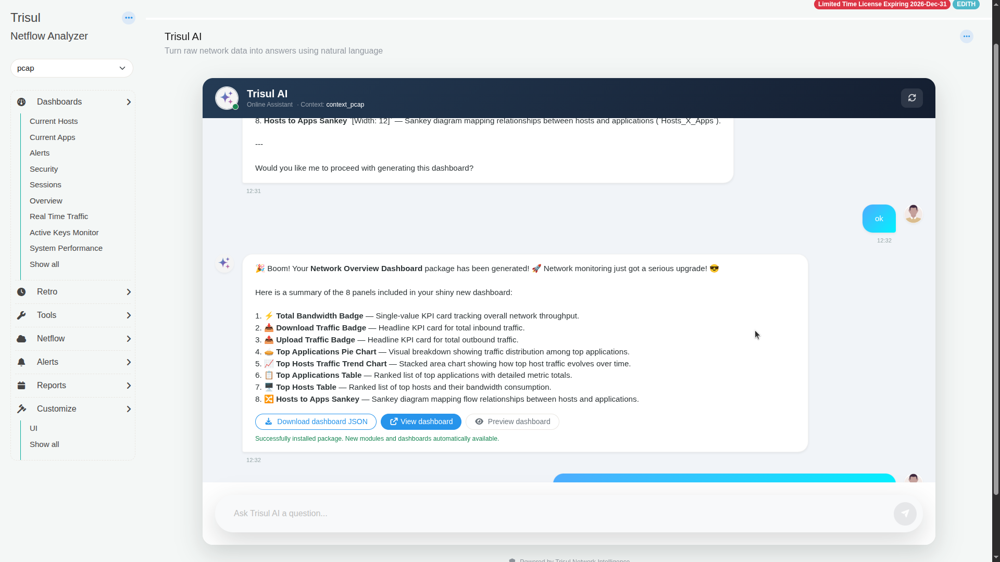
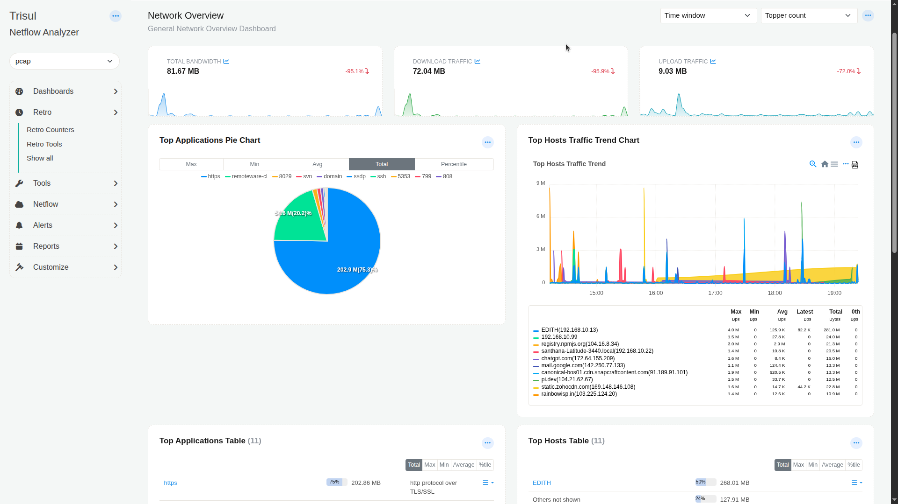

# Build a dashboard with Trisul AI

Describe the dashboard you want. Trisul AI proposes a layout, waits for your approval, then builds the dashboard and installs it in WebTrisul. You don't need to know counter group names or module settings.

**Before you begin:** Trisul AI is [set up](./setup), and you've selected the context the dashboard is for.

## Steps

1. Open the **Trisul AI** page and describe the dashboard:

   ~~~text
   create a network overview dashboard
   ~~~

2. Read the plan. Trisul AI lists each module, its width on the 12-column grid and the data behind it.

   

   For a network overview it proposed eight modules in four rows:

   | Row | Modules |
   | --- | --- |
   | 1 | **Total Bandwidth**, **Download Traffic**, **Upload Traffic** badges (width 4 each) |
   | 2 | **Top Applications Pie Chart**, **Top Hosts Traffic Trend Chart** (width 6 each) |
   | 3 | **Top Applications Table**, **Top Hosts Table** (width 6 each) |
   | 4 | **Hosts to Apps Sankey** (width 12) |

3. To change the plan, say what to change, for example "replace the pie chart with a bar chart". Trisul AI sends a revised plan.
4. When the plan is right, reply `ok`.
5. Trisul AI generates the dashboard package. Use the buttons under its reply:

   | Button | What it does |
   | --- | --- |
   | **Preview dashboard** | Opens a preview without installing the dashboard. |
   | **Download dashboard JSON** | Saves the dashboard package file, so you can keep it or import it on another Trisul. |
   | **Install dashboard** | Installs the dashboard in WebTrisul. |
   | **View dashboard** | Opens the installed dashboard. |

   

6. Click **Install dashboard**, then **View dashboard**.

The dashboard belongs to the context you opened the chat from.

Use **Time window** and **Topper count** at the top right of the dashboard to change the period and the number of items shown.

## Add a module that needs new data

If a module needs data that no counter group collects yet, Trisul AI says so and proposes a new counter group.

For example, "add a module to show data in three dimension with apps, hosts and protocol in tree format" needs a three-way crosskey. Trisul AI found only two-way crosskeys such as **Hosts_X_Apps**, so it proposed a new crosskey counter group, **Apps_X_Hosts_X_Protocol**, with its settings. After you reply `ok`, it creates the counter group and adds the module.

:::note
After Trisul AI creates the counter group, restart the context manually (**Admin Tasks → Start/Stop Tasks**). The new counter group collects data only after the restart, so the module stays empty until then.
:::

## Related

- [Create a counter group with Trisul AI](./create-countergroup)
- Build a dashboard by hand: [Create dashboards](/docs/guide/ug/ui/create_dashboards)
