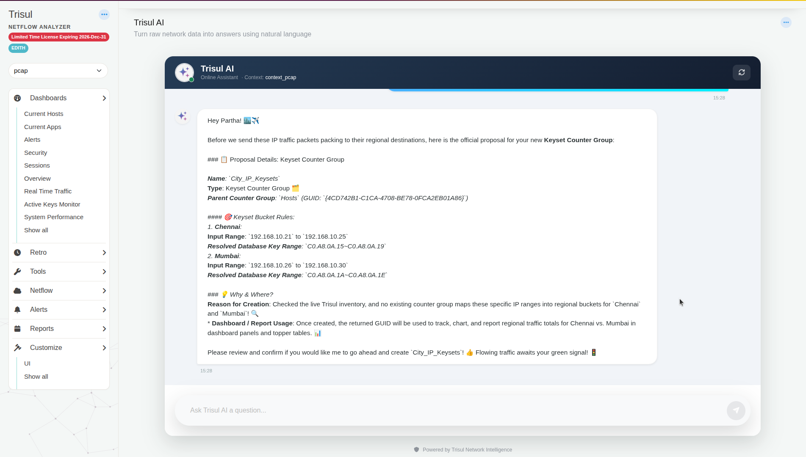
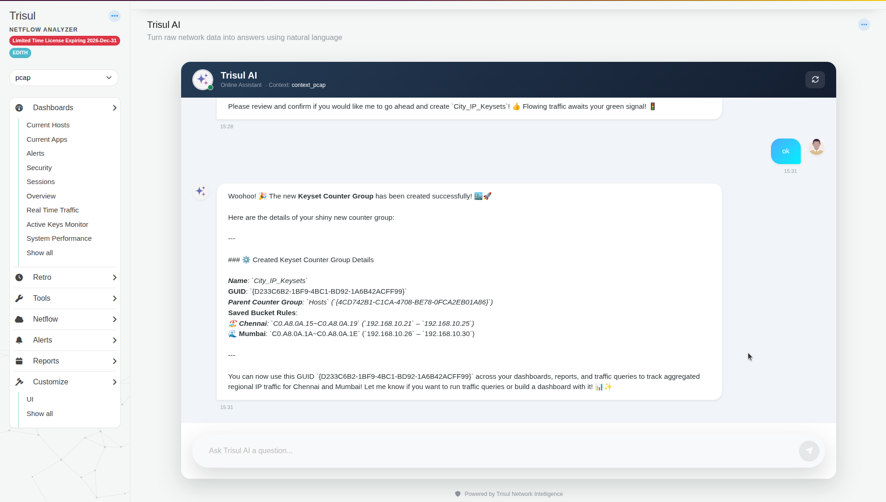

# Create a counter group with Trisul AI

A counter group is a set of meters that Trisul updates for each key, such as each host or each application. Trisul AI can create three kinds of counter group for you:

| Type | What it does | Example |
| --- | --- | --- |
| **Crosskey** | Combines two or three counter groups into one, so you can see their combinations | Hosts × Apps, or Apps × Hosts × Protocol |
| **Filter** | Counts only the keys you choose from a parent counter group | Only DNS (port 53) traffic, per interface |
| **Keyset** | Groups keys from a parent counter group into named buckets | IP ranges named by city |

For each one, Trisul AI first checks the existing counter groups. If none fits, it shows a proposal and creates the group only after you confirm.

**Before you begin:** Trisul AI is [set up](./setup). You don't need an Admin login. Any Trisul AI user can create counter groups.

## Example: group IP ranges by city

1. Open the **Trisul AI** page and describe the group:

   ~~~text
   Create a keyset counter group to show IPs 192.168.10.21–25 as Chennai and IPs 192.168.10.26–30 as Mumbai.
   ~~~

2. Read the proposal. Trisul AI checks existing counter groups first and only proposes a new one if none fits. The proposal lists:

   - **Name:** for example `City_IP_Keysets`
   - **Type:** Keyset Counter Group
   - **Parent Counter Group:** the group the keys come from, here **Hosts**
   - **Keyset Bucket Rules:** each bucket with its input IP range and the resolved database key range

   

3. Check the IP ranges. If anything is wrong, say what to change.
4. Reply `ok`. Trisul AI creates the counter group and shows its **GUID**.

   

5. Use the new group in questions, reports and dashboards, for example "chart Chennai vs Mumbai traffic for the last hour".

:::note
New counter groups collect data only from the time they're created. TODO(verify: whether the context must be restarted before data appears)
:::

## Related

- What keysets are: Keyset counter groups (TODO(verify: link))
- Create one by hand: TODO(verify: link to the Admin Guide page)
