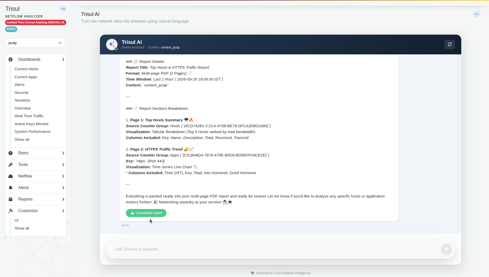
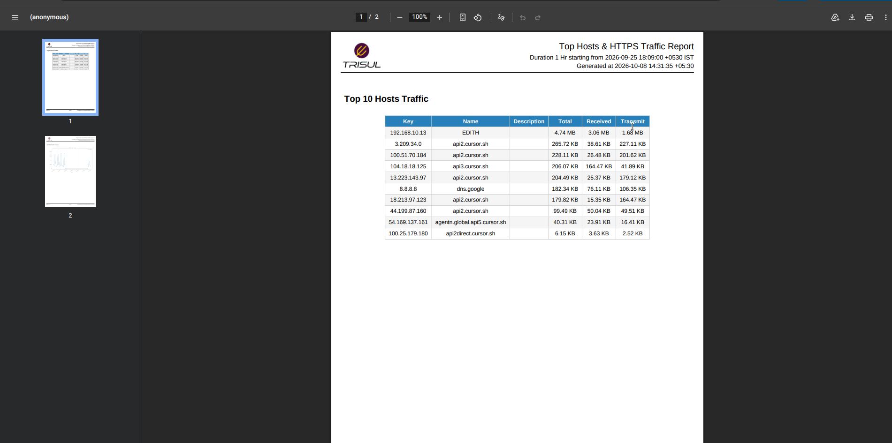
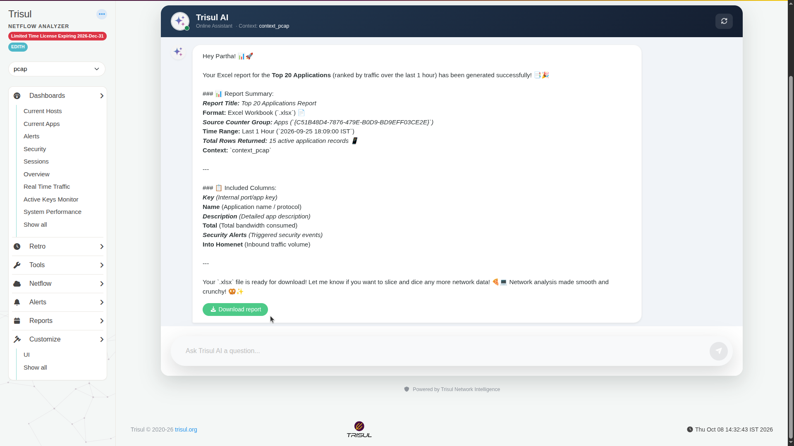
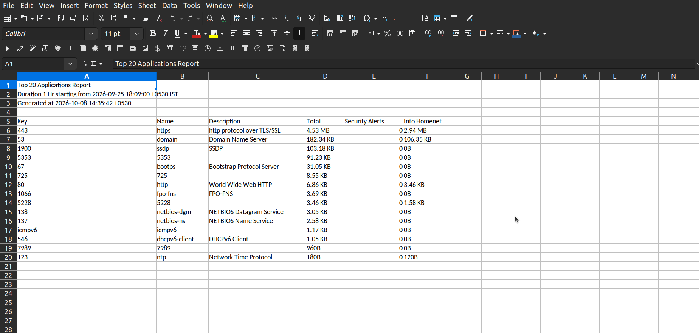

# Create PDF and Excel reports with Trisul AI

Ask for a report with exactly the tables, charts and columns you need. Trisul AI builds it from your stored data and gives you a download link. You don't need a report template.

**Before you begin:** Trisul AI is [set up](./setup), and you've selected the context to report on.

## Create a PDF report

1. Open the **Trisul AI** page and describe the report. Name the format, the contents and the time window:

   ~~~text
   generate a pdf report with the top hosts traffic trend and a https traffic chart for last 1 hour
   ~~~

2. Read the summary. Trisul AI lists the title, format, time window, context, and for each page its counter group, visualization and columns.

   

3. Click **Download report**.

The PDF has a header with the report title, the time window and the time it was generated.

## Create an Excel report

1. Ask for an Excel report:

   ~~~text
   generate a excel report with top 20 applications
   ~~~

2. Read the summary, including **Total Rows Returned**. You can get fewer rows than you asked for if fewer items had traffic in that window.
3. Click **Download report**. The file is an Excel workbook (`.xlsx`).

Rows 1–3 of the sheet hold the report title, the time window and the generation time. The data table starts on row 5.

## Get exactly the columns you need

Name the columns in your question. Trisul AI drops the rest. For example:

~~~text
create an interface utilization report with only Router IP, Hostname, Interface, Interface Description, In Utilization, Out Utilization and Total Utilization
~~~

## Tips

- Always give a time window. Otherwise Trisul AI picks one.
- Check the time window in the summary before you download. "Last 1 hour" means the last hour of data available in the context, not the hour before now. If the context stopped receiving traffic, the report covers the last hour before it stopped.
- To send a report on a schedule, use [**Schedule Email Reports**](/docs/guide/ug/reports/schedreports) in the Admin panel. Trisul AI reports are on demand.

## Related

- [What you can ask](./prompts)
- Built-in reports: [Reports](/docs/guide/ug/reports/)
