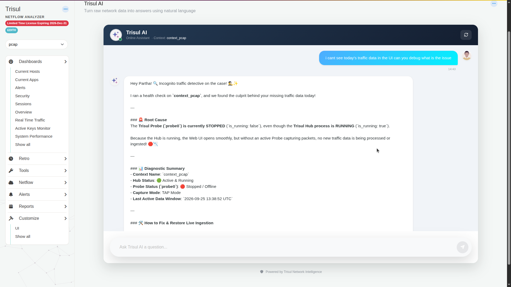
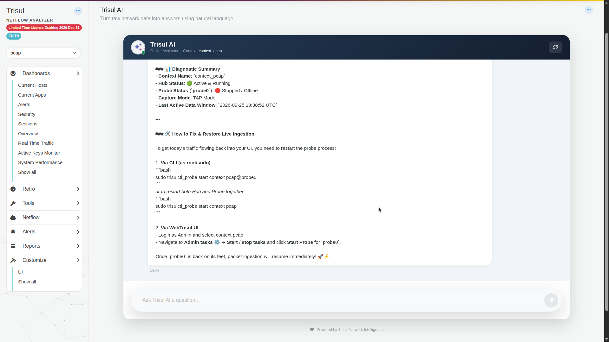

# Find out why data is missing with Trisul AI

When dashboards are empty or stop updating, ask Trisul AI. It checks the Hub and Probe status of the context and tells you what's wrong.

## Steps

1. Select the context with the problem, then open the **Trisul AI** page.
2. Describe the problem:

   ~~~text
   i cant see today's traffic data in the UI can you debug what is the issue
   ~~~

3. Read the **Root Cause** and **Diagnostic Summary**. The summary shows the context name, **Hub Status**, **Probe Status**, capture mode and the last time data arrived.

   

4. Apply the fix. In this example the probe was stopped, so Trisul AI suggested starting it from the CLI or from **Admin Tasks → Start/Stop Tasks**.

   

## Related

- [Troubleshooting](https://docs.trisul.org/docs/Troubleshooting/)
