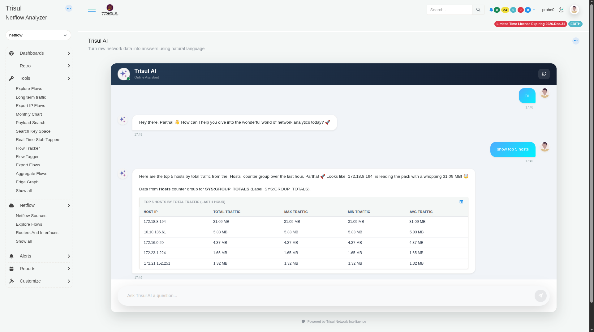
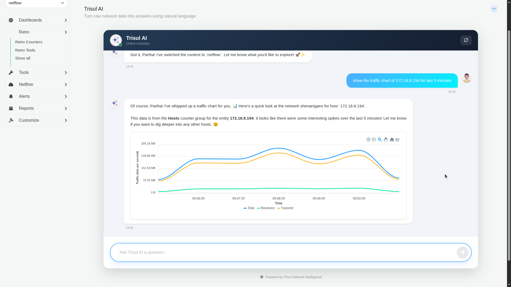
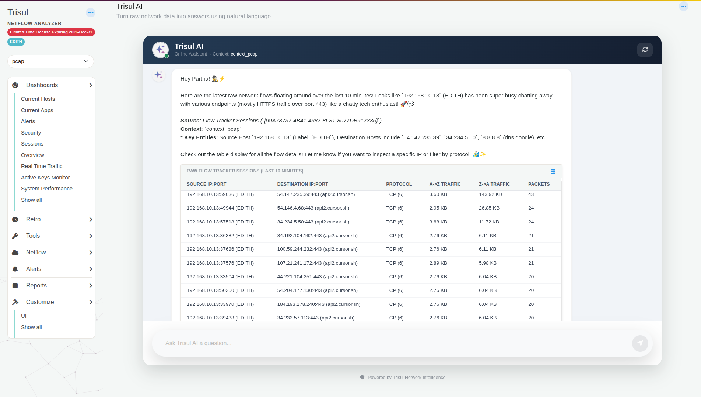
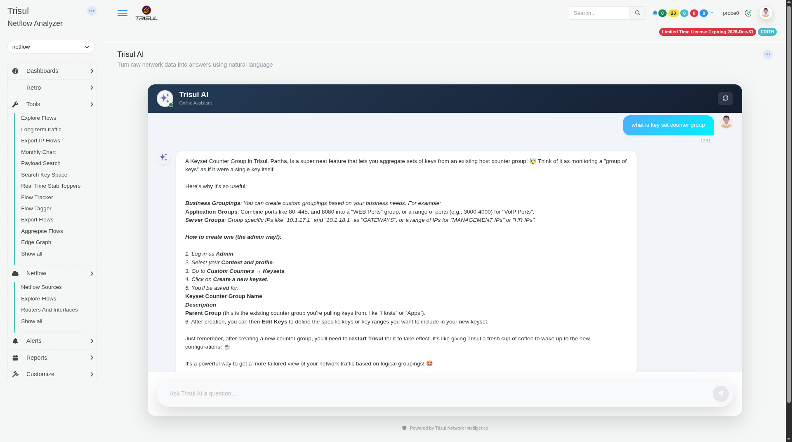

# Ask your first questions

In this tutorial you ask Trisul AI four questions. You get a table, a chart, a list of raw flows and an explanation. Along the way you learn how the chat picks the context and time window.

**Time:** 10 minutes.
**Before you begin:** an admin has [set up Trisul AI](./setup), and your context is receiving traffic.

## 1. Open the chat

1. Log in to WebTrisul.
2. Select a context in the context list at the top left (for example `netflow`).
3. Open the **Trisul AI** page. TODO(verify: menu path)

The page title reads **Trisul AI**, with the subtitle *Turn raw network data into answers using natural language*. The chat header shows **Online Assistant** and the context the chat is connected to, for example **Context: context_pcap**.

Type in the **Ask Trisul AI a question...** box and press Enter, or click the send button.

## 2. Find the top hosts

Type:

~~~text
show top 5 hosts
~~~

Trisul AI returns a table of the five busiest hosts. Above the table it tells you where the data came from, here the **Hosts** counter group.

You didn't give a time window, so Trisul AI used the last hour. The table title says so: **TOP 5 HOSTS BY TOTAL TRAFFIC (LAST 1 HOUR)**.

:::tip
Name the time window to change it: "show top 10 hosts for the last 24 hours".
:::

## 3. Chart one host

Copy an IP from the table and type:

~~~text
show the traffic chart of 172.18.8.194 for last 5 minutes
~~~

Trisul AI draws a line chart with **Total**, **Received** and **Transmit** lines.

Use the chart toolbar to zoom in, zoom out, select an area to zoom, pan and reset the view.

Charts work for applications too:

~~~text
show https traffic chart for last 10 minutes
~~~

This chart uses the **Apps** counter group and shows **Total Traffic**, **Into Homenet** and **Outof Homenet**.

## 4. Look at raw flows

Type:

~~~text
show the raw flows of last 10 minutes
~~~

Trisul AI lists individual flows from the Flow Tracker: source and destination IP:port, protocol, traffic in each direction and packet count.

## 5. Ask about Trisul itself

Trisul AI also answers questions about the product, using the Trisul documentation. Type:

~~~text
what is key set counter group
~~~

:::caution
Answers about menus and steps come from the documentation and can be out of date. If a menu path in an answer doesn't match your screen, follow the docs page for that feature.
:::

## How the chat chooses context and time

- **Context:** the chat is locked to the context you selected before you opened the **Trisul AI** page. Every question uses that context. To use another context, select it in WebTrisul, then open the **Trisul AI** page again. Don't ask the chat to switch context.
- **Time window:** if you don't name one, Trisul AI picks a default (the last hour for top-N tables). TODO(verify: is "last hour" relative to now or to the newest data in the context?)
- **Follow-ups:** the chat remembers earlier messages in the same conversation, so "now chart the second one" works.
- **New conversation:** click the refresh button in the chat header. TODO(verify: confirm it clears the conversation)

## What you learned

You asked for a top-N table, a host chart, an app chart and raw flows, and you asked a product question.

## Next steps

- [Build a dashboard with Trisul AI](./build-dashboard)
- [Create PDF and Excel reports](./create-reports)
- [What you can ask](./prompts)
