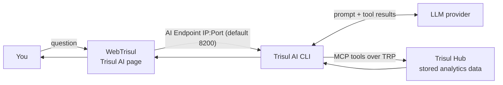

# Trisul AI

Trisul AI is a chat assistant inside WebTrisul. You ask a question about your network in plain language, and Trisul AI answers with tables, charts, reports, dashboards or step-by-step explanations, using the data already stored in Trisul.

**Applies to:** NetFlow Analyzer, NSM and ISP Analytics modes.
**Available from:** Trisul 8.0

:::note Trisul AI is not Trisul IPDR AI
These pages cover **Trisul AI**, the general-purpose assistant. The IPDR compliance product has its own, separate AI layer that turns a plain-language request into an IPDR query form. That layer has its own setup and rules. See [IPDR AI](/docs/prodguide/ipdr/ai-query)
:::

## What you can do with Trisul AI

| Task | Example question | Result |
| --- | --- | --- |
| Find top talkers | "show top 5 hosts" | Table |
| Chart a host or app over time | "show the traffic chart of 172.18.8.194 for last 5 minutes" | Line chart |
| Look at raw flows | "show the raw flows of last 10 minutes" | Flow table |
| Build a report | "generate a pdf report with the top hosts traffic trend and a https traffic chart for last 1 hour" | PDF or Excel (.xlsx) download |
| Build a dashboard | "create a network overview dashboard" | Installed dashboard |
| Create a counter group | "Create a keyset counter group to show IPs 192.168.10.21–25 as Chennai and IPs 192.168.10.26–30 as Mumbai" | New counter group |
| Find out why data is missing | "i cant see today's traffic data in the UI can you debug what is the issue" | Diagnosis and suggested fix |
| Learn Trisul | "what is key set counter group" | Explanation from the Trisul docs |

For more questions you can ask, see [What you can ask](./prompts).

## How it works

Trisul AI has three parts. They can run on one machine or on separate machines.

- **WebTrisul** shows the chat. It sends your question to the Trisul AI CLI.
- **Trisul AI CLI** holds the LLM settings and API key. It asks the LLM what to do, then runs Trisul tools (MCP tools that use the Trisul Remote Protocol, TRP) to fetch data from the Hub.
- **Trisul Hub** stores the analytics data: counter groups, flows and alerts.
- **The LLM** plans the answer and writes the reply. You choose the provider. Trisul AI works with any OpenAI-compatible LLM, commercial or self-hosted.

The LLM never connects to the Hub or its database directly. It only sees what the CLI tools return.

## Data and privacy

- Your LLM API key stays in the Trisul AI CLI. WebTrisul never sees it.
- The LLM can't read packet captures and can't bypass the Trisul analytics engine.
- Trisul AI doesn't store your prompts, conversation history or chat transcripts, and sends no telemetry to Unleash Networks.
- The data needed to answer a question (for example, top host IPs and byte counts) goes to the LLM provider you configure. To keep all data on your network, use a self-hosted LLM.

:::caution Trisul AI can change configuration when you approve it
Most questions only read data. Some requests create things: dashboards and counter groups. For these, Trisul AI first shows a plan and waits for you to reply **ok**. Read the plan before you approve it. TODO(verify: which users can approve changes, and whether non-admin users can create counter groups)
:::

## Where to go next

1. **Admin:** [Set up Trisul AI](./setup).
2. **Everyone:** [Ask your first questions](./first-questions).
3. Then pick a task: [build a dashboard](./build-dashboard), [create reports](./create-reports), [create a counter group](./create-countergroup) or [find out why data is missing](./diagnose).
