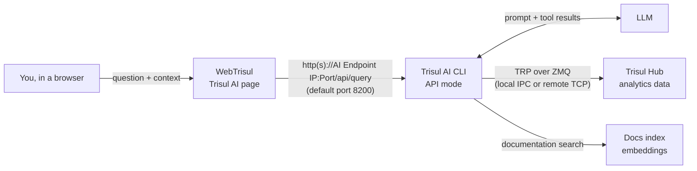

# Trisul AI

Trisul AI is a chat assistant inside WebTrisul. You ask a question about your network in plain language, and Trisul AI answers with tables, charts, reports, dashboards or step-by-step explanations, using the data already stored in Trisul.

**Applies to:** NetFlow Analyzer, NSM and ISP Analytics modes. TODO(verify: confirm the mode list)
**Available from:** Trisul 8.0

:::note Trisul AI is not Trisul IPDR AI
These pages cover **Trisul AI**, the general-purpose assistant. The IPDR compliance product has its own, separate AI layer that turns a plain-language request into an IPDR query form. That layer has its own setup and rules. See [Query IPDR logs with AI](/docs/prodguide/ipdr/ai-query).
:::

## What you can do with Trisul AI

| Task | Example question | Result |
| --- | --- | --- |
| Find top talkers | "show top 5 hosts" | Table |
| Chart a host or app over time | "show the traffic chart of 172.18.8.194 for last 5 minutes" | Line chart |
| Look at raw flows | "show the raw flows of last 10 minutes" | Flow table |
| Build a report | "generate a pdf report with the top hosts traffic trend and a https traffic chart for last 1 hour" | PDF or Excel (.xlsx) download |
| Build a dashboard | "create a network overview dashboard" | Installed dashboard |
| Create a crosskey, filter or keyset counter group | "Create a keyset counter group to show IPs 192.168.10.21–25 as Chennai and IPs 192.168.10.26–30 as Mumbai" | New counter group |
| Find out why data is missing | "i cant see today's traffic data in the UI can you debug what is the issue" | Diagnosis and suggested fix |
| Learn Trisul | "what is key set counter group" | Explanation from the Trisul docs |

For more questions you can ask, see [What you can ask](./prompts).

## How it works

- **WebTrisul** shows the chat. Your browser sends each question, with the context you selected, to the Trisul AI CLI.
- **The Trisul AI CLI** runs in API mode as a REST server, usually on the Hub. It holds the LLM settings and API keys. It asks the LLM what to do, then runs Trisul tools to fetch the data.
- **Trisul Hub** stores the analytics data: counter groups, flows and alerts. The CLI reads it over the Trisul Remote Protocol (TRP): through a local IPC socket, or over TCP for a remote Trisul.
- **The LLM** plans the answer and writes the reply. Use Google Gemini, OpenAI or Anthropic, or a self-hosted OpenAI-compatible endpoint such as Ollama, LM Studio, vLLM or LocalAI.
- **The docs index** lets Trisul AI answer product questions from the Trisul documentation. It needs an embedding provider: Gemini, OpenAI or VoyageAI.

The same CLI also works on its own in a terminal. See the [CLI reference](./cli-reference).

The LLM never connects to the Hub or its database directly. It only sees what the CLI tools return.

## Data and privacy

- Your LLM and embedding API keys stay in the CLI's settings file on the CLI machine. WebTrisul never sees them.
- The data needed to answer a question (for example, top host IPs and byte counts) goes to the LLM provider you configure. To keep all data on your network, use a self-hosted LLM.
- The CLI writes your questions, the tools it called and their responses to `trisul_ai_cli.log` on the CLI machine. In terminal mode it also saves user memory (your preferences) when you exit.
- Trisul AI sends no telemetry to Unleash Networks. TODO(verify: confirm for 8.0)

:::caution Trisul AI can change configuration when you approve it
Most questions only read data. Some requests create things: dashboards and counter groups. For these, Trisul AI first shows a plan and waits for you to reply **ok**. Read the plan before you approve it. Any Trisul AI user, admin or not, can approve these changes.
:::

## Where to go next

1. **Admin:** [Set up Trisul AI](./setup). For terminal use, see the [CLI reference](./cli-reference).
2. **Everyone:** [Ask your first questions](./first-questions).
3. Then pick a task: [build a dashboard](./build-dashboard), [create reports](./create-reports), [create a counter group](./create-countergroup) or [find out why data is missing](./diagnose).
