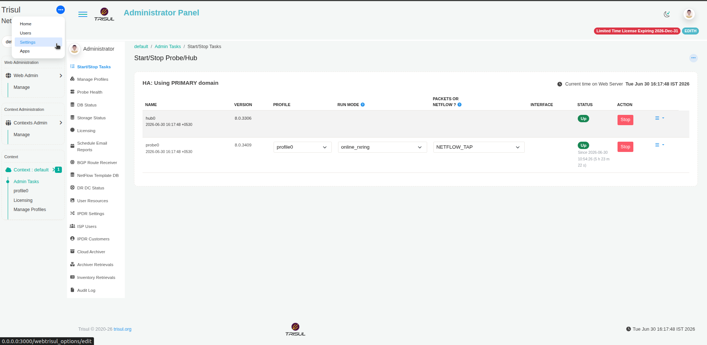
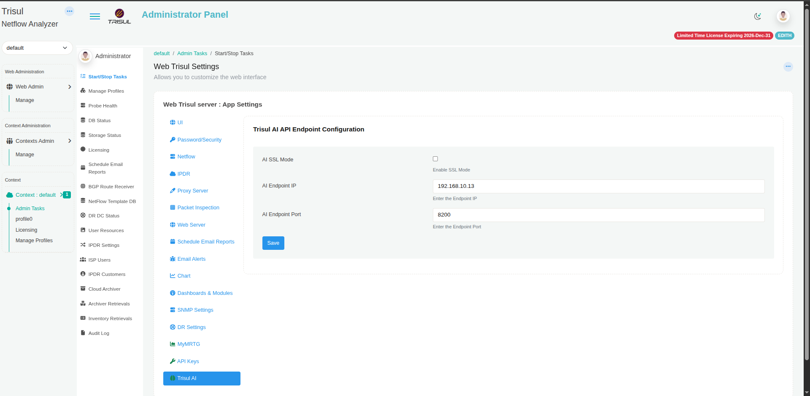

# Set up Trisul AI

Setup has three stages:

1. [Install the Trisul AI CLI](#stage-1-install-the-trisul-ai-cli).
2. [Choose the LLM and the Trisul data source](#stage-2-choose-the-llm-and-the-data-source).
3. [Connect the CLI to WebTrisul](#stage-3-connect-the-cli-to-webtrisul).

After stage 2 you can already chat with Trisul AI in a terminal. Stage 3 adds the **Trisul AI** chat page in WebTrisul.

**Who does this:** a Trisul administrator.

## Before you begin

You need:

- Trisul 8.0 or later (Hub and WebTrisul), installed and running.
- Python 3.10 or later on the machine that will run the Trisul AI CLI. This is usually the Trisul Hub.
- An LLM. Use one of these:
  - an API key for Google Gemini, OpenAI or Anthropic, or
  - a self-hosted, OpenAI-compatible endpoint, such as Ollama, LM Studio, vLLM or LocalAI.
- An API key for an embedding provider (Google Gemini, OpenAI or VoyageAI). Trisul AI uses embeddings to search the Trisul documentation when you ask product questions.

## Stage 1: Install the Trisul AI CLI

The Trisul AI CLI is a Python package. Install it in a virtual environment.

1. Install Python, pip and the Python virtual environment package.

   On Ubuntu:

   ~~~bash
   sudo apt update && sudo apt install python3-pip python3.12-venv -y
   ~~~

   On RHEL:

   ~~~bash
   sudo dnf update -y
   sudo dnf install python3 python3-pip python3-devel -y
   ~~~

2. Create a virtual environment and activate it:

   ~~~bash
   python3 -m venv .venv
   source .venv/bin/activate
   ~~~

3. Install the Trisul AI CLI:

   ~~~bash
   pip install trisul_ai_cli
   ~~~

## Stage 2: Choose the LLM and the data source

1. Start the CLI from the virtual environment:

   ~~~bash
   trisul_ai_cli
   ~~~

2. The first time you start it, the CLI asks you to choose an LLM:
   - Pick a Gemini, OpenAI or Anthropic model, then enter the API key for that provider.
   - Or pick **custom:local** for a self-hosted endpoint, then enter its API base URL (for example `http://localhost:11434`) and the model name. You can skip the API key for Ollama and similar servers.

3. Choose an embedding model (Gemini, OpenAI or VoyageAI) and enter its API key, if the CLI asks for one.

   The CLI saves these settings in a `.env` file. To change them later, see [CLI reference: commands](./cli-reference#commands).

4. Check that it works. At the prompt, type:

   ~~~text
   Show top 10 hosts by traffic in the last hour
   ~~~

   You should get a table of hosts. To leave the CLI, type `exit`.

### Where Trisul AI gets its data

If you don't name a context in your question, Trisul AI fetches data from the default context, `context0`, on this machine. You don't need any extra setup for this.

To get data from another context on this machine, name that context in your question, in plain English.

To get data from a Trisul on another server, first change that server's TRP endpoint from IPC to TCP. See [Switching to a distributed domain](/docs/guide/learntrisul/concepts/change_domain#switching-to-a-distributed-domain). Then ask Trisul AI to connect to it, with the server's IP address and TRP port. For example: `Connect to the remote server with IP address 10.16.8.44 and port 5008`.

:::caution
The TRP port of a remote Trisul server is not the port WebTrisul uses to reach Trisul AI (`8200`, in stage 3).
:::

To use Trisul AI only in a terminal, you can stop here. For terminal commands and examples, see the [CLI reference](./cli-reference).

## Stage 3: Connect the CLI to WebTrisul

The WebTrisul **Trisul AI** chat page doesn't start the AI engine itself. It talks to the CLI running in API mode, a REST server. Your users' browsers call this server directly.

### Start the API server

1. On the machine where you installed the CLI, activate the same virtual environment:

   ~~~bash
   source .venv/bin/activate
   ~~~

2. Start the API server:

   ~~~bash
   trisul_ai_cli api --host 0.0.0.0 --port 8200
   ~~~

   You should see:

   ~~~text
   Trisul AI REST API starting in HTTP mode on http://0.0.0.0:8200
      Interactive docs: http://0.0.0.0:8200/docs
      Health check:     http://0.0.0.0:8200/api/health
   ~~~

   - `--host 0.0.0.0` lets browsers on other machines reach the server.
   - `--port 8200` is the default port for the WebTrisul connection.
   - The API server uses the same LLM settings (`.env`) as the CLI. If you skipped stage 2 on this machine, it asks for them the first time it starts.
   - The process must keep running. TODO(verify: recommended way to run it as a service that starts on boot)

3. To use HTTPS, add your certificate and key:

   ~~~bash
   trisul_ai_cli api --host 0.0.0.0 --port 8200 \
     --ssl-certfile /path/to/cert.pem \
     --ssl-keyfile /path/to/key.pem
   ~~~

4. Check that the server is up:

   ~~~bash
   curl http://127.0.0.1:8200/api/health
   ~~~

   A healthy server returns `{"status":"ok","mcp_connected":true,...}`.

Your users' browsers must be able to reach this machine on port 8200. Open the port in the firewall if needed.

### Point WebTrisul at the API server

1. Log in to WebTrisul as **Admin**.
2. Click the **⋯** menu at the top left, then click **Settings**.

   

3. On **Web Trisul Settings**, click **Trisul AI** at the bottom of the left list.
4. Under **Trisul AI API Endpoint Configuration**, fill in:

   | Field | What to enter |
   | --- | --- |
   | **AI SSL Mode** | Leave it cleared for HTTP. Select **Enable SSL Mode** only if you started the API server with `--ssl-certfile` and `--ssl-keyfile`. |
   | **AI Endpoint IP** | An address of the API server that users' **browsers** can reach, usually the Hub IP. Use `127.0.0.1` only if you browse from the same machine that runs the API server. |
   | **AI Endpoint Port** | The `--port` value, for example `8200`. |

5. Click **Save**.

### Check the chat

1. Select a context in WebTrisul.
2. Open the **Trisul AI** page (`/trisul_ai/index`). TODO(verify: menu path to the Trisul AI page)
3. Check the header: it shows **Trisul AI**, **Online Assistant**, and the context.
4. Type `show top 5 hosts` and press Enter.

If you get a table of hosts, setup is done.

## If it doesn't work

| Symptom | What to check |
| --- | --- |
| The chat shows **Connection Failed** | 1. `trisul_ai_cli api` is still running. 2. `/api/health` answers on the IP and port you entered. 3. **AI SSL Mode** matches how you started the server (HTTP or HTTPS). 4. If you browse from another machine, **AI Endpoint IP** isn't `127.0.0.1`. To reopen the settings, click **Configure Server Settings** in the failed chat. |
| `Error: ZMQ timeout - no response from ipc://...` | Trisul isn't running, or the context you chose doesn't exist. |
| `Error: Invalid API key` | In the CLI, run `change_llm_api_key`. If product questions fail, run `change_embedding_api_key`. |
| Empty answers | Name the time window and the item in your question. Then check `trisul_ai_cli.log`. |

The CLI writes a log, `trisul_ai_cli.log`, in the directory where you started it.

## Next step

[Ask your first questions](./first-questions).
