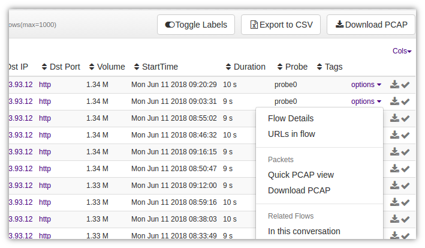

# Full Packet Capture

:::note Applies to
Packet capture mode only. These features are not available in NetFlow mode.
:::

In packet capture mode, Trisul continuously saves raw packets for 
future analysis.The ability to call upon raw packets, or full content, 
is key to the practice of Network Security Monitoring. Raw packets is 
not only useful for security applications but also for network 
performance troubleshooting. For example, you can pull up ARP/Spanning Tree packets which can help you nail a layer 2 issue. [Packet Capture Basics](/docs/guide/ug/caps/fullcontent) describes the design in greater detail.

import DocCardList from '@theme/DocCardList';

<DocCardList />

*Figure: View/Download PCAP Options*

### Use Cases

Trisul allows you to summon raw packets from a number of situations. Some typical examples,

| Context        | How you get to the raw packets                                                                |
| -------------- | ----------------------------------------------------------------------------------------------|
| Retro analysis | You are looking at top applications around 5AM yesterday and want to pull SMB packets in that period                                                                                                           |
| Flows          | You want to see the content of the top 3 flows **uploading** data out of our network                                                                                                          |
| Cross drill    | You can find out the top hosts and MACs contributing to DNS traffic between 5AM and 6AM last tuesday                                                                                                          |
| IDS Alerts     | You want to see the packet that caused a **shellcode** snort alert. You also want to see nearby packets to the one that caused the alert.                                                                        |
| Other Alerts   | Pull up raw packets for threshold crossing alerts, blacklist / CnC activity or flow tracker alerts                                                                                                           |
| Resources      | Pull up raw packets for all HTTP flows that requested a *.dll resource                                                                                                         |
| More           | Trisul has many meters in dozens of counter groups. With access to raw packets you can slice and dice statistics in a large number of permutations                                                               |

### Task List

Jump to common network analysis tasks

- [View flow headers](/docs/guide/ug/caps/tasks#quickly-see-packet-contents-without-pulling-out-the-pcap)
- [Disable full packet captures](/docs/guide/ug/caps/tasks#disable-full-packet-capture)
- [Allocate 100GB disk space for full packet captures](/docs/guide/ug/caps/tasks#allocate-a-fixed-100gb-disk-space-for-full-packet-captures)
- [Don't store SYSLOG packets](/docs/guide/ug/caps/tasks#i-dont-want-to-store-syslog-packets-because-i-send-them-to-splunk)

[View all tasks](/docs/guide/ug/caps/tasks)

### Tips

- Narrow down your analysis time interval
- Adjust the maximum time interval and volume limit caps if needed
- Use the Payload Search Tool if you are looking for pattern
- For recurring tasks – use the programmatic interface [Trisul Remote Protocol](/docs/trp/)
- Familiarize yourself with Wireshark
- Use Unsniff Network Analyzer for reconstructing activity

### Automation

Trisul Remote Protocol allows you to write simple scripts in Ruby to automate complex and repetitive tasks.

- Your first [Hello Packets](/docs/trp/trpgemsteps) example in Ruby
