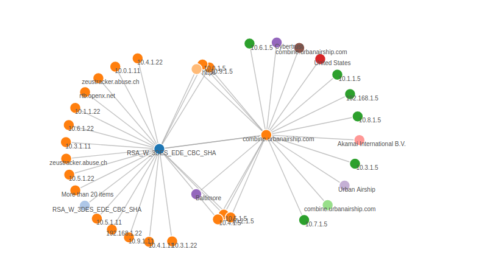
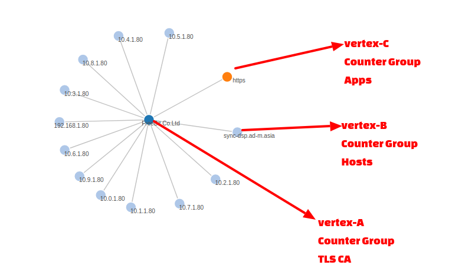

# Trisul Edges – Streaming Graph Analytics

*Trisul Edge* adds graph analytics to Trisul. It lets you discover relationships between metric items. This section introduces the *Trisul Edge* feature and then describes how to use the Trisul User Interface to explore these relationships

import DocCardList from '@theme/DocCardList';

<DocCardList />

## Introducing Trisul Edges

Trisul is a real-time streaming analytics platform. It processes data in a single pass with streaming algorithms, instead of storing data in a search engine such as Elasticsearch or a relational database such as PostgreSQL and querying it on demand. A Trisul Probe captures hundreds of metrics from network traffic. Without Edges, Trisul can relate metrics such as protocol, port and IP address only through the flow they belong to. It can't tell, for example, that a TLS cipher suite was used by a particular IP address, TLS organization or country. The [Flow Tagger](/docs/guide/ug/flow/tagger) enriches each flow with tags, but it still uses the flow as the anchor.

*Figure: Edge Graph Showing Flow Taggers*

Trisul Edges brings graph database features into Trisul. Each entity in Trisul metrics also generates information about related entities. In Graph Database architecture, the central concept is to store “connections” and “graphs of connections” as sets of **edges** and **vertices**.

When you enable Trisul Edges, Trisul generates a new type of stream, called an Edge stream, as it processes packets. Streaming algorithms keep this stream to a manageable size. For example, Trisul doesn't store an unbounded graph for high-cardinality relationships.

## Vertices and Edges

An Edge connects two Vertices. In Trisul the rules are

- **Vertices** are keys that belong to a Counter Group or an Alert Group
- **Edges** are connections between vertices

Consider the following graph.

*Figure: Representation of Vertices and Edges in Edge Graph*

In Trisul you start traversing graphs from a “root vertex”. In the image shown above we want to check which nodes are connected to the *TLS Certificate Authority* named “Freebit.Co.Ltd”. The graph then opens up one level to reveal its adjacent vertices. In this case we have vertices from 3 different counter groups Internal Hosts (10.x), External Hosts, and Applications. You can then expand the other nodes to reveal its adjacencies and explore the graph network.

## Limits

Trisul uses a memory cap on the number of allowed neighbors per vertex. This prevents an explosion of edges for high-cardinality vertices such as the HTTP protocol. Imagine how many IPs would be neighbors of the HTTP protocol.

The limits currently in effect are :

1. Max vertices – unlimited
2. Max neighbors per vertex – 1KB / hour. Roughly 100 uniques per hour.
